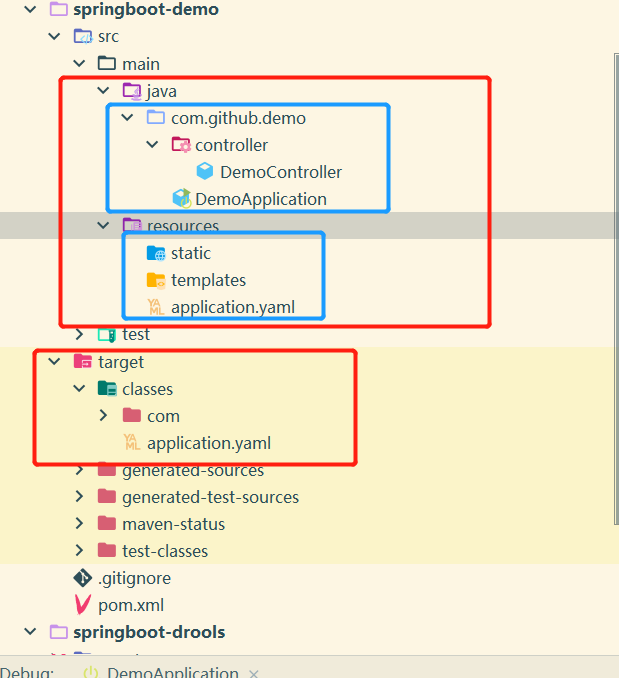

# main 方法和 classpath 说明

## classpath 介绍

classpath 是一个环境变量，用于指定 JVM 查找类和资源的路径。JVM 启动时，会通过 ClassLoader 类加载 Java 类和资源。当 ClassLoader 类加载类或资源时，会在 classpath 中查找这些文件。注意 JVM 查找类和资源时，先会查找 `java -classpath ` 命令指定的类路径，如果找不到会去查找 classpath 系统环境变量设置的类路径。


## classpath: 和 classpath*: 介绍
`classpath:` 和 `classpath*:` 用于配置文件中，表示路径或者文件的相对根路径是 classpath，此相对路径是代码编译后**根包**所在的目录，`classpath*:` 除了表示当前工程根包所在相对路径，还表示依赖的 jar 内根包的相对路径。Java 在 loadClass 类中提供了 `getResource()` 方法来读取 classpath 相对根路径内的资源，如 `this.getClass().getClassLoader().getResource("application.yaml")`, 因为我们打包后的 Jar 是可以在任意目录运行的，如果我们代码直接写死资源文件的绝对路径，明显是不可以的。


在 Java Maven 项目` src\main\java` 和 ` src\main\resources` 都属于 Java 工程的源文件夹编译后对应的是 `target\classes`，则 `target\classes` 就是当前工程的 classpath。如下下图所示：


当在配置文件想要配置 DemoController.class 和 application.yaml 的路劲时，则可以写成 ` classpath:com/github/com/github/demo/controller/DemoController.class ` 和 `classpath:application.yaml `。


## main 函数说明

main 函数是 Java 程序的入口函数，Java 命令启动 JVM 虚拟机时，Jvm 虚拟机会加载指定的 MainClass 并执行 Mainclass 类中的` public static void main(String[] args) `方法。

## Java 程序编译和运行

1. 编译 Java 命令: `javac <options> <source files>`，常用的 options 如下:
    - -classpath, -cp 指定待编译类和依赖包的查找目录
    - -d 指定编译结果的输出目录
    
2. 执行 Java 命令: `java [-options] class [args...] 或者 java [-options] -jar jarfile 
[args...] `，args 用于指定 main 函数的参数，options 常用参数如下：
    - -classpath，-cp 指定依赖包或者运行类的查找目录

### 编译没有包的 java 程序

```java
public class HelloWorld{  
       public static void main(String[] args) {
     
        System.out.println("Hello World");
       
    }

}
```

直接在当前路径编译和运行

```bash
# 编译
javac HelloWorld.java

# 运行，通过 classpath 参数，告诉 JVM 先查找当前位置，是否存在 HelloWorld 类，不存在，再去 classpath 系统变量设置的路径里面找，注意不需要加 .class 后缀 
java -classpath . HelloWorld # -classpath . 时可以省略掉的，因为我们系统变量中的 classpath 已经配置有 . 表示的时当前目录
```

### 编译带包的 java 程序

如在 `D:/helloJava` 目录创建以下 Java 文件

```java
package com.github;

public class HelloWorld {

	public static void main(String[] args) {
		System.out.println("this is helloWorld Java");
	}

}
```

进入  `D:/helloJava` 目录运行 javac 编译命令，注意编译带有 package 的类时，需要指定编译后的输出目录，不然编译时不会生成包路径。

```bash
javac -d ./target HelloWorld.java
```

运行编译后的 HelloWorld

```bash
#  指定 JVM 的查找类，不然会提示找不到 HelloWorld.class 类，注意 helloWorld 不能加 .class 后缀
java -classpath ./target/ com.github.HelloWorld
# 或者
java -classpath ./target/ com/github/HelloWorld
```

### 编译 Java 项目

```bash
helloProject 
├─src # 源码目录
│  ├─com
│  │  └─github
│  │         └─HelloWorld.java
│  │
│  └─org
│      └─github
│             └─HelloResource.java
│
├─resource # 配置目录
|        └─logback.xml
|
├─libraries # 依赖包目录
|         |─logback-classic-1.2.11.jar
|         |─logback-core-1.2.11.jar
|         └─slf4j-api-1.7.36.jar
|
└─bin # 编译输出的目录
    ├─com
    │  └─github
    │         └─HelloWorld.class
    │
    ├─libraries
    │         |─logback-classic-1.2.11.jar
    │         |─logback-core-1.2.11.jar
    │         └─slf4j-api-1.7.36.jar
    │
    └─org
    |    └─github
    |           └─HelloResource.class
    |
    └─logback.xml

```
编译 helloProject 项目命令如下：

```bash
# 通过 classpath 指定依赖包，将编译后的结果输出到 bin 目录下
javac -d ./bin -classpath "./libraries/logback-classic-1.2.11.jar;./libraries/logback-core-1.2.11.jar;./libraries/slf4j-api-1.7.36.jar"  src/com/github/HelloWorld.java src/org/github/HelloResource.java
# 或者
javac -classpath "./libraries/*" -d ./target  $(find src -name "*.java") 

# resource 配置文件到 bin 目录，依赖包不需要复制，运行是通过 classpath 去指定即可。
cp ./resource/logback.xml ./target

```

运行 helloProject 项目，通过 -classpath 参数 Jvm 查找类和依赖路径时，需要指定类包的所在目录即可，但依赖的 jar 不能指定 jar 所在的目录, 需要指定到具体的 jar 名

```bash
java -classpath "./bin;./libraries/logback-classic-1.2.11.jar;./libraries/logback-core-1.2.11.jar;./libraries/slf4j-api-1.7.36.jar"  com/github/HelloWorld
# 或者
java -classpath "./bin;./libraries/logback-classic-1.2.11.jar;./libraries/logback-core-1.2.11.jar;./libraries/slf4j-api-1.7.36.jar"  com.github.HelloWorld
# 或者
java -classpath "./bin;./libraries/*"  com/github/HelloWorld
# 或者
java -classpath "./bin;./libraries/*"  com.github.HelloWorld
```

将 bin 目录中的类和资源文件，打包成 jar 的方式有两种，一种是使用 jar 命令，另外一种是通过打成 zip 压缩包，在将文件后缀改成 jar 就可以, 或者不改后缀也可以。

```bash
# 将 bin 目录的文件打成 jar，注意要进 bin 目录运行命令，防止将 bin 目录打进 jar 中
jar -cvf run-bin.jar ./*
```

第一种通过指定 classpath 和入口类的运行 jar 方式

```bash
# java 运行的 com.github.HelloWorld 类, 通过 classpath 设置改类和依赖包的查找路径 
java -classpath "./libraries/*;./bin/run-bin.jar" com.github.HelloWorld

# zip 打包的也可以运行，因为 jar 本质上也是 zip 压缩 
java -classpath "./libraries/*;./bin/run-bin.zip" com.github.HelloWorld
```
第二种方式通过 -jar 参数的方式运行，如果提示找不到主类，则需要在打包的时候先创建 META-INF/MAINFEST.MF 一起压缩打包，或者用压缩软件打开已压缩好的 jar| zip 包然后新增或修改 META-INF/MAINFEST.MF 文件。

```bash
java -classpath "./libraries/*" -jar ./bin/run-bin.jar
# 或者
java -classpath "./libraries/*" -jar ./bin/run-bin.zip
```

META-INF/MAINFEST.MF 文件说明，**注意每一行不能超过 72 个字符，可以换行需要以空格开头，文件最后必须要有一个回车换行**

```bash
Manifest-Version: 1.0 # 属性和值之间必须空格
Created-By: 1.8.0_41 (Oracle Corporation)
Main-Class: com.github.HelloWorld # 指定运行 jar 的入口类
Class-Paht: ./lib/logback-classic-1.2.11.jar
 .lib/logback-core-1.2.11.jar ./lib/slf4j-api-1.7.36.jar # 指定 jar 包的依赖包，只能使用相对路径，并且是相对 java -jar 运行的 jar 所在路径
           # 注意注意这里是最后一行，是一个回车换行
```
