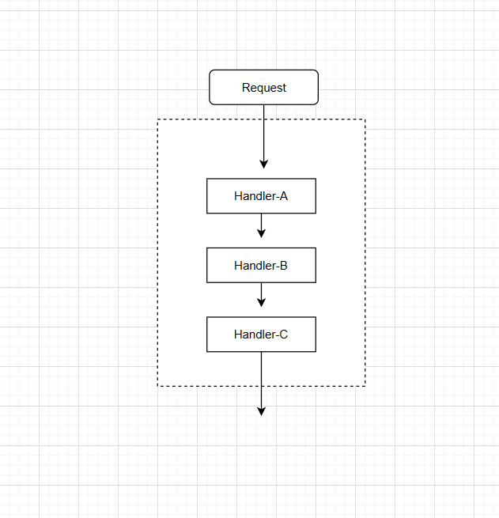

# 责任链模式

## 定义

使多个对象都有机会处理请求，从⽽避免请求的发送者和接收者之间的耦合关系。将这些对象连成⼀条链，并沿着这条链传递请求，直到有⼀个对象处理它为⽌。

责任链模式包含以下几个角色：

- Handler 处理器
- ConcreteHandler 具体处理器
- Client 客户端，

责任链模式（Chain of Responsibility）是一种处理请求的模式，它让多个处理器都有机会处理该请求，直到其中某个处理成功为止。责任链模式把多个处理器串成链，然后让请求在链上传递：




## 遵守原则

- 遵循单一职责原则，分离职责，提高系统的灵活性和可维护性。


## 使用场景
- 多重 if 条件判断，可以使用责任链模式优化
- 流程类的功能，也可以使用责任模式去实现
- Servlet 的过滤器 Filter 和 SpringMvc 的 HandlerInterceptor 拦截器


## 示例代码

1. 第一种实现方式：
   
```java

public class Request{
    
}


```

2. 第二种实现方式：

```java

```

3. 第三种实现方式：

```java


```