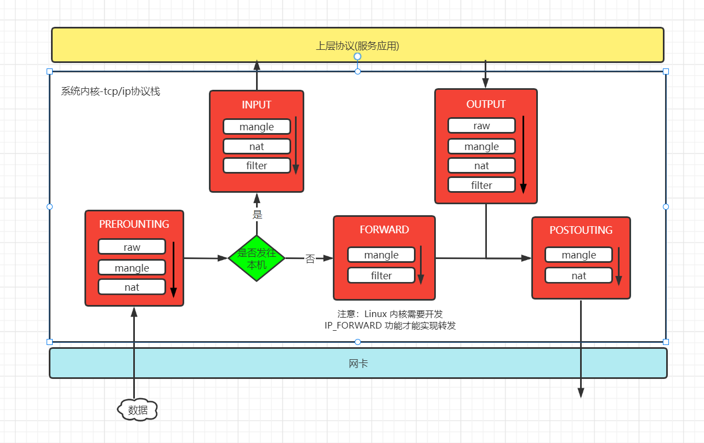

# iptables 学习笔记

## 1. iptables 简介

iptables 是 Linux 防火墙软件，虽然已经被 nftables 取代了，但是仍然广泛的运用着。iptables 防火墙的网络地址转换、数据包修改，以及过滤功能，是由 Linux 内核中的 netfilter 模块实现的，iptables 通过命令行去定义服务器流量的进出规则，然后由 netfilter 模块去执行。

## 2. iptables 过滤和转发数据包的流程

流量数据流量包经过主机内核时，会经过 PREROUTING、INPUT、OUTPUT、FORWARD 和 POSTROUTING 链路节点，通过 iptable 可以在这些节点上配置过滤、转发规则，每一个节点上可以配置多个规则，多个规则串联起来形成一条链(chain)，在节点中的链规则是从上往下执行的，只要某一条规则匹配成功，就不继续往下匹配，并执行规则中配置的 ACCEPT 或者 DROP 等等动作，链中的规则，按规则作用分组，然后每一个分组可以看作一个表(table)，因此不同作用规则要定义到指定的表中，表的说明如下：
- raw 表：控制 nat 表中连接追踪机制的启用状况，可以控制的链路节点有 PREROUTING、OUTPUT;
- mangle 表：用于修改数据包中的数据，可以控制的链路节点有 PREROUTING、INPUT、OUTPUT、FORWARD 和 POSTROUTING;
- nat 表：用于数据包的转发，可以控制的链路节点有 PREROUTING、INPUT、OUTPUT 和 POSTROUTING;
- filter 表：控制数据包是否允许进出及转发，可以控制的链路有 INPUT、FORWARD 和 OUTPUT。

**总上所述，iptable 中常说的4表5链，指的就是 raw、mangle、nat、filter 和 PREROUTING、INPUT、OUTPUT、FORWARD、POSTROUTING。**



### 2.1 iptales 规则

netfilter 是从上到下的一条一条的匹配 iptables 在 raw -> mangle -> nat -> filter 表中定义的规则，只要匹配成功就会执行规则中配置的动作，注意一旦匹配成功就不会继续往下匹配了，如果是定义的规则都不配会执行默认的(policy)策略

### 2.2 iptables 规则定义

iptables 定义规则的语法如下：

```
iptables -t <table> <command> <chain> <match-parameter> -j <target> <target-parameter>
```

* table 指定规则定义在哪个表中，如 raw、mangle、nat、filter 等。
* command 指定规则的添加方式，如 -A 将规则追加到表的末尾，-I 将规则插入到表的指定行中, 行号要在 chain 后面指定，-P 指定链的默认规则。
* chain 指定规则要定义在哪个节点链上
* parameter 指定规则的过滤或者转发的条件参数，条件参数的个数时不限制的，可以同时指定任意多个
* target 指定规则匹配要跳转执行的动作，如 ACCEPT、DROP 等等

### 2.3 定义规则 match-parameter(匹配参数)说明

在规则中的使用参数，就是规则的匹配条件，流量数据包匹配规则中的参数，则说明规则匹配成功，注意大部分参数都是可以使用 ! 符号取反的，定义规则常用的参数如下:
- [!]-p 指定匹配的协议，不指定默认匹配所有跟 -p all 相同，可匹配的协议有 tcp、udp、udplite、icpm、esp、ah、sctp，其中可选 ! 符号表示取反，不匹配某个协议的意思
- [!]-i 指定要匹配某个网卡进来的数据包，如 ` -i eth1 `，注意只能用在 PREROUTING 链、INPUT 链、FORWARD 链上
- [!]-o 根据 -i 相反要匹配数据包从哪个网卡出去的
- [!]-s,--source 指定匹配数据包的来源 IP 地址, 指定多个 IP 需要用逗号隔开，或者指定一个网段如 192.10.0.0/16
- [!]-d,--destination 与 -s 相反，用于指定匹配数据包访问的目标 IP 地址, 指定多个 IP 需要用逗号隔开，或者指定一个网段如 192.10.0.0/16
- [!]--sport 指定匹配数据包的来源端口，如果要指定多个端口，可以使用冒号隔开，如 --sport 22:25, 注意如果 :22 等同于 0:22 , 25: 等同于 25:65535
- [!]--dport 指定匹配数据包访问的目标端口
- -c, --set-counters 用于初始化规则的 PKTS(数据包)和 bytes (字节)计数器，如：`-c 0 0` 将经过规则的数据包和字节计数器置为0
- --icmp-type 指定 icmp 类型，常用的可选值 8 或 echo-request 表示 ping 请求、0 或 echo-reply 表示 ping 应答
- -j,--jump [target] 跳转到指定的动作或者用户定义链
- -g,--goto [chain] 跳转到指定的链


#### 2.3.1 扩展的匹配参数模块

1. iprange 模块，用于指定连续的 ip 访问, 扩展的参数如下：
- -m 指定要使用的扩展模块
- --src-range 指定源 ip 范围
- --dst-range  指定目的 ip 范围

```
iptables -t filter -A INPUT -m iprange --src-range 192.168.1.1-192.168.2.5 -j DROP
```
2. string 模块，用于匹配报文中是否包含对应的字符串，扩展的参数如下：
- --string 指定要匹配的内容
- –algo 可选参数，指定使用什么算法去匹配，如 bm  

```
iptables -t filter -A INPUT -m string --algo bm --string "abcs" -j DROP 
```
3. time 扩展模块，根据时间段区匹配报文，扩展的参数如下：
- –timestart 指定时间范围的开始时间，注意不可取反
- –timestop 指定时间范围的结束时间，注意不可取反
- –weekdays 指定星期的天数
- –monthdays 用于指定月份的天数
- –datestart 指定日期范围的开始日期，注意不可取反
- –datestop 指定日期范围的结束时间，注意不可取反

```bash
# 限制 ssh 只能在以下时间段链接
iptables -t filter -I OUTPUT -p tcp --dport 22 -m time --timestart 08:00:00 --timestop 12:00:00 -j REJECT
iptables -t filter -I OUTPUT -p tcp --dport 22  -m time --weekdays 1,2 -j REJECT
iptables -t filter -I OUTPUT -p tcp --dport 22  -m time --monthdays 10,25 -j REJECT
iptables -t filter -I OUTPUT -p tcp --dport 8220  -m time --timestart 08:00:00 --timestop 12:00:00 --weekdays 1,2 -j REJECT
```
4. connlimit 扩展模块，用于匹配限制链接数量，扩展的参数如下：
- -connlimit-above 表示限制的链接数量
- -connlimit-mask 用于指定要限制的网段

```
iptables -I INPUT -p tcp --dport 22 -m connlimit --connlimit-above 80 --connlimit-mask 25 -j REJECT
```
5. multiport 模块，用于指定多个端口, 扩展的参数如下：
- --sports
- --dports

```
ptables -I INPUT -p tcp --dports 22,25,26 -j REJECT
```

### 2.4 定义规则的 target(动作)和 target-parameter(动作参数)说明
- ACCEPT：允许数据包通过。
- DROP：直接丢弃数据包，不给任何回应信息，客户端会提示超时。
- REJECT：拒绝数据包通过，会响应一个拒绝的信息，可选参数如下：
    - --reject-with 参数用户设定回复的报文，可选值有 icmp host unreachable(无法访问)、icmp-port-unreachable、icmp-proto-unreachable、icmp-net-prohibited(禁止)、icmp-host-prohibited，如果是 TCP 还可以设置 tcp-reset 要求对方关闭链接 
- SNAT：源地址转换，解决内网用户用同一个公网地址上网的问题，使用 SNAT 时不需要配置 NDAT，iptables 会自动维护 NAT 表，并将响应报文的目标地址转换回来，可选参数如下：
    - --to-source 用于设置源地址转换后的值
- MASQUERADE：是 SNAT 的一种特殊形式，MASQUERADE 会自动将源 ip 动态转换到  -o 指定网卡的ip
- DNAT：目标地址转换，可选的参数如下：
    - --to-destination 用于设置目的地址转换后的值
- REDIRECT：在本机做端口映射，可选参数如下：
    - --to-ports 用于设置目标端口转换后的值。使用该参数时，必须指定 -p [tcp|udp|sctp|dccp]
    - --random 将目的端口转换成任意端口
- LOG：会将访问日志记录到 /var/log/messages 文件中，只是做日记记录，所以会继续往下匹配规则，可选的参数如下：
    - --log-level 设定 iptables 日志的等级，可选值有 debug，info，notice，warning，err，emerg。默认是 info 级别。
    - --log-prefix 在日志消息中添加特定的字串前缀
- RETURN 如果在自定义链的规则中使用，则跳回默认链，然后往下匹配默认链的规则，如果默认链中使用，则跳转到默认策略。

### 2.5 定义规则例子

```bash

# 指定链的默认规则，如果所有规则都不匹配成功，就会执行链默认(policy)
$ iptables -P INPUT DROP # 默认不允许访问
$ iptables -P FORWARD DROP # 默认不允许转发
$ iptables -P OUTPUT ACCEPT # 默认可以出去

# 指定特定的网段才能连接主机的 ssh 
iptables -A INPUT -s 100.128.0.0/16 -p tcp --dport 22 -j ACCEPT

# 拒绝访问 80 端口，并提示无法访问
iptables -A INPUT -p tcp --dport 80 -j REJECT --reject-with icmp-host-unreachable

# 主机禁止 ping，在 INPUT 和 OUTPUT 链上丢弃包都可以
iptables -A INPUT -p icmp --icmp-type echo-request -j REJECT
iptables -A OUTPUT -p icmp --icmp-type echo-request -j DROP

# 应用使用内网 ip 去访问主机，利用 iptables 将内网 ip 转成外网的 ip 
iptables -t nat -A OUTPUT -d 192.168.0.88 -j DNAT --to-destination 116.205.143.251

# 内网主机使用一个公网地址上网转发上网
iptables -t nat -I POSTROUTING -s 172.16.0.0/16 -j SNAT --to-source  100.120.20.12

# 内网主机使用一个公网地址上网转发上网, MASQUERADE 根据 SNAT 的区别是自动将源 ip 转换到 -o 指定网卡的外网ip
iptables -t nat -I POSTROUTING -s 172.16.0.0/16 -o eht0 -j MASQUERADE

```

### 2.6 定义链的策略

```bash
# 定义 filter 表 OUTPUT 链的默认策略是允许访问，如果 OUTPUT 所有的规则都不匹配，就会执行默认的策略
ipatables -t filter -P OUTPUT ACCPT 
```


## 3. 自定义链

自定义链主要为方便管理规则，自定义链是默认链规则的下一级匹配链。

### 3.1 创建和使用自定义链

1. 创建自定义链使用命令  `iptables -t [raw|mangle|nat|filter] -N <自定义链名>  `

```bash
# 在 filter 表中创建一条名为 SSH-FIREWALL 的链，
iptables -t filter SSH-FIREWALL
```
2. 自定义链关联系统的默认链，数据包匹配默认链的规则后，跳转到自定义链，并继续匹配自定义链中的规则，自定义链相当于默认链规则的下一级匹配链

```bash
# 默认 INPUT 链中的规则匹配时跳转到自定义链 SSH-FIREWALL , 然后匹配 SSH-FIREWALL 链中的规则
iptables -t filter INPUT -p tcp -dport 22 -j SSH-FIREWALL 
``` 
3. 在自定义链 SSH-FIREWALL 中定义规则

```bash
# 定义数据包来源地址是 129.12.0.0 网段的，能访问 22 端口
iptables -t filter SSH-FIREWALL -s 129.12.0.0/16 -j ACCEPT
# 定义数据包来源地址是 100.12.0.0 网段的禁止访问 22 端口
iptables -t filter SSH-FILEWALL -s 100.12.0.0/16 -j DROP
# RETURN 动作在自定义链中使用，如果规则匹配，则跳回到默认链，并且往下匹配默认链的规则
iptables -t filter SSH-FILEWALL -s 100.12.0.1 -j RETURN
```
### 3.2 重新命名自定义链

```
iptables -t [raw|mangle|nat|filter] -E <旧的自定义链名> <新的自定义链名>
```

### 3.3 删除自定义链

删除自定链时，必须要先删除自定义链中的规则和删除默认链中关联的自定义链，删除自定义链的命令如下：

```bash
iptables -t [raw|mangle|nat|filter] -X <自定义链名> 
```

## 4. 查看规则

查看 iptables 表规则时使用如下参数：
* -t 指定要查看的表，不使用 -t 指定表时，默认查看的是 filter 表
* -L 查看指定链的规则，如果 -L 后面不指定链，则默认查看 -t 指定表所有的规则
* -S 查看指定链的规则，与 -L 的区别是 -S 显示的是规则的定义语句，如果 -S 后面不指定链，会默认查看 -t 指定表的所有链，不能和 -n 一起使用
* -n 将 IP 地址和端口号将以数字格式打印，默认显示为主机名、网络名或服务
* -v, --verbose 输出详细信息，列出数据包和字节计数时会在后缀加 K、M 等单位
* –line-number 显示规则的序列号，删除或修改规则时会用到
* -x 显示数据包和字节计数器的展开值，不加单位 K、M 等单位

```
# 查看 filter 表的所有规则
iptables -t filter -nL 

# 查看 nat 表 OUTPUT 链的规则
iptables -t nat -L OUTPUT 

# 查看 nat 表的所有规则，并打印行号
iptables -t nat -nL --line-numbers

```
查询规则显示的结果说明
- pkts 规则匹配到的报文的个数。
- bytes 匹配到的报文包的大小总和。
- target 规则执行的动作。
- prot 表示规则作用的协议。
- opt 表示规则对应的选项。
- in 表示数据包由哪个接口(网卡)流入，定义规则的时候，可以设置。
- out 表示数据包由哪个接口(网卡)流出，定义规则的时候，可以设置。
- source 表示规则对应的源头地址，可以是一个IP，也可以是一个网段。
- destination 表示规则对应的目标地址，可以是一个 IP，也可以是一个网段。
当然，我们也可以只查看某个链的规则，并且不让IP进行反解，这样更清晰一些，比如 iptables -nvL INPUT
- line-numbers 显示规则在对应表中的行号，删除的时候，指定行号去删除。
- policy 表示当前链的默认策略，表示所有规则都没有匹配时，默认指定的动作。
- packets 表示当前链（上例为INPUT链）默认策略匹配到的包的数量，0 packets表示默认策略匹配到0个包。
- bytes 表示当前链默认策略匹配到的所有包的大小总和。

## 5. 将所有链中的数据包和字节计数器清零

```bash
# 将所有链中的数据包和字节计数器清零
iptables -t [table] [-Z | --zero ] [chain]
```
## 6. 删除规则

删除整个表的规则命令 ` iptables -t <table>  -F ` 

```bash 
# 删除整个 filter 表的规则，不用 -t 指定表就默认时操作 filter 表
iptables -F 

# 删除 nat 表的整个规则
iptables -t nat -F
```
删除某一条规则的命令 `iptables - <table> -D <chain> <line-number> `，例子如下：

```
# 查看规则的 chain 和 line-number
iptables -t filter -nL
# 删除规则
iptables -t filter -D INPUT 5  

```

## 参考连接
1. https://www.frozentux.net/iptables-tutorial/cn/iptables-tutorial-cn-1.1.19.html#prelude
2. https://ipset.netfilter.org/iptables.man.html#lbAH
3. https://ipset.netfilter.org/iptables-extensions.man.html