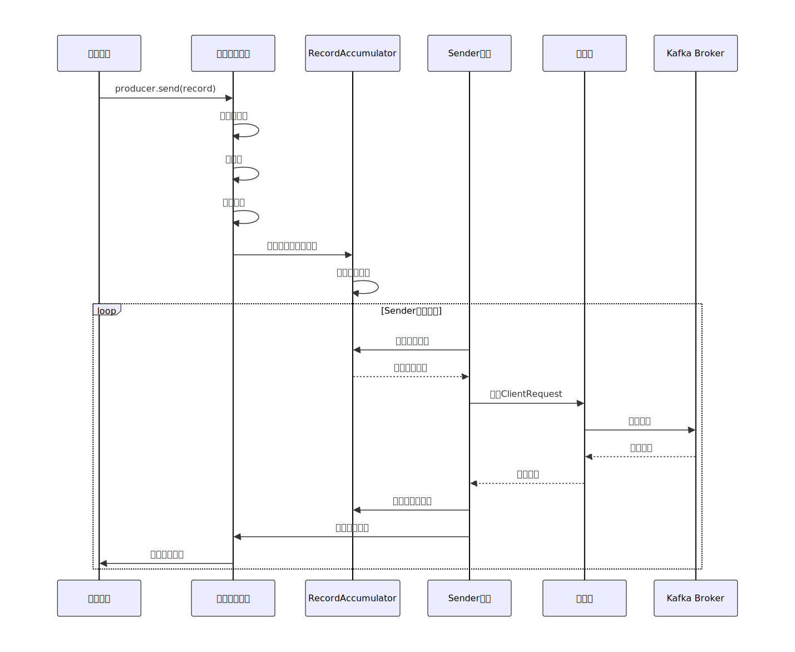

# 生产者消息缓存机制

Kafka 生产者通过一套精巧的异步缓冲和批处理机制，在保证高吞吐量的同时，提供了数据可靠性保证。

其核心组件可以概括为下图所示的流程：

## 核心组件详解

### 主线程处理流程

当应用程序调用 producer.send() 方法时，消息不会立即被发送，而是经历以下步骤：

**拦截器链：** 可选的，用于在发送前对消息进行定制化处理（如添加日志、监控指标）。

**序列化器：** 将键和值对象转换为字节数组。

**分区器：** 决定消息应该被发送到主题的哪个分区（根据键或轮询策略）。

### 消息累加器 (RecordAccumulator) - 核心缓冲区

这是生产者客户端的核心缓存区。经过主线程处理的消息，最终会进入这里。

**数据结构：** 它是一个为每个分区（Partition）维护的 Deque<ProducerBatch>（双端队列）。ProducerBatch 是批处理的基本单位。

**批处理：** 消息不会以单条（Record）的形式存储和发送，而是会追加到对应分区的最后一个未满的 Batch 中，或者新建一个 Batch。这极大地减少了网络请求次数，是 Kafka 高吞吐的关键。

**内存管理：** RecordAccumulator 管理着一块统一的内存池（BufferPool），用于分配和回收 ProducerBatch 所需的内存（默认为 32MB）。这避免了频繁的 JVM GC 开销。

### Sender 线程 - 异步发送引擎

这是一个独立的后台线程，负责将 RecordAccumulator 中“就绪”的批次发送出去。

**“就绪”条件：** 满足以下任一条件，一个 Batch 就被认为是就绪的：

1. `batch.size`： Batch 已满（默认 16KB）。

2. `linger.ms`：Batch 创建后等待的时间已到（默认 0ms，表示无延迟等待）。适当调大此值（例如 5-100ms）可以增加批处理效果，提高吞吐，但会引入少量延迟。

3. RecordAccumulator 已满或 metadata 需要刷新：当缓存区快被占满，或者需要获取新的元数据（例如发现新的 Leader）时，Sender 会立即开始发送。

**发送过程：** Sender 线程从 RecordAccumulator 中收集所有就绪的 Batch，按目标 Broker 进行分组，然后通过 Selector（网络 I/O 线程）以非阻塞的方式批量发送给对应的 Kafka Broker。

### 飞行中的请求 (InFlight Requests) - 网络层缓冲

这是位于网络层的缓冲区，用于管理已发出但尚未收到响应的请求。

1. `max.in.flight.requests.per.connection`：此参数控制每个 Broker 连接上最多允许的未确认请求数（默认 5）。它实现了“管道化”的网络通信，在等待先前请求响应的同时，可以继续发送后续请求，充分利用网络带宽。

2. 顺序保证：如果启用了重试（retries > 0）且此参数大于 1，在发生重试时可能导致消息乱序。如果需要严格保证单个分区内的顺序，可以将此参数设为 1，但可能会轻微影响吞吐。

## 工作原理与数据流转

**写入缓冲区：** send() 将消息放入对应分区的 ProducerBatch。

**异步发送：** Sender 线程持续检查就绪的 Batch。

**网络传输：** 将批处理数据通过 Selector 发送，并放入 InFlightRequests 队列。

**Broker 处理：** Broker 将消息写入其 PageCache 并返回响应。

**清理与回调：**

1. 成功：Sender 线程收到成功响应，从 RecordAccumulator 中移除已发送的 Batch，释放内存，并触发用户指定的回调函数（Callback）。

2. 失败：根据配置的重试次数（retries）和重试间隔（retry.backoff.ms）决定是否重试。对于可重试错误（如 Leader 切换、网络抖动），Batch 会被重新放入队列等待再次发送。对于不可重试错误，会直接抛出异常。

数据流转完整流程时序图如下：

