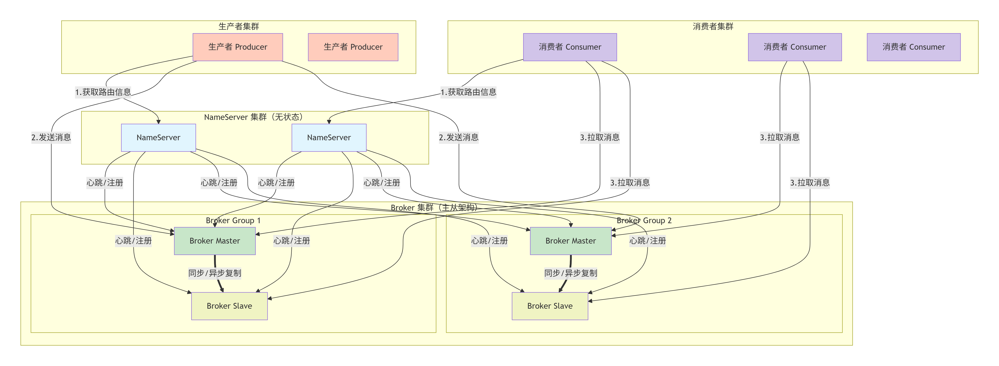
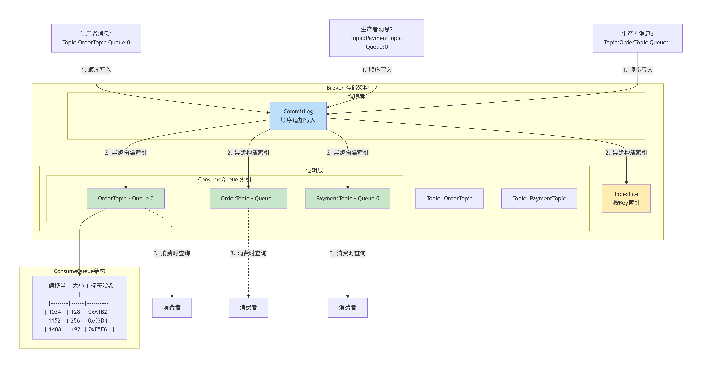
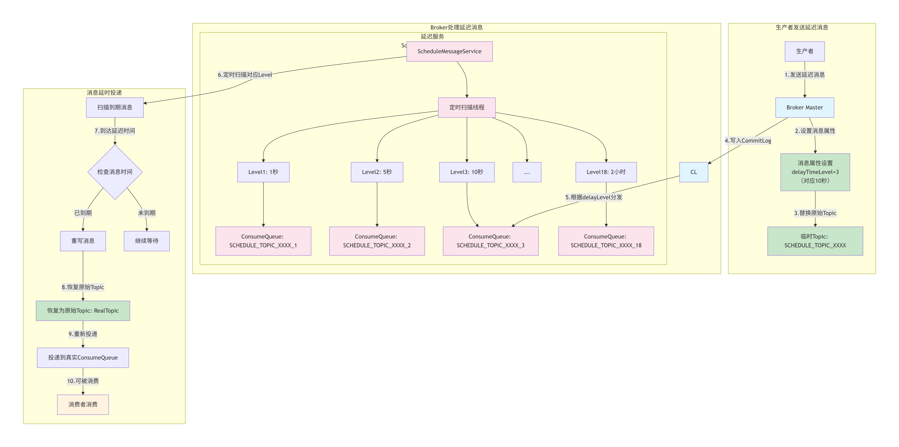

# RocketMQ 学习笔记

## 核心架构与角色

 

**NameServer**：提供轻量级的 Broker 路由服务，类似于 ZooKeeper 但更简单，无状态。

**Broker（代理服务器）**：消息存储和转发的核心节点。负责接收生产者发送的消息、持久化存储，并处理消费者的拉取请求。

**Producer（生产者）**：发送消息的客户端。支持同步发送、异步发送、单向发送。

**Consumer（消费者）**：接收消息的客户端。采用 Pull（拉）模式，同时支持 Push 模式的封装（底层仍是 Pull）。


## 核心概念

**Topic（主题）**：

- 消息的逻辑分类，生产者向指定 Topic 发送消息，消费者订阅指定 Topic 进行消费。
- Topic 是一个逻辑概念，它本身并不存储实际的消息数据。
- 一个 Topic 在物理上会被分成一个或多个 ConsumerQueue。ConsumerQueue 是消息负载均衡和并行消费的最小单元。消息在发送时，会根据一定的策略（如轮询、Hash）被分配到该 Topic 下的某个 ConsumerQueue 中。

**CommitLog （提交日志）**：

- CommitLog 是 RocketMQ 真正的、唯一的物理存储文件，当 Topic 消息发送到 Broker 后，Broker 会按照消息到达的顺序追加写入本地 CommitLog 文件中。注意 CommitLog 是混合存放所有 Topic 消息的。
- 消息写入 CommitLog 日志成功后，Broker 会构建消息在 CommitLog 文件中的索引记录，并写入  ConsumerQueue 队列中。

**ConsumerQueue（消费队列）**：

- ConsumerQueue 队列存放的不是真正的消息内容，而是存放消息的索引记录，即存放消息在 CommitLog 文件中的 offset 偏移量、消息大小以及消息的标签哈希值。消费者消费时，先从 ConsumeQueue 队列读取索引记录，然后利用索引记录中的CommitLog Offset 和 Size，从 CommitLog 中读取完整的消息内容，最后再将消息内容返回给消费者。
- 消息在同一个 Queue 内保证 FIFO（先进先出）顺序，但不同 Queue 间不保证顺序。
- 生产者的发送时通过策略（如轮询）决定消息落在哪个 Queue；消费者的负载均衡策略决定消费哪些 Queue。

**Offset（偏移量）**：

- CommitLog Offset：消息在全局 CommitLog 文件中的物理偏移量。
- Consumer Offset：消费者在某个 ConsumeQueue 上的消费进度。

**Message（消息）**：

- 组成：Topic、Body、Properties（Tag, Key 等）、MessageId。
- Tag（标签）：用于对 Topic 下的消息进行二级过滤，方便消费者精细订阅（如 TagA || TagC）。
- Key：用户自定义的业务关键词，可用于消息索引查询。


## 消息储存机制 




设计核心：

- 所有消息顺序写入 CommitLog，获得全局物理偏移量
- 异步构建 ConsumeQueue 索引，按 Topic-Queue 维度组织
- 消费时通过 ConsumeQueue 定位 CommitLog 中的消息
- IndexFile 提供 Key 查询能力


## 生产写入消息流程

```
[Producer]
    |
    | 1. 启动，从 NameServer 获取路由
    |
    | 2. send(msg)
    |    -> 拦截器处理消息
    |    -> 根据策略路由选择 MessageQueue (如轮询) 找到对应 Broker (Master)
    |    -> 将消息缓存到本地缓存队列
    |
    | 3. 通过 Netty 发送消息到选定 Broker，发送消息的触发条件：
    |      a. 缓存消息数量达到 batchSize（默认 1000 条）
    |      b. 缓存时间达到 sendMsgTimeout（默认 3s）
    |
    V
[Broker Master]
    |
    | 4. 接收请求，解析校验
    |
    | 5. 消息存储核心流程：
    |    a. 获取锁，顺序追加写入 CommitLog 文件
    |    b. (根据配置) 同步/异步刷盘
    |    c. 异步构建对应的 ConsumeQueue 和 IndexFile
    |    d. (根据配置) 同步/异步复制到 Slave
    |
    | 6. 向 Producer 发送 ack 响应（包含发送状态：成功 / 失败）。
    |
    V
[Producer]
    |
    | 7. 处理响应，成功则结束，失败则重试。
```

## 延迟消息实现原理



核心设计：

- Broker 收到消息后，将消息的主题改写为 SCHEDULE_TOPIC_XXXX，然后写入 CommitLog 日志文件
- 将消息索引记录投递到主题 SCHEDULE_TOPIC_XXXX 的队列（队列有 18 个级别）中
- 通过 ScheduleMessageService 定时扫描每个 Level 队列
- 到期消息恢复原始 Topic 重新投递目标 Topic 的消费队列中


## 消费模式

- 集群消费（Clustering）：一条消息只能被同一个 Consumer Group 中的一个消费者消费，但是一条消息可以被多个 Consumer Group 进行消费。集群消息是默认的消费模式，用于负载均衡。
  
- 广播消费（Broadcasting）：一条消息会被同一个 Consumer Group 中的所有消费者消费。即消息会忽略消费者组，只要是消费者都能消费消息。


## 消息顺序性

- Topic 消息会被划分为多个先进先出的 ConsumerQueue 队列，能保证同一个队列的消息是有序的，但不同队列间不保证顺序。

- 一条消息只能被同一个 Consumer Group 中的一个消费者消费，但是一条消息可以被多个 Consumer Group 进行消费。

通过以上规则，我们可以通过以下方式保证消息的顺序性：

- 主题设置单一 ConsumerQueue 队列（全局顺序）
- 发送和消费主题消息时，根据 Key 的路由到指定的 ConsumerQueue，实现的业务的局部顺序。
- 消费者端使用单一线程去消费消息， 如果消费者处理逻辑中出现问题，不建议抛出异常，可以返回 ConsumeOrderlyStatus.SUSPEND_CURRENT_QUEUE_A_MOMENT 暂时停止消费，过一点时间再消费。
  


## MessageType 消息类型

从 RocketMQ5.x 开启创建主题时，需要选择消息类型，并支持强制校验消息类型，即每个主题只允许发送一种消息类型的消息。

- Normal：普通消息，消息本身无特殊语义，消息之间也没有任何关联。

- FIFO：顺序消息，Apache RocketMQ 通过消息分组MessageGroup标记一组特定消息的先后顺序，可以保证消息的投递顺序严格按照消息发送时的顺序。

- Delay：定时/延时消息，通过指定延时时间控制消息生产后不要立即投递，而是在延时间隔后才对消费者可见。

- Transaction：事务消息，Apache RocketMQ 支持分布式事务消息，支持应用数据库更新和消息调用的事务一致性保障。


## Broker 和 Producer 和 Consumer 关键属性

### Broker 关键属性

- `autoCreateTopicEnable`：主题不存在时，生产/消费时自动创建 Topic（默认值 true，线上建议改成 false）

- `defaultTopicQueueNums`：自动创建 Topic 时的队列数，默认值：4

- `flushDiskType`：ASYNC_FLUSH(异步刷盘) 或 SYNC_FLUSH(同步刷盘)，默认值：ASYNC_FLUSH

- `brokerRole`：同步复制策略 ASYNC_MASTER、SYNC_MASTER、SLAVE，默认值：ASYNC_MASTER

- `brokerIP1`：当前 broker 监听的 IP

- `brokerIP2`：当前 broker 是主节点时，从 broker 节点会通过主节点的 brokerIP2 地址来同步副本。

- ` transactionCheckinterval`：本地事务状态返回 UNKNOWN 时，会重新回查事务状态，通过该配置可以指定本地事务回查时间，默认 30000ms
- `transactionCheckMax` 本地事务回查次数，如果超过回查次数，则将消息丢弃掉，默认值：15 次。


### Producer 关键属性

- `retryTimesWhenSendFailed`：表示同步发送失败时的内部重试次数（不包括第一次），默认值：2

- `retryTimesWhenSendAsyncFailed`：异步发送失败重试次数，默认值：2
  
- `batchMaxSize`：表示本地缓存队列最大储存多少条后批量发送，默认值：1000 条

- `batchMaxDelayMs`：表示本地缓存队列中的消息，延迟多少时间后发送，设置为 0 表示立即发送。


### Consumer 关键属性

- `consumeFromWhere`：指定初始消费位置，设置 LAST_OFFSET 从消费者启动后发送的消息，设置 FIRST_OFFSET 最开始可以消费的位置，设置 TIMESTAMP 表示从某个时间点开始消费，需要配合参数 `consumeTimestamp` 使用。

- `consumeTimestamp`：consumeFromWhere为 TIMESTAMP 时生效，默认值：30分钟前。 

- `autoCommit`：表示是否自动提交消费进度，默认值 true（建议true）

- `commitOffsetPeriod`： 自动提交Offset的时间间隔，默认值：5000 ms

- `persistConsumerOffsetInterval`：持久化消费进度间隔，默认值：5000ms

- `pullBatchSize`：Pull 时单次拉取的最大消息数（Push模式内部使用），默认值：32

- `consumeMessageBatchMaxSize`：批量消费的最大消息数，Pull模式可设置>1，默认值：1

- `consumeThreadMin`：消费线程池最小线程数，默认值：20

- `consumeThreadMax`：消费线程池最大线程数，默认值：20

- `maxReconsumeTimes`：最大重试消费次数，可选值从-1表示16次，默认值：-1
