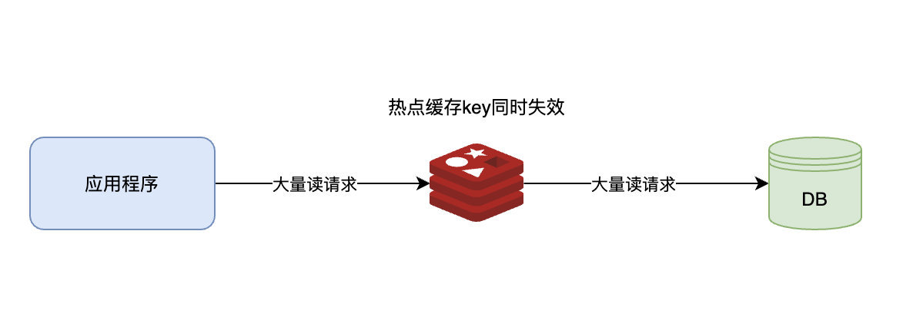

# Redis 缓存穿透、缓存击穿、缓存雪崩

使用缓存的目的时为提高响应的效率和并发量，以及减少数据库的压力，如果缓存出现穿透、击穿、雪崩，就是失去了使用缓存的目录和意义，没有了缓存流量直通数据库，数据库压力增大，可能会就会导致系统崩溃。

## 缓存穿透

### 穿透说明

缓存穿透是要查询的数据在缓存中查询不到，在数据库中也查询不到，因为数据库中没有，每次查询之后都无法写入缓存，就导致每次查询数据都是直接查询数据库，当高并发或人为恶意查询数据，就会造成数据库的压力剧增、或者崩溃。

### 穿透出现场景

1、原有的数据在缓存中和数据库中已经删除，前端仍然有关联的数据查询，未去掉。
2、人为的利用不存在的 key 恶意尝试请求，攻击系统。

### 穿透的处理方案

1、查询到空值时也将缓存设置默认值或者空，有效期设置短一些如3分钟，同时数据库写入数据时，必须更新缓存。
2、校验数据的有效性，防止恶意的 key 请求。
3、黑名单限制，防止恶意请求。
4、使用布隆过滤器，数据库写入数据时，先使用布隆过滤器标记，查询缓存没有数据时，查询布隆过滤器判断是否存在数据，不存在直接返回，存在在查询数据库。

## 缓存雪崩

### 雪崩说明

在使用缓存时，通常会对缓存设置过期时间，一方面目的是保持缓存与数据库数据的一致性，另一方面是减少冷缓存占用过多的内存空间。一个时刻出现大规模的缓存失效的情况或者 Redis 服务崩溃的情况下，大量的请求全部转发到数据库，从而导致数据库压力骤增，甚至宕机。从而形成一系列的连锁反应，造成系统崩溃等情况，就是缓存雪崩。

### 雪崩出现场景

1、大量热点 key 同时失效。
2、redis 集群彻底崩溃。

### 雪崩的处理方案

1、在原有的失效时间上加上一个随机值，比如1-5分钟随机。这样就避免了因为采用相同的过期时间导致的缓存雪崩。
2、使用熔断机制。当流量到达一定的阈值时，就直接返回系统拥挤之类的提示，防止过多的请求打在数据库上。至少能保证一部分用户是可以正常使用，其他用户多刷新几次也能得到结果。
3、提高数据库的容灾能力，可以使用分库分表，读写分离的策略。
4、为了防止 Redis 宕机导致缓存雪崩的问题，可以搭建Redis集群，提高Redis的容灾性。

## 缓存击穿

### 击穿说明

缓存雪崩有点类似，缓存雪崩是大规模的 key 失效，而缓存击穿是一个热点的 Key，有大并发集中对该 key 进行访问，因为没有缓存，一瞬间的大量并发请求直接打到数据库。

### 击穿的处理方案

1、如果业务允许的话，对于热点的key可以设置永不过期的key。
2、使用互斥锁。如果缓存失效的情况，只有拿到锁才可以查询数据库，降低了在同一时刻打在数据库上的请求，同时也会来的一个问题使用锁导致性能变差。

