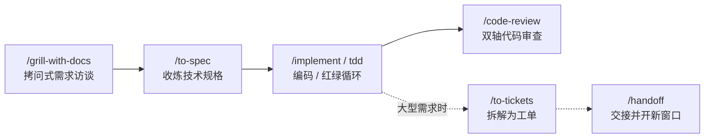

# mattpocock/skills 使用指南与实战教程

> **Skills for Real Engineers, Straight from my .agents directory.**

- **适用版本**：mattpocock/skills v1.2.x（2026-09 仍高频更新，以官方仓库为准）
- **仓库**：https://github.com/mattpocock/skills
- **许可**：MIT
- **兼容**：Claude Code / Codex CLI / Cursor / Cline 等支持 Agent Skills 规范的客户端
- **实战样例项目**：WMS（仓储管理系统）

---

## 目录

1. [这是什么](#1-这是什么)
2. [设计哲学：四个失败模式，四类解法](#2-设计哲学四个失败模式四类解法)
3. [安装与初始化](#3-安装与初始化)
4. [技能全景（25 个已晋升技能）](#4-技能全景25-个已晋升技能)
5. [核心机制：防污染知识库](#5-核心机制防污染知识库)
6. [实战 1：从零开发第一个功能（商品资料批量导入）](#6-实战-1从零开发第一个功能商品资料批量导入)
7. [实战 2：TDD 核心算法（FIFO 批次出库分配）](#7-实战-2tdd-核心算法fifo-批次出库分配)
8. [实战 3：疑难 Bug 诊断（可用库存为负）](#8-实战-3疑难-bug-诊断可用库存为负)
9. [实战 4：大型需求拆解与工单流转（波次拣货模块）](#9-实战-4大型需求拆解与工单流转波次拣货模块)
10. [实战 5：会话交接（防上下文污染）](#10-实战-5会话交接防上下文污染)
11. [实战 6：日常维护与省 token](#11-实战-6日常维护与省-token)
12. [实战 7：非代码决策拷问（/grill-me）](#12-实战-7非代码决策拷问grill-me)
13. [FAQ 与常见陷阱](#13-faq-与常见陷阱)
14. [命令速查表](#14-命令速查表)

---

## 1. 这是什么

**mattpocock/skills** 是 TypeScript 教育界头部人物 Matt Pocock（Total TypeScript 作者、前 Vercel 开发者体验负责人）公开的私人 Agent 技能集。他把每天在真实工程里使用的 25 个已晋升技能（全仓库含 in-progress 共 39 个）开放出来，GitHub 星标 15 万+，是 Agent Skills 生态最热门的参考实现。

一句话定位：**一套"反 Vibe Coding"的工程纪律原语**。它不接管你的开发流程（这是它与 BMAD、GSD、Spec-Kit 的本质区别），而是把需求澄清、TDD、调试、架构治理等工程基本功封装成一个个小的、可独立使用、可自由组合的 SKILL.md 文件。用哪个、怎么串，由你决定。

## 2. 设计哲学：四个失败模式，四类解法

整个仓库围绕 AI 编码的四个经典失败模式设计，方法论源自《程序员修炼之道》《领域驱动设计》《解析极限编程》《软件设计哲学》：

| 失败模式 | 症状 | 解法 |
|---|---|---|
| **1. Agent 没做你想要的** | 你以为它懂了，做出来完全不是那回事 | 拷问式访谈：`/grill-with-docs`（代码）、`/grill-me`（非代码）——Agent 反过来面试你，沿决策树逐项追问，一次一个问题并给出推荐答案 |
| **2. Agent 太啰嗦** | 用 20 个词表达 1 个词能说清的概念，token 白烧 | 共享语言文档 `CONTEXT.md`：一次定义领域术语，终身复用 |
| **3. 代码跑不起来** | 没有反馈回路，改一处坏三处 | `/tdd` 红-绿-重构循环；`/diagnosing-bugs` 纪律化诊断 |
| **4. 造了个大泥球** | Agent 加速写码的同时加速软件熵增 | `/to-spec` 动手前考问要动哪些模块；`/improve-codebase-architecture` 定期勘察（建议每隔几天跑一次） |

## 3. 安装与初始化

### 3.1 环境要求

- Node.js ≥ 18（用于 npx 安装器）
- GitHub CLI 并完成认证（使用工单功能时必选）：`gh auth login`
- 一个支持 Agent Skills 规范的 AI 编码客户端

### 3.2 两种安装方式（二选一，同时装会导致技能重复）

| | 方式 A：Claude Code 插件 | 方式 B：skills.sh（推荐折腾者/其他客户端） |
|---|---|---|
| **命令** | `claude plugins install mattpocock-skills` 或会话内 `/plugin install mattpocock-skills` | `npx skills@latest add mattpocock/skills` |
| **哲学** | 托管式、只读，随作者更新自动送达（"订阅"） | 可编辑的普通文件副本，你拥有完全控制权（"fork"） |
| **更新** | 自动 | `npx skills@latest update mattpocock/skills` |
| **卸载** | `claude plugins uninstall` | `npx skills@latest remove mattpocock/skills` |

> ⚠️ **注意**：方式 B 安装时，交互选项中务必勾选 `setup-matt-pocock-skills`；安装模式选 **Symlink**（多客户端共享一份源码，更新一键全局生效）。Windows 下技能文件位于 `C:\Users\<你>\.agents\skills\`。

### 3.3 项目初始化（每个仓库只跑一次）

1. 在项目根目录的 Agent 会话中执行 `/setup-matt-pocock-skills`
2. 依次回答三个问题：① 用哪个 issue 追踪器（GitHub / Linear / 本地文件）② triage 用什么标签 ③ 领域文档存放在哪里
3. 初始化完成，生成如下结构：

```text
WMS/
├─ CLAUDE.md                  # Agent 主入口（含 ## Agent skills 区块）
└─ docs/
   └─ agents/                 # AI Agent 专属配置目录
      ├─ issue-tracker.md     # 工单追踪系统配置
      ├─ triage-labels.md     # 工单分流状态标签映射
      └─ domain.md            # 领域模型架构与上下文路由规则
```

> 💡 **懒加载原则**：初始化不会生成空文件。CONTEXT.md 和 docs/adr/ 只有在第一次真正收炼出领域术语或架构决策时才会被创建。

## 4. 技能全景（25 个已晋升技能）

技能按**调用方**划分：`用户调用`只能由你通过斜杠命令触发，职责是编排；`模型调用`既可手动触发、也会在任务匹配时被 Agent 自动调用，承载可复用规范。用户调用技能可以调用模型调用技能，但不会调用另一个用户调用技能。

### 工程类

| 命令 | 调用方 | 作用 |
|---|---|---|
| `/ask-matt` | 用户 | **万能路由**——不知道用哪个技能时问它 |
| `/grill-with-docs` | 用户 | 拷问式访谈 + 构建领域模型，就地更新 CONTEXT.md 与 ADR。**最受欢迎的技能，每次变更前都该用** |
| `/setup-matt-pocock-skills` | 用户 | 仓库级首次配置（追踪器/标签/文档布局） |
| `/to-spec` | 用户 | 把当前对话综合成 spec 发布到追踪器（只综合，不访谈） |
| `/to-tickets` | 用户 | 把计划/spec 拆成"曳光弹"工单，每个工单声明阻塞关系 |
| `/implement` | 用户 | 按 spec 或工单构建，在预定接缝驱动 /tdd，收尾跑 /code-review |
| `/wayfinder` | 用户 | 规划超出单会话容量的大型工作，生成共享决策工单地图 |
| `/triage` | 用户 | 用 triage 角色状态机批量流转 issue |
| `/improve-codebase-architecture` | 用户 | 扫描"加深模块"机会，出可视化 HTML 报告后拷问式深挖 |
| `/tdd` | 模型 | 红-绿-重构循环，一次一个垂直切片 |
| `/diagnosing-bugs` | 模型 | 诊断循环：反馈环变红 → 最小化 → 假设 → 插桩 → 修复 → 回归测试 |
| `/code-review` | 模型 | 双轴评审：Standards（编码规范）与 Spec（是否忠实实现规格）并行子代理，互不污染 |
| `/prototype` | 模型 | 一次性原型回答设计问题（单 HTML 或多变体路由） |
| `/research` | 模型 | 基于高可信一手来源调研，产出带引用的 Markdown 入库 |
| `/domain-modeling` | 模型 | 对照词汇表挑战术语、边界场景压测、就地更新文档 |
| `/codebase-design` | 模型 | 深模块设计规范：小接口后藏大量行为 |
| `/resolving-merge-conflicts` | 模型 | 逐 hunk 解决 merge/rebase 冲突，追溯双方原始意图 |
| `/wizard` | 模型 | 生成交互式 bash 向导，带人走完只有人能执行的步骤 |

### 生产力类

| 命令 | 调用方 | 作用 |
|---|---|---|
| `/grill-me` | 用户 | 非代码场景的无情访谈（计划/设计/决策） |
| `/handoff` | 用户 | 把当前对话压缩成交接文档，供下一个 Agent 接手 |
| `/teach` | 用户 | 跨多个会话教你新技能/概念，当前目录作为教学生作区 |
| `/to-questionnaire` | 用户 | 把你无法独自回答的决策转成 Markdown 问卷交给关键人 |
| `/wait-what` | 用户 | 没听懂的瞬间触发，Agent 用 CONTEXT.md 词汇重新表述 |
| `/grilling` | 模型 | 所有拷问类技能背后的可复用访谈原语 |
| `/writing-for-agents` | 模型 | 为 Agent 撰写文档（SKILL.md、AGENTS.md 等） |

### 典型工作流



**旁线**（按场景独立调用）：`diagnosing-bugs`（修 bug）· `research`（调研）· `prototype`（原型）· `ask-matt`（路由）· `caveman`（省 token）
**维护线**：`improve-codebase-architecture` 每隔几天对代码库跑一次

## 5. 核心机制：防污染知识库

### 5.1 CONTEXT.md——共享语言文档

官方称这是"本仓库最酷的单项技术"。它解决 Agent 啰嗦问题：项目行话一次定义，之后所有会话复用。

| 没有 CONTEXT.md | 有 CONTEXT.md |
|---|---|
| "当一个课程的某个章节里的某节课被'实体化'（也就是在文件系统里占了位置）时出了问题" | "物化级联出了问题" |

额外收益：变量、函数、文件用共享语言**一致命名**；Agent 导航代码库更容易；思考时**消耗更少 token**。

### 5.2 三层防污染机制

1. **懒加载**：不强制生成空文件，真正收炼出术语/决策时才创建 CONTEXT.md 和 docs/adr/。
2. **纯领域字典**：CONTEXT.md 只存跨需求共享的业务名词与不变量，不存代码细节；后续会话强制遵守该词汇，防止"用词漂移"。旧词条由 `/grill-with-docs` 自动提纯更新而非盲目追加。
3. **Multi-Context 物理隔离**：大项目/Monorepo 用 CONTEXT-MAP.md 划模块边界——

```text
WMS/
├─ CONTEXT-MAP.md            # 路由地图：各子系统 → 对应上下文
├─ docs/adr/                 # 系统级总决策
└─ src/
   ├─ inbound/               # 入库模块
   │  ├─ CONTEXT.md          # 仅入库领域术语（收货、上架、批次）
   │  └─ docs/adr/           # 模块专属 ADR
   └─ outbound/              # 出库模块（同构：波次、拣货、复核）
```

拆分不用手动建文件，两种触发方式：直接发指令"这个项目模块较多，请重构为 Multi-Context 架构"；或跑 `/improve-codebase-architecture` 时 Agent 检测到多模块会主动询问。拆分后日常零切换——做出库需求时，Agent 按 docs/agents/domain.md 的路由规则自动只读 `src/outbound/CONTEXT.md`，入库、盘点等模块的上下文零干扰。

### 5.3 ADR——架构决策记录

难以解释的决策写成 ADR，由 `/grill-with-docs` 和 `/domain-modeling` 在会话中就地更新。核心理念引自 Ousterhout："最好的模块是深的——大量功能通过简单接口访问。"

---

## 6. 实战 1：从零开发第一个功能（商品资料批量导入）

**场景**：仓储管理系统 WMS 项目，要开发"商品资料批量导入"功能。这是最常见的主线链路：访谈 → 规格 → 实现 → 审查。

### 第 1 步：拷问式访谈

> **你**：`/grill-with-docs` 开发商品资料批量导入模块：支持从 CSV 文件读取商品主数据，校验 SKU 编码、条码、名称、单位、规格字段，存入商品库；重复 SKU 自动覆盖，输出导入成功条数与异常日志。

> **Agent**：好的。在动手前我需要澄清几个决策点，一次一个问题。
>
> **问题 1/5**：CSV 的列顺序是固定的吗？还是依赖表头映射？
> ——我的推荐：**按表头名映射**。上游 ERP 的导出模板经常调整列顺序，固定列序会悄悄污染数据。

> **你**：按表头映射。

> **Agent**：**问题 2/5**："重复 SKU 自动覆盖"——是整行覆盖，还是仅覆盖非空字段？覆盖时需要保留审计记录吗？
> ——我的推荐：整行覆盖，保留最新导入；覆盖条数计入导入报告即可，不单独做单条审计。

> **你**：整行覆盖。审计不需要，但覆盖条数要统计。

> **Agent**：**问题 3/5**：单位字段缺失时，这一行的处理策略是：拒绝整行、默认按"件"入库、还是沿用同 SKU 上次的单位？
> ——我的推荐：拒绝该行并记入异常日志。单位是出入库换算的基准字段，给默认值会埋下换算事故。

> **你**：拒绝。

> *（后续问题：条码与既有其他 SKU 冲突怎么处理？是否支持断点续传导入？……全部澄清后，Agent 就地创建/更新 CONTEXT.md）*

访谈结束后，项目根目录生成 `CONTEXT.md`：

```markdown
## 领域词汇

- **SKU（库存单元）**：最小库存管理单元，由 SKU 编码唯一标识，
  含条码、名称、单位、规格五要素。
- **覆盖规则 (Overwrite Rule)**：同一 SKU 编码的商品资料整行覆盖，
  仅保留最新导入；每批次统计覆盖条数并计入导入报告。
- **坏行 (Bad Row)**：字段校验失败（含单位缺失、条码格式非法）的数据行，
  写入 bad-rows.log，不入库，不中断批次。

## 不变量

- SKU 编码全局唯一；同一批次内出现重复 SKU 编码即为坏行（批次内不覆盖）。
- 条码在商品库内唯一，与既有其他 SKU 冲突即为坏行。
- 导入批次要么全部走完并出报告，要么整体回滚，不存在半途状态。
```

### 第 2 步：收炼规格

> **你**：`/to-spec`
>
> **Agent**：已把本次对话综合为 spec #12《商品资料批量导入模块》，发布到 GitHub Issues，含验收标准：表头映射解析、五字段校验规则、SKU 覆盖规则、坏行处理、导入报告格式。需要调整请直接说。

### 第 3 步：实现（自动串联 TDD 与审查）

> **你**：`/implement` spec #12
>
> **Agent**：开始按 spec 构建。计划三个垂直切片：① CSV 解析与表头映射 ② 校验与坏行分类 ③ 覆盖写入与导入报告。切片 ①② 涉及数据正确性，我会走 /tdd 红绿循环；每个切片完成后跑 /code-review。现在从切片 ① 的第一个失败测试开始。

> 💡 **/implement 的行为**：按 spec 或一组工单构建工作，在预定接缝处自动驱动 `/tdd`，提交前以 `/code-review` 收尾——你不需要手动在中间插命令。

## 7. 实战 2：TDD 核心算法（FIFO 批次出库分配）

**场景**：实现出库时的批次分配算法——按先进先出（FIFO）从多个库存批次中分配数量。**强制规范：凡涉及核心数值计算、库存增减的逻辑，必须走 /tdd——先写失败测试，再写实现。**

> **你**：`/grill-with-docs` 实现 FIFO 批次出库分配：输入 SKU 与出库数量，按批次入库时间升序分配库存；兼容单批次数量不足需跨批次合并的场景，输出分配明细（批次号 × 数量）。

> **Agent**：**问题 1/3**：所有批次可用量加起来仍不足请求数量时，怎么处理？整单拒绝、部分出库、还是允许负库存？
> ——我的推荐：**整单拒绝并返回缺口数量**。部分出库会制造半截拣货任务，负库存是 WMS 的灾难。

> **你**：整单拒绝，返回缺口。

> **Agent**：**问题 2/3**：已过保质期的批次参与分配吗？

> **你**：跳过过期批次，但在分配结果里标注被跳过的批次和数量。

> *（澄清完毕 → /to-spec → 进入 /tdd）*

`/tdd` 的红-绿-重构循环，一次只推进一个垂直切片：

> **Agent**：**RED**｜切片 1：单批次库存充足
> 写测试：`expect(allocate([batchA(100)], 30)).toEqual([{ batch: 'A', qty: 30 }])`
> 运行 → ❌ 失败（函数尚不存在）

> **Agent**：**GREEN**｜最小实现让测试通过：`function allocate(batches, qty) { return [{ batch: batches[0].id, qty }]; }`
> 运行 → ✅ 通过。不加重构——红绿之间不做无关重构。

> **Agent**：**RED**｜切片 2：单批次不足，跨批次合并
> 写测试：`allocate([batchA(20), batchB(50)], 30)` 应得 `[{A,20},{B,10}]`
> 运行 → ❌ 失败

> **Agent**：**GREEN**｜实现按入库时间升序的滚动扣减 → ✅ 通过

> **Agent**：**RED**｜切片 3：过期批次跳过 + 总量不足整单拒绝
> 写测试：`allocate([expired(50), batchB(20)], 30)` 应拒绝并返回缺口 10
> 运行 → ❌ 失败

> **Agent**：**GREEN + REFACTOR**｜实现过期过滤与缺口计算 → ✅ 通过。统一重构：抽取"可用批次序列"为独立函数，接口不变，全部测试仍绿。

> 💡 **纪律要点**：一次只写一个测试；红绿之间不重构；重构只改结构不改行为；全部由 Agent 执行，但每一步的测试与结果都亮给你看。

## 8. 实战 3：疑难 Bug 诊断（可用库存为负）

**场景**：拣货员反馈某 SKU 可用库存显示为 -8，人工盘点核算应为 120。典型"改一处坏三处"的陷阱场景，用 `/diagnosing-bugs` 强制走诊断循环，禁止"试试看"。

> **你**：`/diagnosing-bugs` 某 SKU 可用库存显示为 -8，人工盘点核算应为 120。请定位根因并补回归测试。

> **Agent**：**① 反馈环**：先构造能对这个 bug "变红"的测试——用人工核算过的库存流水写固定用例：`expect(available('SKU-001')).toBe(120)`。当前确实失败（输出 -8），反馈环建立。

> **Agent**：**② 最小化**：截取该 SKU 近 30 天库存流水，二分裁剪到 11 条单据即可复现，差异集中在 2026-06-18 的一笔预售订单之后。

> **Agent**：**③ 假设清单**（可证伪，逐项排除）：
> H1 拣货锁定库存在订单取消后未释放 → 插桩观测 → 排除
> H2 并发出库竞态导致丢失一次扣减 → 观测 → 排除
> H3 预售订单的预留库存未计入可用量扣减 → 观测 → **命中**

> **Agent**：**④⑤ 修复**：可用量公式从"在库 − 锁定"修正为"在库 − 锁定 − 预留"。**⑥ 回归测试**：该 11 条单据用例永久入库。全绿。


**diagnosing-bugs 六步诊断循环**——先建反馈环，再列可证伪假设逐项排除。

## 9. 实战 4：大型需求拆解与工单流转（波次拣货模块）

**场景**：波次拣货模块——创建波次、按规则圈定订单、生成拣货任务与库位路径、拣货复核、缺货处理。工作量超出单会话容量。

> **你**：`/grill-with-docs` 开发波次拣货模块：包含创建波次、按规则圈定订单、生成拣货任务与库位路径、拣货确认与复核、缺货回退五个能力。

> *（一轮拷问：圈单规则按承运商/库区/截止时间哪些维度组合？拣货路径按库位编码序还是按巷道聚簇？缺货时整单回退还是拆单？复核用扫码还是称重？……）*

> **你**：`/to-spec`
>
> **Agent**：已综合为 spec #15《波次拣货模块》并发布。

> **你**：`/to-tickets` spec #15
>
> **Agent**：拆解为 7 张"曳光弹"工单，已写入 GitHub Issues 并声明阻塞关系：
> #16 波次圈单规则引擎（阻塞 #18 #20）
> #17 库位与批次库存查询服务（阻塞 #18）
> #18 拣货任务生成与路径排序（阻塞 #19 #21）
> #19 拣货 PDA 任务接口
> #20 复核与打包出库
> #21 缺货回退与补货建议
> 每张工单可独立抓取、独立验收。推荐从 #17 开始，#16 可并行。

后续用 `/triage` 按状态机批量流转工单（todo → in-progress → in-review → done），用 `/implement` 指定单张工单推进。如果需求大到连规划本身都需要多轮会话，用 `/wayfinder` 把"通往目标的路径"本身做成共享决策地图，逐一解决直到路径清晰。

## 10. 实战 5：会话交接（防上下文污染）

**场景**：波次拣货模块开发完，对话里堆满调试记录，接下来要开发盘点模块——继续在这个窗口开发会污染下一个需求。

1. 当前窗口输入 `/handoff`，Agent 把本次会话压缩成交接文档（已完成/未完成/关键决策/下一步）
2. 关闭当前对话窗口，新建干净窗口
3. 新窗口的 Agent 读取交接文档 + 纯净的 CONTEXT.md 继续，不受上一个需求繁杂调试对话的干扰

> 💡 **最佳习惯**：换新需求 = 新窗口。领域知识靠 CONTEXT.md/ADR 沉淀，不靠对话历史续命。配合 `/wait-what`——新会话里 Agent 说了你没听懂的话，随时触发它用领域词汇重新解释。

## 11. 实战 6：日常维护与省 token

### 架构勘察（每隔几天跑一次）

> **你**：`/improve-codebase-architecture`
>
> **Agent**：扫描完成，生成 HTML 可视化报告：发现 3 个"加深模块"的机会——① 库存服务与订单服务在 2 个文件间互相穿透调用 ② 库位分配逻辑在入库、移库、波次拣货三处重复实现 ③ 出库单状态机散落在 3 个服务层。想从哪个方向深入？我会针对你选的方向继续拷问式深挖。
>
> 提示：这是勘察不是救援——我会找到真实候选项，但不会替你解开泥球，重构节奏由你定。

### Caveman 模式（省 65-75% token）

> **你**：caveman mode
>
> **Agent**：收到。省略冠词/填充词/客套，片段化表达，常用缩写（DB/auth/config），因果用箭头（X → Y）。安全警告、不可逆操作确认、澄清请求时临时恢复正常语气，之后恢复 caveman。

> *（恢复正常模式：stop caveman。典型长编码会话可从约 10,000 input tokens 降到约 2,500）*

### 调研与原型

- `/research` 选型调研：后台代理基于高可信一手来源调查，产出带引用的 Markdown 存入仓库，不占当前会话。例如"主流 WMS 开源方案与 RF 手持终端协议对比"。
- `/prototype` 设计问题原型：状态/逻辑问题出单个可分享 HTML（如波次圈单规则的可视化推演）；UI 问题出多个迥异变体一键切换路由（如拣货路径展示的三种界面方案）。

## 12. 实战 7：非代码决策拷问（/grill-me）

**场景**：技术负责人要定"新 WMS 替换旧系统的切换方案"——纯决策、不涉及写代码。这种场景用 `/grill-me` 而不是 `/grill-with-docs`（两者共用同一个 `/grilling` 访谈原语，区别在于前者不落盘领域文档，访谈目标是把决策树的每个分支都逼出答案）。

> **你**：`/grill-me` 我们计划用新 WMS 替换现有旧系统，下个月切换上线。帮我拷问这个切换方案。

> **Agent**：**问题 1/6**：切换策略是一次性切换（cutover），还是新旧双轨并行？
> ——我的推荐：**双轨并行 2 周**。一次性切换省成本，但旧系统跑了多年，积累了大量没写进文档的隐性规则（临期批次特殊处理、大客户优先发货），新系统第一周大概率接不住。

> **你**：双轨并行。但最多两周，再久现场人力撑不住。

> **Agent**：**问题 2/6**：并行期间以哪个系统的数据为准？双写还是单向同步？两边库存数对不上时，以谁裁决？

> **你**：以新系统为准写入，旧系统降级为只读兜底。

> **Agent**：**问题 3/6**：静态库存数据（批次、库位、锁定状态）在哪个时点冻结迁移？迁移窗口内的收货和发货怎么处理？
> ——我的推荐：选周末低峰冻结 24 小时，期间只收不发，窗口内的入库单据事后补录。

> **你**：周末冻结可以，但业务只给 12 小时，24 小时不行。

> **Agent**：**问题 4/6**：如果切换后第一周新系统库存准确率跌破 95%，回退标准是什么？回退到旧系统的操作经过演练、是可逆的吗？

> **你**：……这个我们还没定。

> **Agent**：**这正是这轮访谈要抓的东西。**没有明确回退标准的切换计划，等于没有回退能力。我的建议：准确率 < 98% 且持续 48 小时即触发回退；旧系统在并行期内保持可写热备；回退脚本上线前完整演练一遍。这两个数字你可以改，但必须在切换前定死。

> *（后续问题：仓库人员培训窗口怎么排？切换期是否与 618/双 11 大促冻结期冲突？供应商驻场支持签了几周？……直到决策树每个分支都有明确答案）*

> **Agent**：访谈完毕。决策清单：双轨并行 2 周（新系统主写）/ 周末冻结 12 小时只收不发 / 回退阈值 98% 持续 48 小时、旧系统热备 + 回退演练。若要把这份决策沉淀进项目知识库，再跑一遍 `/grill-with-docs` 即可带 CONTEXT.md 与 ADR 更新。

### grill-me 与 grill-with-docs 怎么选

| | /grill-me | /grill-with-docs |
|---|---|---|
| **对象** | 计划、方案、决策（不写代码） | 要落代码的需求 |
| **产出** | 被拷问清楚的决策清单 | 决策 + CONTEXT.md 领域词条 + ADR |
| **典型场景** | 上线切换方案、自研 vs 采购、团队流程约定、预算分配 | 业务功能、算法逻辑、模块设计 |
| **通用规则** | 一次只问一个问题、附带推荐答案、问到决策树没有悬空分支为止 | 同左 |

## 13. FAQ 与常见陷阱

### Q1：多个需求连续开发，CONTEXT.md 会不会变成垃圾堆？

不会。三层防护：懒加载（不产空文件）、纯领域字典（只录业务词汇与不变量，不存代码细节；`/grill-with-docs` 提纯更新旧词条而非追加）、物理隔离（Multi-Context 按模块拆分）。最佳习惯仍是换需求开新窗口 + `/handoff`。

### Q2：调用方式差异

Claude Code 用斜杠（`/grill-with-docs`）；Codex CLI 不带斜杠（`grill-with-docs`）。Claude Code 插件方式安装的技能更新自动送达；skills.sh 方式需要手动 `npx skills@latest update`。**两种方式二选一，同时安装会重复。**

### Q3：和 BMAD / GSD / Spec-Kit 有什么区别？

那些框架接管整个开发流程；这套是小的、可组合的原语，不接管流程——用哪个不用哪个由你决定，每个都能独立使用。适合任何规模项目，但越是长期维护的真实项目价值越大。

### Q4：技能内容是英文的？

是，SKILL.md 原文英文，但方法论通用，中文项目照常工作（Agent 会用中文执行英文规范）。

### Q5：常见陷阱

- **跳过访谈直接 `/implement`**——spec 为空时实现没有锚点，等于回到 Vibe Coding。每次变更前先 `/grill-with-docs`。
- **核心计算不走 `/tdd`**——数值逻辑没有失败测试兜底，改一处坏三处。
- **忘跑 `/setup-matt-pocock-skills`**——`/to-spec`、`/to-tickets`、`/triage` 依赖 docs/agents/ 下的配置，不初始化会报缺配置。
- **在旧代码库跑 `/improve-codebase-architecture` 期望自动重构**——它只勘察出报告并拷问你选方向，不代劳。

## 14. 命令速查表

| 场景 | 命令链 |
|---|---|
| 不知道用哪个 | `/ask-matt` |
| 日常功能开发 | `/grill-with-docs` → `/to-spec` → `/implement`（自动串联 tdd + code-review） |
| 核心数值/结算逻辑 | `/grill-with-docs` → `/to-spec` → `/tdd` |
| 设计探索 | `/grill-with-docs` → `/prototype` |
| 修 Bug | `/diagnosing-bugs` |
| 大型需求 | `/grill-with-docs` → `/to-spec` → `/to-tickets` → `/implement` 按工单推进；超大用 `/wayfinder` |
| 工单管理 | `/triage` |
| 换需求/换窗口 | `/handoff` → 新窗口 |
| 技术调研 | `/research` |
| 架构维护 | `/improve-codebase-architecture`（每隔几天） |
| 合并冲突 | `/resolving-merge-conflicts` |
| 没听懂 Agent 的话 | `/wait-what` |
| 省 token | `caveman mode` 开启 / `stop caveman` 关闭 |
| 学新概念 | `/teach` |
| 非代码决策拷问 | `/grill-me` |

---

*本指南基于 mattpocock/skills v1.2.x（2026-09）官方仓库与实测社区资料编写。AI 工具链迭代频繁，若官方有重大变更，以 github.com/mattpocock/skills 最新文档为准。*
