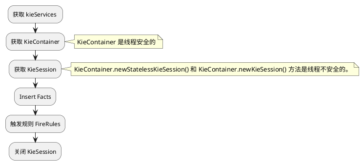

## 一、 Drools 简介
Drools 是一款基于 Java 的开源规则引擎，规则引擎的核心思想是是将应用程序中的业务决策（if-else）部分分离出来，以规则脚本的形式存编写在文件中，从而达到业务规则与业务代码解耦。当业务规则的变化不需要修改代码，只需要修改业务规则即可。

## 二、 Drools 术语说明

- Rules：表示用于定义的业务规则或 DMN 决策，所有规则必须包含触发规则的条件和规则执行的动作。
- Facts： 事实对象，表示规则引擎中输入或者更改的数据对象，即规则判断条件和执行动作时，要使用的数据对象。
-    ：Drools 引擎中存储规则的地方。
- Working memory：Drools 引擎中存储 Facts 事实对象的内存。
- Agenda：注册和排序激活规则引擎匹配的规则（如果适用）以准备执行的存放位置。

## 三 Kie 简介
Kie 的全称是 knowledge is everything，即“知识就是一切”的缩写。Kie 是 Jboss 一系列项目的总称，Kie 包含的一系列子项目如下图所示，Drools 只是 Kie 其中的一个子项目而已。


## 四、Kie APi 介绍
###  4.1 KieModule
KieModule 是 Drools 规则引擎中的一个概念，KieMolde 在宏观上指的是一个标准的 Drools Java Maven 工程，包含 Facts 事实类、规则文件、流程定义、kmodule.xml 文件等其他规则引擎资源，其中 kmodule.xml 文件是必需的，并且目录固定为 `resource/META-INF/kmodule.xml`， 如下图所示：


同时 KieModule 也是 Drools 规则引擎中非常重要的一个接口，它定义了访问 KieModule 工程的方法，包括获取 KieBase、KieSession 和其他资源等。通过 KieModule 接口，可以方便地管理和使用 KieModule 工程下的资源，提高规则引擎的可维护性和可扩展性。KieModule接口提供了以下功能：
- 获取 KieBase：KieBase 是 Drools 规则引擎的核心组件之一，它表示规则的集合。KieModule 接口定义了一个 getKieBase() 方法，可以用来获取 KieBase 对象。通过 KieBase，可以加载和执行 KieModule 中定义的所有规则。
- 获取 KieSession：KieSession 是 Drools 规则引擎中用于执行规则的主要组件之一。KieModule 接口定义了一个getKieSession() 方法，可以用来获取 KieSession 对象。通过 KieSession，可以加载和执行 KieModule 中定义的所有规则。
- 获取其他资源：KieModule 可能包含其他类型的资源文件，如图像、文本文件和属性文件。KieModule 接口定义了一系列方法，可以用来获取这些资源文件。这些资源文件可以被用来支持规则的执行或提供其他功能。
- 版本控制：KieModule 接口支持版本控制机制，可以通过接口的方法获取 KieModule 的版本信息。这个版本信息可以用来检测 KieModule 是否有新版本，并且可以用来更新已经存在的 KieModule。

### 4.2 kieBase
KieBase 是规则引擎的知识库，它包含了规则、流程、函数等各种知识元素，并提供了一种高效的方式来执行规则。每个 KieBase 都与一个或多个 KieSession 相关联，其中包括 stateful 和 stateless KieSession。KieBase 还可以从多种来源创建，例如从规则文件、数据库或Java类中加载规则。

### 4.3 KieContainer
KieContainer 是Drools 中的一个高级组件，它提供了一个应用程序的部署单元。KieContainer 包含一个或多个 KieModule，每个 KieModule 包含一个或多个 KieBase。KieContainer 的主要作用是管理应用程序中的规则库，包括从外部资源（如文件、数据库等）加载规则，并提供一种简单的方式来访问这些规则库。
KieContainer 还提供了一些有用的方法，例如从 KieBase 创建 KieSession，从外部资源（如文件、数据库等）加载规则库，以及获取 KieBase 的详细信息。

### 4.4 KieService 
KieService 接口提供了很多方法，可以通过这些方法访问 Kie 操作和管理的 Drools 资源的接口对象。比如说可以获取 KieContainer，然后利用 KieContainer 来访问 KBase 和 KSession 等信息；可以获取 KieRepository 对象，利用 KieRepository 来管理 KieModule 等。

### 4.5 KieSession 
KieSession 表示的是规则引擎的会话，用于执行规则，和插入事实（insert）、更新事实（update）、删除事实（delete）等，还提供了一些高级特性，如全局变量、动态规则修改、事实监听等，可以增强规则引擎的功能和灵活性。KieSession 的创建是比较消耗资源的操作，因此一般情况下应该尽可能重复利用同一个 KieSession，而不是频繁地创建和销毁。

KieSession 分为有状态和无状态两种模式，它们两种的区别如下：
- 有状态模式：在有状态模式下，KieSession 会维护一个工作内存（working memory），并根据规则对工作内存中的事实进行推理、更新和删除，并且每次插入、更新、删除事实后，KieSession 都会重新匹配和执行规则，有状态模式的 Session 需要直到显式地销毁，销毁调用方法 `kSession.dispose()`。

- 无状态模式：KieSession 会在执行完规则后立即销毁 Session，故每次调用 KieSession 时，它都是一个新的实例，每次调用KieSession时，需要将所有需要的事实重新插入到KieSession中。因此，无状态模式适用于单独的、短暂的推理和查询，长时间持续的会话需要用有状态的 Session，否则会会影响性能。

需要注意的是，在无状态模式下，每次都需要重新加载规则，因为无状态模式执行规则后会立即消耗。而有状态模式则只需要加载一次规则，之后在会话期间都可以使用。

## 五、KieModule.xml 配置说明
### 5.1 KieBase 标签属性说明

|属性名|默认值|合法的值|描述|
|:----|:----|:----|:----|
|name|none|any|KieBase 的名称，必须指定一个名称。|
|includes|none|逗号分隔的 KieBase 名称列表|表示引入其他的 KieBase|
|packages|all|逗号分隔的字符串列表|定义 KieBases 规则资源的路径，默认情况下将包含 resources 目录下面（子目录）的所有规则文件。也可以指定具体目录下面的规则文件，通过逗号可以包含多个目录下的文件。|
|default|false|true, false| 表示当前 KieBase 是不是默认的，如果是默认的话，则在 Java 中不需要显示的根据名字指定使用哪个 KieBases |
|equalsBehavior|identity|identity,equality| 设置为identity 时，每次 insert 事实`FactHandle faceHandle = kieSession.insert(事实) ` 都会返回一个新的 FactHandle，如果使用 equality 则会判断是否已经存在相同的事实对象，如果已经存在则返回已经存在的 FactHandle。|
|eventProcessingMode|cloud|cloud, stream|当以云模式编译时，KieBase将事件视为正常事实，而在流模式下允许对其进行时间推理。|
|declarativeAgenda|disabled|disabled,enabled|该属性是一个高级功能开关，打开后规则将可以控制一些规则的执行与否。|

### 5.2 KieSession 标签属性说明

|属性名|默认值|合法的值|描述|
|:----|:----|:----|:----|
|name|none|any|设置 KieSession 的名称，该值必须唯一，且必须设置。|
|type|stateful|stateful, stateless| 定义 session 的工作状态模式|
|default|false|true, false| 定义该 session 是否是默认的，非默认的，需要在 Java 代码中根据名称指定才行，注意是每个工作状态模式的 session 都可以定义一个默认值 |
|clockType|realtime|realtime,pseudo| 定义时钟类型，用在事件处理上面，在复合事件处理上会用到，其中realtime表示用的是系统时钟，而pseudo则是用在单元测试时模拟用的。|
|beliefSystem|simple|simple,defeasible, jtms|定义KieSession使用的 belief System的类型。|


## 六、Drools 入门例子
### 6.1 导入 Maven 依赖
```xml
<dependencies>
        <dependency>
            <groupId>org.kie</groupId>
            <artifactId>kie-api</artifactId>
            <version>7.73.0.Final</version>
        </dependency>

        <dependency>
            <groupId>org.kie</groupId>
            <artifactId>kie-internal</artifactId>
            <version>7.73.0.Final</version>
        </dependency>

        <dependency>
            <groupId>org.drools</groupId>
            <artifactId>drools-core</artifactId>
            <version>7.73.0.Final</version>
        </dependency>

        <dependency>
            <groupId>org.drools</groupId>
            <artifactId>drools-templates</artifactId>
            <version>7.73.0.Final</version>
        </dependency>
        <dependency>
            <groupId>org.drools</groupId>
            <artifactId>drools-decisiontables</artifactId>
            <version>7.73.0.Final</version>
        </dependency>
        <!-- https://mvnrepository.com/artifact/org.drools/drools-core-dynamic -->
        <dependency>
            <groupId>org.drools</groupId>
            <artifactId>drools-core-dynamic</artifactId>
            <version>7.73.0.Final</version>
        </dependency>

        <dependency>
            <groupId>org.drools</groupId>
            <artifactId>drools-compiler</artifactId>
            <version>7.73.0.Final</version>
        </dependency>

        <dependency>
            <groupId>org.slf4j</groupId>
            <artifactId>slf4j-nop</artifactId>
            <version>1.7.2</version>
        </dependency>

                <dependency>
            <groupId>junit</groupId>
            <artifactId>junit</artifactId>
            <version>4.13.2</version>
<!--            <scope>test</scope>-->
        </dependency>

    </dependencies>
```

### 6.2 Drools API 开发步骤


### 6.3 创建事实类
```Java
public class User {

    private String username;

    private String age;

    private String mobile;

    public String getUsername() {
        return username;
    }

    public void setUsername(String username) {
        this.username = username;
    }

    public String getAge() {
        return age;
    }

    public void setAge(String age) {
        this.age = age;
    }

    public String getMobile() {
        return mobile;
    }

    public void setMobile(String mobile) {
        this.mobile = mobile;
    }
}

```

### 6.4 编写规则文件
Drools 规则引擎默认递归查找 Maven 工程 resource 目录下的所有规则文件，加载到 Production Memory（规则库）中，Drools 是以逻辑 package 去组织规则的，跟规则文件名和存放路径无关，故可以任意命名。
```java
// 定义规则的包名，逻辑上的包名，与规则路径无关联 
package com.github.drools.rules

import com.github.drools.model.User

rule "rule1"
    no-loop true
when
    // 匹配工作内存中的 username 等于 admin 的 User 事实对象，只要存在一个就返回 true
    u1: User(username=="admin")
then
    // 但 when 条件为真时，执行 then 语句
    System.out.println("execute rule1, I am " + u1.getUsername());
end

rule "rule2"
when
    u2: User(username=="dev")
then
    System.out.println("execute rule2，I am " + u2.getUsername());
end

```

### 6.5 编写 kiemodule.xml 文件
在 Maven 工程中创建文件 `resource/META-INF/kiemodule.xml` 
```xml
<?xml version="1.0" encoding="UTF-8"?>
<kmodule
        xmlns="http://www.drools.org/xsd/kmodule">

    <!-- 指定规则的逻辑包 -->
    <kbase packages="com.github.drools">
        <!-- 指定能操作和执行该逻辑包规则的 Session -->
        <ksession default="true" name="session01" type="stateful"/>
    </kbase>

    <kbase packages="com.github.drools">
        <ksession  name="session02" type="stateless"/>
    </kbase>

</kmodule>

```

### 6.6 规则测试代码
```java

import com.github.drools.model.User;
import org.junit.Test;
import org.kie.api.KieServices;
import org.kie.api.runtime.KieContainer;
import org.kie.api.runtime.KieSession;
import org.kie.api.runtime.StatelessKieSession;

public class DroolsTest {


    @Test
    public void testStateless() {
        KieServices kieServices = KieServices.Factory.get();
        KieContainer kieClasspathContainer = kieServices.getKieClasspathContainer();
        // 获取默认有状态的 Session
        KieSession session1 = kieClasspathContainer.newKieSession();
        User user = new User();
        user.setUsername("admin");
        // 插入事实对象，存在规则引擎的工作内存中
        session1.insert(user);
        // 执行规则
        session1.fireAllRules();
        // 有状态session 需要手动销毁
        session1.dispose();

        // 获取默认的无状态 Session
        StatelessKieSession session2 = kieClasspathContainer.newStatelessKieSession();
        /*
         * 无状态 session，不会维护工作内存，每次执行规则时，
         * 都需要将所有需要的事实重新插入到 KieSession 中，且插入和执行规则的方法跟有状态的不相同
         */
        user.setUsername("dev");
        session2.execute(user);
        user.setUsername("admin");
        session2.execute(user);
    }
}

```

## 七、语法格式规则
```java
//定义规则包，注意只是逻辑上的包，实际上并不要求规则文件存放路径跟包路径一样
package com.rule

// 导入需要引用的 Java Class 
import   // Optional

// 函数定义，可以在 then 中执行
function   // Optional

// 定义一个查询 Fact 过滤条件，然后在Java 程序代码中通过 ksession.getQueryResults("name") 获取 Fact 对象，name 就是 query 的名字
query   // Optional

// 在规则中定义对象类型，即 Class、枚举类等，一般不常用，基本的 Fact 都是在程序代码中定义的
declare   // Optional

// 定义规则的全局变量，该规则文件下的所有 rule 中都可以引用
global    // Optional

// 定义规则的名字，在包下必须唯一
rule "rule name"
    // Attributes，定义规则的属性
    when
        // Conditions  定义规则执行的条件
    then
        // Actions   定义规则要执行的动作
end

rule "rule2 name"
  when
   
  then
   
end
```
### 7.1 function 语法 
```java
function String hello(String applicantName) {
    return "Hello " + applicantName + "!";
}

rule "Using a function"
  when
    // Empty
  then
    System.out.println( hello( "James" ) );
end
```

## 7.2 query 语法
query 用于在规则中定义 Fact 查询过滤语句，然后在 Java 代码中通过` ksession.getQueryResults("name") ` 方式引用。

1. 规则查询语句定义如下：
```java
package com.rules

query "people under the age of 21"
    $person : Person( age < 21 )
end

rule "rule name1"
    when

    then 
end 
```
2. Java 代码中引用方式如下：
```java
QueryResults results = ksession.getQueryResults( "people under the age of 21" );
System.out.println( "we have " + results.size() + " people under the age of 21" );

System.out.println( "These people are under the age of 21:" );

for ( QueryResultsRow row : results ) {
    Person person = ( Person ) row.get( "person" );
    System.out.println( person.getName() + "\n" );
}
```
## 7.3 declare 语句
declare 语句用于在规则文件中定义类型，如下定义一个 Person 类对象：
```java
package com.rules

import java.util.Date;

// 定义一个 Person 对象
declare Person
  name : String
  dateOfBirth : Date
  address : Address
end

rule "Using a declared type"
  when
    // 判断规则引擎工作内存中，是否有 name == "James" 的 Person 对象，并将该对象，赋值给 $p
    $p : Person( name == "James" )
  then   
    Person mark = new Person();
    mark.setName( "Mark" );
    insert( mark );
end

```

## 7.4 Global 语句
Global 用于定义规则文件中的全局变量，在同一个规则文件中，所有的 rule 中都能引用到，使用列子如下：

先在 Java 代码中定义规则的全局变量
```java
List<String> list = new ArrayList<>();
KieSession kieSession = kiebase.newKieSession();
kieSession.setGlobal( "myGlobalList", list );
```

然后在规则文件中定义全局变量
```java
global java.util.List myGlobalList;

rule "Using a global"
  when
    // Empty
  then
    myGlobalList.add( "My global list" );
end
```

## 7.5  Rule attributes 语句
规则属性，可以限制和修改规则的行为属性，具体可以查看官网 [Rule attributes](https://docs.drools.org/7.73.0.Final/drools-docs/html_single/index.html#rules-attributes-ref_drl-rules) 介绍，Drools 支持的规则属性如下：

|  Attribute  |  Value      |
| ----------- | ----------- |
| salience      | 值为整数，用于定义规则的优先级，值的越大优先级越高 |
| enabled   | 值为布尔类型 true 或者 false, 表示是否启用规则        |
| date-effective  | 值为日期，用于指定规则生效时间，表示当前日期大于设置的日期后，规则才生效 <br> 例子：date-effective "4-Sep-2018"|
| date-expires    | 值为日期，用于指定规则失效时间 <br> 例子：date-expires  "4-Oct-2018" |
| no-loop         | 值为布尔类型，防止规则重复执行，特定的环境下规则会重复执行，如在 then 中使用 insert、update 语句时，所有的规则都是会重复执行 <br>例子：no-loop true|
| activation-group| 值为字符串，指定规则的激活分组名，同一个分组的规则只能执行一个，默认按顺序执行第一个，可以通过 salience 设置最高优先级的执行 <br> activation-group "group name01" |
| agenda-group    | 值为字符串，指定规则的议程分组名称，跟 activation-group 的区别时是，需要获取焦点后才能执行，可以执行多个，需要在 Java 代码中设置焦点或者使用 auto-focus 属性设置焦点 <br>例子：agenda-group "GroupName"|
| auto-focus | 值为布尔类型，自动为 agenda-group 设置焦点 <br>例子：auto-focus true |
| timer      | 值为间隔的整形时间或者 corn 表达式，通过定时器指定规则的执行时间<br>例子1：timer(10s 2s) 表示10秒后触发，然后每隔2s重新触发<br>例子2： timer (cron:* 0/15 * * * ? ) 表示每15分钟执行一次 |
| calendar   | 通过日历来定时执行规则，可以排除节假日<br>例子：calendars "* * 0-7,18-23 ? * *" |
| ruleflow-group | 值为字符串，用于标识规则为流程组。在规则流组中，规则只有在该组被相关的规则流激活时才能启动<br>例子：ruleflow-group "GroupName"|
| dialect | 值为 JAVA or MVEL，用于指定当前规则使用的语言类型，默认是 JAVA<br>例子：dialect "JAVA"|

规则属性的用法如下：

```java
package com.rules

rule "rule_name"
    // Attribute
    salience 10 // 设置规则的优先级
    enabled true // 表示是否启用规则

    when
        // Conditions
    then
        // Actions
end
```

## 7.6 when 语句
when 语句用于判断条件是否满足，条件满足时，就会执行 then 动作语句，注意当 when 语句的条件为空时，等于同于 eval(true) 表示条件为真，会执行 then 动作语句。[when 语句官网参考](https://docs.drools.org/7.73.0.Final/drools-docs/html_single/index.html#drl-rules-WHEN-con_drl-rules)

3.6.1 条件为空的规则
```java
rule "Always insert applicant"
  when
    // Empty ，空条件时，规则引擎会默认添加 eval(true), 所以空条件，默认为真
  then   
    insert( new Applicant() );
end

// 空条件的规则，规则引擎会在内部默认将其改写如下:

rule "Always insert applicant"
  when
    eval( true )
  then
    insert( new Applicant() );
end

```

3.6.2 事实对象模式约束
```java
rule "rule1"
when 
    // 匹配任何事实对象
     
     
     Object() 
then 
end 

when 
    // 匹配所有 Person 事实对象
    Person() 
then 
end 

when 
    // 匹配 username = "admin" 的 Person 事实对象
    Person(username="admin")
then 
end 

```

  


## 参考连接
1. https://docs.drools.org/7.73.0.Final/drools-docs/html_single/index.html#_droolslanguagereferencechapter