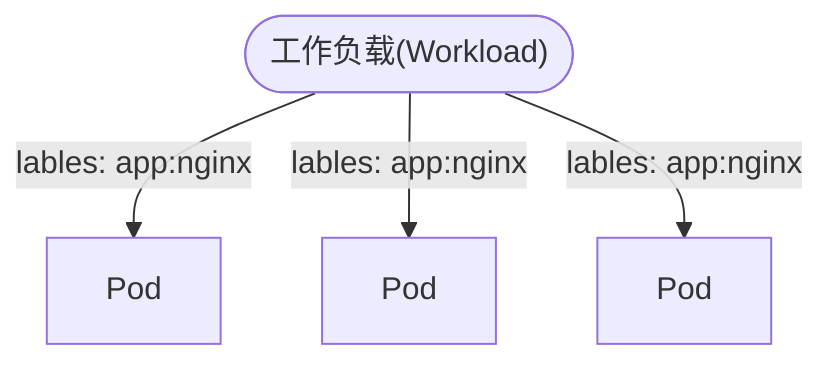

## 1. 介绍
Kubernetes 的简称 K8s，Kubernetes 是 Google 开源的容器编排工具。kubernetes 的本质是一组服务器集群，集群的每个节点上运行特定的程序组件，通过组件去实现资源管理的自动化。

## 2. K8s 组件
一个 K8s 集群主要是由控制节点（Master node）、工作节点（Work node）构成，每个节点上都会安装不同的组件, 如下图所所示(图片来源于网络)：

### 2.1 Master 节点 
Mater 节点负载整个集群的管理和和控制、以及负责集群的决策。
| 组件 | 作用 |
|--    | --  |
| apiserver |提供了资源操作的唯一入口，并提供认证、授权、访问控制、API注册和发现等机制 |
| controller-manager | 负责维护集群的状态，比如故障检测、自动扩展、滚动更新等 |
| scheduler | 负责资源的调度，按照预定的调度策略将Pod调度到相应的机器上 |
| etcd | 保存了整个集群的状态（集群中各种资源对象的信息） |
### 2.2 Node 节点
Node 真正运行工作负载的节点，通过 kube-proxy 管理应用服务的访问入口，包括集群内 pod 到 service 的访问，以及集群外访问 service。
|组件|作用|
| -- | -- |
| Kubelet | 负责维护容器的生命周期，即通过控制 docker、来创建、更新、销毁容器 |
| Kube-Proxy | 负责提供 Node 节点应用集群的服务发现和负载均衡，Internet(或者用户)访问应用前必须经过 Kube-Proxy |
| docker | 负责镜像管理以及Pod和提供容器的真正运行接口(CRI) , CRI 是一个接口，用来操作容器的接口。k8s通过CRI对容器进行操作，创建、启停容器等 |

### 2.3 kubectl 
kubectl 是与 kubernetes 集群交互的一个命令行工具，kubectl 通过与 kubernets api server 提供 Rest API 来操作控制 K8s 集群，类似于 docker 中的 docker 命令。kubectl 在执行命令的时候可以加上一个 -v=9 参数（注意参数值越大日志越详细）查看执行的具体步骤：
- 读取 kubectl 的配置文件，判断需要与哪个 api server 交互
- 生成 request body
- 调用 API
- 输出结果
#### 2.3.1 kubectl 的语法
kubectl 的命令行语法格式 ` kubectl [command] [resource-type] [name] [flags]`
- command 指定对资源执行的操作，如：create、apply、get、describe、delete 等
- resource-type 指定要操作的资源类型，使用资源的单数或者复数、简写都可以，如 pods 或 pod 或 po, nodes 或 node 或 no, 等等
- name 根据名称指定要操作的具体资源
- flags 

## 3. K8s resouce(资源)的理解
K8s 组件是支持 K8s 平台运行的软件，是系统运行的进程，资源是通过组件去创建和管理的。跟 Linux 中一切皆文件, 在 K8S 中也有一切皆资源的概念。Resource 是 K8s 的一个基础概念，k8s 用 Resource 来表示集群中的各个资源。d都可以在资源文件中配置。比如 Pod、Service、Deployment、namespace 等等都属于 K8s 的资源，尽管这个资源看起来差别很大，但它们都有许多共同的属性，如 name(名称)、kind(类型)、apiVersion(api版本)、metadata(元信息等)。

### 3.1 查看 resource(资源)的命令
```bash
kubectl api-resource 
```
### 3.2 resource(资源)文件定义
k8s 资源支持定义的属性很多，定义资源文件时，未定义的属性 k8s 会设置有默认值，k8s 支持通过 YAML 和 JSON 格式文件定义资源对象，使用命令 `kebectl explain [ resource | resource.attribe ]` 资源能定义哪些属性，使用 YAML 定义资源的格式如下：
```yaml
# 指定资源的版本，命令 kubectl explain resource 可以查看资源使用的版本，如查看 pod 资源的版本，运行命令： kubectl explain pod
apiVersion: v1  
# 指定资源的类型，pod、namespace, service 等等
kind: pod
# metadata 可以定义的资源的名称等，可以使用命令 kubectl explain resource.metadata 查看支持哪些属性的定义  
metadata:   
  # 指定资源的名称
  name: test-nginx
  # 指定资源的命名空间，指定的话，默认是 default
  namespace: default
  # 指定资源的版本
  resourceVersion: "11012"
# 定义资源的特定属性
spec: 
  # 使用命令 kubectl explain resource.
  containers:
    # 指定容器的名称
    - name: nginx-container 
      # 指定容器运行的镜像
      image: nginx
      ports:
        # hostport(主机端口) 和 containerPort(容器端口) 相当于 docker run -p 指定的端口
        - containerPort: 80
          hostport: 80  
```
快速生成资源文件
```bash
# 不存在的资源，需要指定 --dry-run 表示不是正在的创建资源，只是试运行，为了导出资源文件 
kubectl create deployment web --image=nginx-o yaml --dry-run
# 或者
kubectl run Pod test-nginx --image=nginx --dry-run=client -o yaml
# 根据存在的资源导出资源文件
kubectl get pods [pod-name] -o yaml
```

### 3.3 资源的命名空间
命名空间为集群中的资源名称赋予作用域，主要作用是资源名称隔离，在命名空间中资源名称必须是唯一的，但是并不是所有的资源都使用命名空间隔离的名称，具体可以使用命令 `kubectl api-resource` 查看。
创建命名空间使用以下命令：
```bash
# 第一种方式创建命名空间，查看创建日志，在命令后面加参数 -v = 9 其中 9 表示日志的级别，一般数字越大信息越详细
kubectl create [ns | namespaces]  空间名称  
# 第二种方式，第一中方式其实时第二种方式的简化处理
kubectl create -f /xx/xx/xx.yaml

# 查看命名空间信息，可选参数 -o 指定查看信息的详细程度和输出格式
kubectl get [ns | namespaces] 空间名称 -o [wide | ymal | json ] 
# 删除命名空间
kubectl delete [ns | namespaces]  空间名称
```
### 3.4 操作 resouce(资源)的常用命令
需要命名空间隔离的资源，使用 kubectl 操作时，都是需要指定命名空间的，如果不指定命名空间，则默认操作的是 default 命名空间下的资源。使用命令 `kubectl api-resources ` 查看哪些资源是需要命名空间隔离的。

1. kubectl create 命令，用于创建 k8s 资源，常用可选参数：
- f 指定创建资源使用的资源文件或者流
```bash
# 注意需要命名空间隔离的资源，如果没有指定命名空间的会默认将资源创建在 default 命令空间中
kubectl create -f resource-file.yaml 或 resource-file.josn 或 http://xxx/xx/xx.yaml
```
2. kubectl apply 命令，用于更新资源，不存在则创建新的资源，常用的可选参数
- -f 指定创建资源使用的资源文件或者文件流
- -k 指定使用某个目录下的 kustomization.yaml 文件创建或者更新资源
- --record 将当前执行的命令，记录在资源的annotation(注释)中，记录的格式为 ` kubernetes.io/change-cause: <kubectl 执行的命令>` 
```bash
# 根据指定的资源文件更新或者创建资源
kubectl apply -f  resource-file.yml 或 resouce-file.json 或 https://xxx/xxx/resource-file.yml
# 根据资源文件的标准输入流创建或者更新资源
cat resource-file.yml |  kubectl apply -f - 
# 指定读取目录下的资源文件
kubectl apply -k  /home/resource-dir
```
3. kubectl get 命令查看资源信息，常用参数
- -A 指定查看全部命名空间的资源
- -n 指定查看某个命名空间的资源，如 `-n kube-system `
- --show-lables 查看资源的 label 
- -w, --watch=<true|false> 实时显示资源信息，相当于 tail 中的 -f 
- -o, --output 指定结果的输出格式，常用的可选值有 wide、yaml、json、name(只显示名称) 等等
注意查看资源时，如果时需要命名空间隔离的资源，需要 `-n ` 参数指定命名空间或者 ` -A ` 指定查看全部命名空间的资源，如果指定命名空间，默认查看的是 default 命名空间的资源，可以使用命令 ` kubectl api-resources ` 查看资源是否需要命名空间隔离。
```bash
# 查看 k8s 的所有 node 节点
kubectl get nodes 
# 根据名字查看某个 node 节点
kubectl get node [node-name] 
# 查看 pod 资源
kubectl get pods # 不指定命名空间，查看的 default 命名空间的所有 pod 
# 查看所有命名空间下的所有 pod
kubectl get pods -A
# 查看某个命名空间的所有 pod
kubectl get pods kube-system
# 根据名称查看某个 pod 
kubectl get pod [pod-name] -o wide | yaml | josn 
```
4. kubectl describe 命令展示资源详情信息
```bash
# 查看 Pod 的详情信息和 Pod 容器事件 Events
kubectl describe pod [pod-name] [-n 命名空间]
# 查看 node 节点的详细信息和节点的内存和 cpu 信息，以及 Pod 限制 cpu 和内存信息
kubectl describe node [node-name]
```
5. kubectl label 命令，用于新增、更新、删除资源标签，资源的每个标签都是 `key=value` 的形式，注意在 yaml 中定义资源的标签时，使用的是` key : value ` 形式
命令的语法格式 `kubectl lable <resource-type : resource-file > <resouece-name>... <key=label>... [--resource-version=version]` 其中 ... 表示可以指定多个然后用空格隔开 
```bash
# 查看 node 节点标签
kubectl get nodes --show-labels
# 给名为 k8s-node01 的 node 节点打上 hello=world 标签
kubectl label node k8s-node  hello=world
# --overwrite 表示打标签时，如果存在标签 key 相同的标签，则覆盖更新标签
kubectl label node k8s-node --overwrite hello=node-world
# 给所有node 节点都打上 test-k8s-node = true 标签
kubectl label node --all  test-k8s-node = true 
# 给名为 k8s-node01 和 k8s-node02 的节点都打上 hello=world 和 whoiam=node 标签
kubectl label node k8s-node01 k8s-node02 hello=world whoiam=node
# 删除资源的标签，使用 key和减号，如删除所有节点中标签 key 等于 hello 的标签
kubectl lable node --all hello- 

# 查看 pods 的标签
kubectl get pods --show--label
# 为名 test-web 的 pod 打上 nginx-pod=true 标签
kubectl lable pods test-web nginx-pod=true
# 根据文件资源文件中定义的 kind、metadata.namespace、metadata.name 找到对应的 pod 打上 hello=world 标签
kubectl label pod -f xxx.yaml hello=world
```
6. kubectl exec 命令，在宿主机执行 Pod 中容器的命令，跟 docker exec 类似
命令语法格式：` kubectl exec <pod-name> [-n 命名空间] [ -c Pod 中容器名称 ] [ -it ]  -- <container-command>`
- -n 指定命名空间，不指定的话，默认是 default 命名空间下的 Pod
- pod-name 指定 Pod 的名称
- -c 指定运行 Pod 中的哪个容器的命令，如果不指定默认随机运行一个
- container-command 指定容器要运行的命令，如 bash、ls、cat、date 等等想要运行的命令

```bash
# 进入 default 命名空间下 test-web 内的 web01 容器中
kubectl exec  test-web -c web01 -it -- /bin/sh 
```

## 4. Pod
Pod 是 k8s 的最小调度单位，Pod 包含一个或多个 Container(容器) ，K8s 创建 Pod 时，Pod 内容器默认使用的 Container 网络模式，所以在运行 Pod 中定义的容器之前，会先默认创建运行一个 init 容器，其他容器使用 init 容器的网络命名空间, 从而实现 Pod 内容器共享网络。即 Pod 内容器使用 localhost 就可以相互访问。注意 init 容器也是可以在资源文件中自定义，具体可以查看官方文档。
kubernetes 本身的组件也可以通过容器化的方式运行在集群中，并且都存在于 kube-system 命名空间下。注意 k8s 支持通过资源文件或者运行 kubectl run 创建 Pod。 

### 4.1 定义 Pod 资源文件
使用` kubectl explain pod ` 查看 pod 资源可以定义的属性和支持的版本
```yaml
apiVersion: v1
# 注意要大写
kind: Pod 
metadata:
  name: test-web
spec:
  # 定义 Pod 中的容器，可以多个
  containers:
      # 指定容器的名称, 注意 docker ps 查看容器的时候，看到的名字实际为： k8s_<pod容器名>_<pod名>_<命名空间>_<uid>_<Priority>
    - name: web01
      # 指定容器运行的镜像
      image: nginx
      # 指定镜像拉取的策略，可选值分别为，Always(总是从远程仓库拉取)、IfNotPresent(本地没有镜像时，才会从远程仓库拉取)、Never(只使用本地镜像，没有就报错) 默认是 IfNotPresent
      imagePullPolicy: IfNotPresent
      ports:
          # 容器 expose 的端口，在集群集群内，可以使用 Pod 分配的 ip 访问
        - containerPort: 80
          # 宿主机的端口，相当于 docker run -p 8000:80，可以使用 Pod 所在节点的 Ip 访问
          hostPort: 8000 
```
### 4.2 操作 Pod 的常用命令
1. 创建和更新 pod
```bash
# 创建 pod，注意如果 yaml 文件或者不使用 -n 指定命名空间，则 pod 会创建在默认 default 命名空间下，是使用命令 kubectl explain pod.metadata 可以查看
kubectl create pod -f xxx.yaml
# 创建或者更新 pod 
kubectl apply pod -f xxx.yaml
```
2. 删除 pod
```bash
# 根据名称删除 pod，如果不指定命名空间，则删除 default 命名空间下的 pod 
kubectl delete pod [pod-name] [-n 命名空间]
# 根据资源文件中的 kind、metadata.namespace、metadata.name 确定要删除的资源
kubectl delete -f xxx.yaml
```
3. 查看 pod
第一种方式：使用 kubectl get pod [pod-name] [-o wide | yaml | json ] [-n 命名空间 | -A ]
```bash
# 不指定命名空间，默认查看 default 命名空间下的 pods
kubectl get pod -o wide 
# 查看所有命名空间的 pods
kubectl get pod -A 
# 根据名字查看指定的 pod 不指定命名空间，默认查看 default 命名空间的 pod 
kubectl get pod [pod-name]
```
第二种方式：kubectl describe pod [po-name] [-n 命名空间 | -A]，使用第二种方式，可以查看 pod 详细信息和 events 事件
```bash
# 查看 default 命名空间的下的所有 pod
kubectl describe pod 
# 根据名称查看 pod 信息，注意如果不指定命名空间，则默认查看 default 命名空间下的 pod 
kubectl describe pod [pod-name]
```
4. pod 端口映射到宿主机端口
命令格式 ` kubectl port-forward [pod-name] [hostPort:containerPort] `, 注意要 pod 所在的 node 节点运行才行
```bash
# 将 pod 端口映射到宿主机的端口, 注意 ip 地址要执行命令运行节点的才行
kubectl port-forward test-web --address localhost,192.168.204.3  3000:80
```
5. 进入 Pod 内的容器
```bash
kubectl exec test-web -n default -c web01 -it -- bash
# 查看环境变量
kubectl exec test-web -n default -c web01 env 
```
6. 查看 Pod 内的容器日志
```
kubectl logs test-web -n default -c web01 -f --tail=200
```
7. kubectl run 命令创建 Pod
命令语法格式: `kubectl run <pod-name> --image=image [--dry-run=server|client] ` 具体查看帮助文档
```bash
# 通过 --dry-run 参数，指定显示 Pod 的创建资源文件信息，不实际运行 Pod
kubectl run test-web  --image=nginx --dry-run=client -o yaml  
```
### 4.3 Pod 容器数据持久化，即容器挂载目录到宿主机，防止数据丢失
第一种方式：通过 volumes 和 volumeMounts 定义挂载的目录，如下
```yaml
apiVersion: v1
kind: Pod 
metadata:
  name: test-web
spec:
  # 指定将 Pod 资源创建在标签为 hello=world 的 node 主机节点中，注意如果多个 node 节点都存在 hello=world 标签, k8s 会调度选定一个节点，
  # 如果固定选择某个 node 节点，需要标签唯一
  nodeSelector:
    #注意在，在 yaml 中定义或者使用 label 时用 : 代替 = 
    hello: world 
  volumes:
    - name: nginx-data
      hostPath: # 定义挂载的宿主机目录
        # 注意该目录是 node 节点主机的目录，Pod 创建时调度到不确定的节点，最好使用 nfs、ceph、glusterfs 文件共享存储目录,
        # 或者通过 nodeSelector 指定 pod 部署的节点，才能保证，Pod 删除后重新创建时，挂载目录还是固定的主机目录 
        path: /opt/data 
        # 指向一个目录，不存在时自动创建
        type: DirectoryOrCreate     
  containers:
    - name: test-nginx # 容器名字
      image: nginx # 镜像
      volumeMounts:
        - name: nginx-data # 注意 name 要跟上面 hostPath 的名字一样，因为是根据名字取匹配的
          mountPath: /usr/share/nginx/html  # 指定容器的挂载目录
```

### 4.4 Pod 重启策略
Pod 重启策略(RestartPolicy)，定义容器的重启规则，当 Pod 内某个容器异常退出或者探针健康检测失败时，kubelet 会根据重启策略(RestartPolicy)来进行相应的操作。Pod 的重启策略有三种分别是 Always、OnFailure、Never，默认值是 Always。
- Always 当容器进程退出时，kubelet 总是会自动重启容器
- OnFailure 当容器终止运行且退出码不为0时，kubelet 会自动重启容器
- Never 当前容器运行状态如何，kubelet 都不会自动启动容器 

```bash
apiVersion: v1
kind: Pod 
metadata:
  name: test-web
  namespace: default
spec:
  restartPolicy: OnFailure
  containers:
    - name: busybox
      image: busybox
      # 命令正常执行成功返回的 0，设置退出码为 1 测试 OnFailure 重启策略
      args: 
        - /bin/sh
        - c 
        - sleep 10 && exit 1

```

### 4.5 容器 Probe(探针)
probe(探针) 是由 kubelet 对容器定期执行的健康诊断。 诊断的方式是 kubelet 在容器内执行代码，或者发送一个网络请求。如果没有在资源文件中定义 prode 则 kubelet 会默认所有的诊断结果都是健康的。
#### 4.5.1 探针检测的方式
- exec 在容器内执行指定命令。如果命令退出时返回码为 0 则认为诊断成功。
- gRPC 如果容器中实现 gRPC健康检查，可以使用 gRPC 执行一个远程过程调用。如果响应的状态是 SERVING，则认为诊断成功。
- httpGet 对容器服务发起 HTTP GET 请求。如果响应的状态码大于等于 200 且小于 400，则任务诊断成功。
- tcpSocket 对容器的指定端口执行 TCP 检查。如果端口打开，则诊断被认为成功

#### 4.5.2 探测结果
每次探测都将获得以下三种结果之一：
- Success（成功） 容器通过了诊断。
- Failure（失败）容器未通过诊断。
- Unknown（未知） 诊断失败，不会采取任何行动。

#### 4.5.3 探针的类型
k8s 提供了三种容器探针，分别如下：
- startupProbe 启动探针，用于诊断容器中的服务是否已经启动成功，如果探针检测返回失败结果，则 kubelet 会杀死容器，并且根据容器重启策略(RestartPolicy)决定是否重启。注意该探针如果诊断成功之前不会运行 livenessProbe 和 readinessProbe 探针，未资源文件中配置 startupProbe 探针，则 kubelet 默认是诊断成功的。
- livenessProbe 存活探针，用于诊断容器是否已经挂掉了，如果探针检测返回失败结果，则 kubelet 会杀死容器，并且根据容器重启策略(RestartPolicy)决定是否重启。
- readinessProbe 就绪(READY)探针，用于诊断容器中的服务是否能正常接收请求，如果探针检测返回失败结果，Endpoint 控制器将 Pod 从 Endpoint 对应的服务中移除，不会将任何请求发送该 Pod 上，直到探针检测返回成功结果为止。
1. livenessProbe 存活探针例子，使用 `kubectl describe pod <pod-name>`命令查看检测是否成功，如果失败会有事件提示。
```yaml
apiVersion: v1
kind: Pod
metadata:
  name: test-web
spec:
  containers:
    - name: web01
      image: nginx
      ports:
        - containerPort: 80
      livenessProbe:
        # kubectl 每3秒请求一次 /index 如果请求返回的状态码范围是 200 <= statuCode < 400 说检测成功
        httpGet:
          path: /index
          port: 80
        initialDelaySeconds: 5 # 表示容器运行5秒后，kubelet 开始检测
        periodSeconds: 3 # 表示每隔 3 秒 kubelet 检测一次
        successThreshold: 3 # 表示3次检测成功才算是检测成功，主要防止出现误差，默认值是 1
        failureThreshold: 3 # 表示3次检测失败才算是检测失败，主要防止出现误差，默认值是 1
```

### 4.6 Pod 容器资源限制
Pod 内容器运行依赖的硬件资源，最重要的指标就是 cpu 和内存，k8s 提供 requests 和 limits 两种参数类型来分配和限制容器使用的资源。它们的区别如下：
- requests 限制的资源只是作为 k8s 创建 Pod 时调度到指定节点的判断依据，不限制容器运行资源，只有主机节点的可分配资源大于等于 requests 限制的资源时，才允许 Pod 调度到此节点。
- limits 限制 Pod 内容器能使用的最大资源，如果容器使用的内存超出设置值，则会报 OOM。如果内存和 cpu 的值都设置为 0 则 表示资源不作限制。
```yaml
...
sepc:
  containers:
    - name: web01
      image: nginx
      resource:
        # 使用命令 kubectl describe node [node-name] 能查看主机节点的内存和 cpu 
        requests:
          memory: 200Mi
          cpu: 50m
        limits:
          memory: 500Mi
          cpu: 100m 
```
### 4.7 Pod 状态和生命周期
#### 4.7.1 生命周期
```mermaid
gantt
  title Pod 生命周期
  dateFormat ss
  axisFormat %Ss
  pod start : milestone, s1, 00, 0s
  section Init Container
  # 内容，颜色、标签、起始点，
  init Container-01 : i1, 00, 3s
  init Container-02 : i1, 01, 3s
  init Container-03 : i1, 02, 3s
  section Main Container
  post start hook:  m1, 05, 2s
  main container: m1, 05, 6s
  livenessProbe: m1, 07, 2s
  readinessProbe: m1, 07, 2s
  pre stop hook: m1, 09, 2s
  section  
  pod stop : milestone, crit, s1, 11, 0s
```
Pod 资源对象从创建到结束的时间段称为 Pod 的生命周期，Pod 周期过程和钩子函数说明如下：
1. Pod 创建过程
2. 运行初始化容器(init container)过程
3. 运行主容器(main container)过程
    - 容器启动后执行的钩子函数（post start），容器终止前执行的钩子函数（ pre stop）
    - 容器的存活性探测(liveness probe)、就绪性探测(readiness probe)
4. Pod 终止过程
    - 执行删除命令，k8s 给需要删除的 Pod 发出 SIGTERM 信号，Pod 状态变为 Terminating
    - kube-proxy watch 监控到 Pod 的状态不是 READY 状态，将 Pod 从 service 的 endpoint 列表中摘除掉，新的流量不再转发到该 Pod
    - kubelet watch 监控到 Terminating 状态，则开始销毁 Pod，如果 Pod 中的容器配置了  preStop Hook 将会执行，
      发送 SIGTERM 信号给容器内主进程以通知容器进程开始停止，并等待 container 中的主进程完全停止，如果在 terminationGracePeriodSeconds 内 (默认 30s) 还未完全停止，就发送 SIGKILL 信号将其强制杀死，所有容器进程终止，清理 Pod 资源，完成 Pod 删除

#### 4.7.2 Pod 状态和容器状态
1. Pod 生命周期中各种状态说明
- Pending（等待中）	Pod 已被 Kubernetes 系统接受，但有一个或者多个容器尚未创建亦未运行。此阶段包括等待 Pod 被调度的时间和通过网络下载镜像的时间。
- Running（运行中）	Pod 已经绑定到了某个节点，Pod 中所有的容器都已被创建。至少有一个容器仍在运行，或者正处于启动或重启状态。
- Succeeded（成功）	Pod 中的所有容器都已成功终止，并且不会再重启。
- Failed（失败）	Pod 中的所有容器都已终止，并且至少有一个容器是因为失败终止。也就是说，容器以非 0 状态退出或者被系统终止。
- Unknown（未知）	因为某些原因无法取得 Pod 的状态。这种情况通常是因为与 Pod 所在主机通信失败。

2. Pod 内容器生命周期状态
- Waiting （等待） 容器运行前的等待状态，如拉取容器镜像，或者向容器应用 Secret 数据等等。
- Running（运行中） 表明容器正在执行状态并且没有问题发生。
- Terminated（已终止） 容器已经开始执行并且或者正常结束或者因为某些原因失败。

### 4.8 静态 Pod 
静态 Pod 指的是 kubelet 自动创建的 Pod，不需要我们使用` kubectl <create|apply> `手动创建。静态 Pod 的 yaml 是存放在 ` /etc/kubernetes/manifests/ ` 中的，kubectl 会自动扫描该目录的 yaml 文件并自动创建，创建的 Pod 即为静态 Pod。如果我们想创建静态 Pod 直接将 yaml 放到该目录即可，kubectl 会自动创建。

## 5. ConfigMap 和 Secret
k8s 提供 [ConfigMap](https://kubernetes.io/zh-cn/docs/tasks/configure-pod-container/configure-pod-configmap/) 和 Secret 两种不同类型的资源，来实现业务配置信息的统一管理。在静态 Pod 中无法使用配置资源。
1. ConfigMap 用于管理不敏感的配置项。ConfigMap 资源的定义如下：
```yaml
apiVersion: v1
kind: ConfigMap
metadata:
  name: test-web-config
  # 不指定命名空间的话，资源默认在 default 命名空间下
  namespace: default
# 定义配置项，注意如果 Pod 是以挂载文件的方式引用 configMap 则 data 中的每 key-value 键值对都会单独生成一个文件，key 作为文件名，vlaue 作为文件内容 
data:
  # 简单键值对配置项，注意值要加引号，不然会报错
  redis_host: "127.0.0.1"
  redis_port: "6739"
  # 类似文件的配置项
  # | 在 yaml 中表示每一行都保留换行符号 \n
  game.properties: |   
    enemy.types=aliens,monsters
    player.maximum-lives=5    
  user-interface.properties: |
    color.good=purple
    color.bad=yellow
    allow.textmode=true  
  test-web.conf: |
    server {
      listen       81;
      listen  [::]:81;
      server_name  localhost;
      #access_log  /var/log/nginx/host.access.log  main;
      location / {
        root   /usr/share/nginx/html;
        index  index.html index.htm;
      }
    }
```
2. Secret 用于管理中的配置信息，如账号密码，等等敏感配置信息。Secret 资源的定义如下：
```yaml 
apiVersion: v1
kind: Secret
metadata:
  name: test-web-secret
  # 不指定命名空间的话，资源默认在 default 命名空间下
  namespace: default 
# type 指定 data 能定义哪些配置项，Opaque 表示用户可以定义的任意数据，当类型为 kubernetes.io/service-account-token 时 data 中只能配置 k8s 服务账号令牌
# 具体查看： https://kubernetes.io/zh-cn/docs/concepts/configuration/secret/#secret-types
type: Opaque
# 定义应用使用的配置项
data:
  # 与configMap的区别是。配置项的值需要 base64 编码
  db_username: "YWRtaW4K"
  db_password: "MTIzNDU2Cg=="
```
3. 创建和查看 configMap 和 Secret 跟 Pod 一样操作即可
```bash
# 创建资源
kubectl create -f test-web-config.yaml
# 查看资源, 不指定命名空间，默认查看的是 default 命名空间的
kubectl get <configmap | cm> [资源名]
或者
kubectl describe <configmap | cm> [资源名]
```
4. 通过内容为 `key=value ` 格式的文件创建 configMap 资源
```bash
# 通过 key=value 文件创建 configMap 资源
kubectl create configmap test-web-config -n default --from-env-file=configs.txt
# 通过 key=value 文件创建 secret 注意文件中的 value 是需要 base64 的
kubectl create configmap ggeneric test-web-config -n default --from-env-file=configs.txt
# configs.txt 的文件内容格式如下
hello="world"
lang="en"
```
5. Pod 内容器服务使用 ConfigMap 和 Secret 资源中的配置项，方式如下：
- 作为环境变量使用，注意 Pod 和 ConfigMap 必须要在同一个命名空间中
使用命令  `kubectl exec test-web -c web01  -- env ` 可以查看容器环境变量
```yaml
apiVersion: v1
kind: Pod
metadata:
  name: test-web
spec:
  containers:
    - name: web01
      image: nginx
      # 使用 envFrom 将所有 ConfigMap 的数据定义为容器环境变量
      envFrom:
        - configMapRef:
            name: test-web-config
      env:
        # 定义环境变量 db_url
        - name: db_url
          value: jdbc://mysql/xxx//xx/xx
        # 定义环境变量 test-env-json 
        - name: test-env-json  
          # | 符号，表示值可以换行和值中保留换行符号        
          value: | 
            {
              "hello":90
            }
        # 定义环境变量 db_password，变量的值从 Secret 资源中获取
        - name: db_password
          valueFrom:
              secretKeyRef:
                # Secret 的资源名
                name: test-web-secret
                # 获取 Secret 资源中 db_password 的值
                key: db_password
        - name: redis_port
          valueFrom:
            configMapKeyRef:
              name: test-web-config
              key: redis_port
          # 定义环境变量
        - name: apiversion
          # 将 Pod 信息存到环境变量中 
          valueFrom:
            fieldRef:
              fieldPath: metadata.name
          # 环境变量中获取 Pod IP
        - name: pod_ip
          valueFrom:
            fieldRef:
              fieldPath: status.podIP
      volumeMounts:
        - name: config-file-demo
          mountPath: "/etc/web-config"
          readOnly: true
        - name: nginx-config-file
          mountPath: "/etc/nginx/conf.d"
          readOnly: true
  volumes:
    - name: config-file-demo
      configMap:
        name: test-web-config
        # 指定哪些 key 可以在容器 /etc/web-config 目录下生成文件，不指定的话，所有 Key 都会生成文件 
        items:
        - key: "game.properties"
          path: "game.properties"
        - key: "user-interface.properties"
          path: "user-interface.properties"
    - name: nginx-config-file
      configMap:
        name: test-web-config
        items:
        - key: "test-web.conf"
          path: "test-web.conf"
```
- 将配置资源挂载为容器文件
```yaml
apiVersion: v1
kind: Pod
metadata:
  name: test-web-02
  namespace: default
spec:
  containers:
  - name: test-nginx
    image: nginx
    volumeMounts:
    - name: secret-config
      # test-web-secret 中的 data 的每一个配置项都会在容器目录 /etc/config 中生成文件，key 作为文件名，value 是文件的内容  
      mountPath: "/etc/config"
  volumes:
  - name: secret-config
    secret:
      secretName: test-web-secret
```

## 6. 工作负载(Workload)
工作负载又称 Pod 控制器用于管理 Pod，比如创建 Pod 副本、扩容或者升级版本等等，确保 Pod 资源能处于预期的工作状态中，Pod 资源遇到故障时能，会根据策略自动重启或者重新新建 Pod
资源，k8s 提供的工作负载资源有以下几种：
- ReplicaSet 自动创建指定数量的 Pod 副本，并且支持滚动式自动扩容和缩容功能
- Deployment 以 ReplicaSet 为基础，进一步的封装，用于管理无状态的应用，支持副本创建伸缩的同时，支持滚动更新和回滚功能
- DaemonSet 用于确集群中的每一个 Node 节点都运行特定的 Pod 副本，比如用于定义每个节点上都运行日志收集类的 Pod，因为每一个节点的日志都需要收集
- Job 用于管理运行完就退出的 Pod，不需要重启或者重建的 Pod 资源
- CronJob 用于运行周期性任务的 Pod，不需要后台持久性运行
- StatefulSet 用于管理有状态的应用

### 6.1 工作负载如何控制 Pod
工作负载(Workload)是通过标签去关联 Pod 的，工作负载通过属性 spec.selector.matchLabels 指定要管理的 Pod 的标签


### 6.2 Deployment 工作负载
### 6.2.1 创建 Deployment
1. Deployment 的声明式文件如下：
```yaml
apiVersion: apps/v1
kind: Deployment
metadata:
  name: nginx-deployment
  namespace: default
  labels:
    app: nginx
spec:
  # 指定 Pod 的副本个数
  replicas: 3
  # 根据标签选择要控制的 Pod
  selector:
    matchLabels:
      app: nginx
  # template 属性声明定义 Pod 的信息 
  template:
    metadata:
      # 定义 Pod 的标签 
      labels:
        app: nginx
    spec:
      containers:
      - name: nginx
        image: nginx
        ports:
        - containerPort: 80
```
2. 声明式文件创建 Deployment 使用如下命令：
```
# 执行创建或更新资源命令时加上 --record=true 参数，k8s 会将当前执行的创建或者更新命令记录在资源的 annotations 属性中
kubectl create -f nginx-deployment.yaml --record=true
# 或者
kubectl apply -f nginx-deployment.yaml
```
3. 命令行方式创建 Deployment 的方式如下：
```
kubectl create deployment nginx-depoyment --image=nginx --replicas=3
```
4. 查看 Deployment 信息
```bash
# 查看默认命名空间下的所有 deployment 
kubectl get deployments

# 根据名称查看默认命名空间下的 deployment
kubectl get deployments nginx-deployment

# deployment 是 replicasets 的扩展封装，在创建 Deployment 的同时创建了 ReplicaSet
kubectl get replicasets  -o wide

# 查看 deployment 信息和事件 
kubectl describe deployment nginx-deployment

# 查看 Depoyment 的状态
kubectl rollout status deployment nginx-deployment
```

5. 删除 Deloyment 
```bash
# 方式一，通过 yaml 文件删除
kubectl delete -f nginx-deployment.yaml

# 方式二，通过 deloyment 名称删除
kubectl delete depolyment nginx-deloyment
```

6. 重启 Deployment 
```bash
kubectl rollout restart deployment nginx-deployment
```

### 6.2.2 更新 Deployment 

1. 更新副本数量

```bash
# 第一种方式，命令行通过指定 --replicas 参数，来修改
kubectl scale deployment nginx-deployment --replicas=2

# 第二种方式，修改 yaml 文件中的 replicas 属性，然后执行更新
kubectl apply -f nginx-deloyment.yaml

# 第三种方式，通过 kubectl edit 命令直接修改 replicas 属性，即可生效
kubectl edit deployment nginx-deployment

```
注意，创建 Deployment 资源时，也会创建 replicaset ，如果想通过修改 replicaset 资源的副本数量，去改变 Deployment 创建的副本数量是行不通，如下： 
```bash
# deployment 的副本数量并不会变
kubectl scale replicaset nginx-deployment-687df7cddc --replicas=2
```

2. 更新镜像版本
```bash
# 第一种方式，直接修改 yaml 文件，然后更新
kubectl apply -f nginx-deployment.yaml

# 第二种方式，kubectl edit 命令直接修改
kubectl edit deployment nginx-deployment

# 第三种方式，使用 kubectl set image 命令
kubectl set image deployment nginx-deployment nginx=nginx:1.9.1 # 将所有 nginx 镜像改成 nginx:1.9.1
kubectl set image deployment nginx-deployment busybox=busybox nginx=nginx:1.9.1 # 将所有 busybox 和 nginx 镜像分别改成busybox 和 nginx:1.9.1
kubectl set image deployment nginx-deployment *=nginx:1.9.1 # 将所有 deployment 中的镜像都改成 nginx:1.9.1

# 第四种方式使用命令 kubectl patch 使用补丁的方式修改更新资源的字段
kubectl patch deployment nginx-deployment --patch '{"spec": {"template": {"spec": {"containers": [{"name": "nginx","image":"nginx:1.9.1"}]}}}}'
```

3. 暂停和恢复 Pod 资源更新
```bash
# 将 deployment 的状态标记为 pause 状态时，更新镜像时则会被暂停，当使用 kubectl rollout resume 命令恢复状态时，会继续执行之前暂停的更新命令
kubectl rollout pause deployment nginx-deployment
# 将 Deployment 从 pause 状态恢复到 kubectl rollout status 查看到的状态
kubectl rollout resume deployment test-k8s-deployment
```

### 6.2.3 Deployment 查看历史和回滚
Deployment 资源中 Pod 信息的更改时，才会记录历史记录，比如修改镜像的名称、版本号等都是记录为历史记录，但是 Deployment 副本的伸缩或者其他非 Pod 信息改动不会记录历史版本，只是会将版本号递增

1. 查看历史记录
```bash
# 查看历史记录版本列表，其中结果列 CHANGE-CAUSE 显示的是 delopyment 资源 annotations 属性下的 kubernetes.io/change-cause 属性，如果不存在会显示为 <none>
# annotations.kubernetes.io/change-cause 属性是执行创建或者更新资源命令添加 --record 参数，才指定增加的属性
kubectl rollout history deployment test-k8s-deployment
# 查看历史记录的详细信息需要指定版本，注意只有详细信息里面的属性改动时才会记录历史记录，其他的改动只会改变版本号
kubectl rollout history deployment test-k8s-deployment --revision=1
# 查看历史版本详情信息
kubectl rollout history deployment test-k8s-deployment -oyaml
```
2. 回滚
```bash
#回滚到指定历史版本
kubectl rollout undo deployment nginx-deployment --to-revision=1
```

### 6.2.4 更新策略(strategy)
Deployment 控制器提供了两种更新策略，分别是：
- Recreate  在更新新的 Pod 之前，先把旧的 Pod 全部先删除掉
- RollingUpdate  滚动更新，根据指定的规则先创建新的 Pod 在删除旧的 Pods

Deployment 默认使用的是 RollingUpdate 策略，它是一种平滑的滚动更新方式，可以保证服务的高可用，使RollingUpdate 策略时，需要设置 maxUnavailable 和 maxSurge 参数值，说明如下：
- maxUnavailable 表示在更新过程中，最多有多少个 Pod 不可用，值可以是数值或者百分比，默认值是 25%，计算结果向下取整
- maxSurge 表示在更新过程中，Pod 的个数最大峰值，值可以是数值或者百分比，默认值是 25%，注意计算结果向上取整，跟 maxUnavailable 的取整结果相反

列如有 8 个 Pods 需要更新，如果 maxUnavailable 和 maxSurge 都按默认值 25 % 来计算，那么得出以下规则：
- 在更新过程中，Pods 的数量最大值为 10 = (8 + 8 * 0.25maxSurge)
- 在更新过程中，Ready 状态 Pods 数量至少大于等于 6 = (8 - 8*0.25maxUnavailable) 
使用 `kubectl describe deployment nginx-deployment ` 命令查看 Deployment 的升级事件，如下：

由可以看到滚动升级的过程如下：
- 启动 maxSurge 个 Pods
- 关闭 maxUnavailable 个 pods
- 启动 maxUnavailable 个 Pods 
- 关闭 1 个 Pod
- 启动 1 个 Pod 
- 关闭 1 个 Pod
- 启动 1 个 Pod，后面一直重复，启动一个关闭一个，直到 Pods 版本更新完成

## 7. Service
Service 资源是一组 Pods 的抽象服务，可以看成是一组 Pods 的负载均衡(LB)，创建 Service 资源时，K8s 会为 Serivce 资源生成一个虚拟 IP，又称
ClusterIP(集群IP)。访问该 ClusterIP 时，Serivice 会负责将请求转发给对应的 Pod。

Service 主要有以下特性：
- Service 是通过 label 去关联对应的 Pods
- Servcie 只会监控 Ready 状态的 Pods
- 提供了负载均衡功能，能自动转发流量到不同 Pod 副本上
- 集群内所有的 Pods 的内部都可以通过服务名字或者服务虚拟 IP 访问，但在节点中只能虚拟 IP 访问，注意在 Pod 内部使用服务名访问时，如果是不同的命名空间下，需要在服务名后面加命名空间

### 7.1 Service 资源文件式声明定义
```yaml
apiVersion: v1
kind: Service
metadata:
  name: test-k8s
spec:
  # 根据 label 关联 Pods, 并根据 label 实时 Watch Pods 的状态
  # 如果 Pod 是 Ready 状态，就将 Pod 加入 Service 的 Endpoints 中，不是就将其从 Service 的 Endpoints 中剔除 
  selector:
    app: test-k8s-pod
  # type 支持四种类型分别是 ClusterIP、NodePort、LoadBalancer、ExternalName
  type: ClusterIP
  ports:
    # 本 Service 的端口
    - port: 8888
      # Pod 应用的端口
      targetPort: 80
# 三个横线表示是将文件分成多个 yaml 文件
--- 
apiVersion: v1
kind: Service
metadata:
  name: test-k8s
spec:
  selector:
    app: test-k8s-pod
  # 表示除了可以通过使用 Service 的名称和IP 访问该 Service 负载均衡的 Pods 外
  # 还可以通过通过每个节点的 IP 加 nodePort 访问
  type: NodePort
  # ports 指定多个端口时，必须指定 name
  ports:
    # 本 Service 的端口
    - port: 8888
      # Pod 应用的端口
      targetPort: 80
      # 节点端口，如果不指定的话，创建时会默认从范围 30000 ~ 32767 中指定一个
      # 集群节点的端口，注意每节点的 Kube-Proxy 组件都会监听改端口，所有每个节点的 IP 都可以访问 Service 服务
      nodePort:  30458
      name: test-service-001
    - port: 8889
      # Pod 应用的端口，如果 Pod 应用的 ports 属性定义 name 则 targetPort 的值也可以设置为 Pod 端口的 name
      targetPort: 81
      nodePort: 30459
      name: test-service-002
```

Service 资源的的 Type 说明如下：
- ClusterIP：通过集群内的 ClusterIP 暴露服务，选择该值时服务只能够在集群内部访问。注意 ClusterIP 是可以在配置文件中固定写死一个值的。
- NodePort：通过集群节点 IP 和集群 ClusterIP 暴露服务。
- LoadBalancer：使用云提供商的负载均衡器向外部暴露服务。 外部负载均衡器可以将流量路由到自动创建的 NodePort 服务和 ClusterIP 服务上。
- ExternalName：通过返回 CNAME 和对应值，可以将服务映射到 externalName 字段的内容（例如，foo.bar.example.com）。 无需创建任何类型代理。

两个注意点：
- 通过服务名访问服务，只能在 Pod 的容器内部使用。Pod 容器中的 `/etc/resolv.conf` 文件，维护有 Core-DNS 组件的 IP 地址，使用服务名访问会通过该 IP 去访问 Core-DNS 将服务名
解析成服务的 ClusterIP
- nodePort 实际上是由节点上的 Kube-proxy 组件监听的，通过节点 IP 访问服务时，实际是访问 kube-proxy 在转发到 Service 服务 


### 7.1.2 操作资源的常用命令
```bash
# 通过资源配置文件创建资源
kubectl apply -f [test-service.yaml]

# 查看默认命名空间下的资源信息
kubectl get service -owide

# 查看服务详情和 Endpoints(Pods 的应用的访问地址)
kubectl describe svc [资源名]

# 查看服务资源的 endpoints
kubectl get endpoints

# 根据资源配置文件删除资源
kebectl delete -f [test-service.yaml]
# 通过资源名称删除资源
kubectl delete service [test-service]
```

## 8. Ingress
Ingress 为外部访问集群提供了一个 统一入口，避免了对外暴露集群端口，可以根据域名、路径把请求转发到不同的 Service 资源。Ingress 资源主要用于定义统一的访问配置和转发规则，去适配不同的负载均衡器，目前支持负载均衡器有 nginx、Haproxy, trafik, lstios 等等。

Ingress 资源只是提供访问转发路由的配置，实际访问配置和负责转发工作的是 Ingress 控制器，也就是底层的负载均衡器，ingress 控制器通过和 k8s API 交互，动态监控 ingress 资源中配置的规则。并将其更新到 ingress 控器 Pod 内的负载均衡应用中。如使用 ningx 控制器(ingress-nginx-controller)时，nginx 控制器通过 k8s API 实时监控 ingress 资源中配置的转发规则，当监控到 ingress 中
的配置规则时，会将 ingress 规则转发 nginx 配置规则，并实时写到 ingress-nginx-controller 的 Pod 里的 nginx 服务的 nginx.config 文件中和在控制器中运行` nginx -s reload `动态实时生效配置。外部流量访问时，访问的是 ingress-nginx 控制器中 pod 的 nginx 服务，所以部署 ingress-nginx 控制器时候要指定 Deployment 中 Pod 的网络默认为 host 或者将 Service 中的类型改成 NodePort。

注意Ingress 通过 Service 关联已经是 Ready 状态的 Pods，如下图所示：


### 8.2 Ingress 
Ingress 资源文件定义
```yaml
apiVersion: networking.k8s.io/v1
kind: Ingress
metadata:
  name: hello-ingress
  annotations:
    # 指定要使用的控制器类，ingress-nginx 控制器需要在 pods 容器的启动参数中设置 –-ingress-class=nginx 
    kubernetes.io/ingress.class: nginx 
    # 表示闭 https 连接，只使用 http 连接
    nginx.ingress.kubernetes.io/ssl-redirect: "false"
spec:
  # 如果规则不指定 host 则表示匹配所有域名
  rules:
    - http:
        paths:
          - path: /hello
            # 匹配路径的规则有三个可选值，Prefix 表示按路径前缀匹配，区分大小写，Exact 表示全路径精准匹配，区分大小写，ImplementationSpecific 匹配方法取决于 IngressClass 即取决于Ingress 控制器
            # 指定规则匹配后跳转到的 service 名称和端口
            backend:
              # 支持两种写法，第一种写法
              service:
                name: test-service
                port:
                  number: 3000
      # host 支持 * 通配符号
    - host: ecm.jintiantong.com
      http: 
        paths:
          path: /
          pathType: Prefix
          backend:
            # 第二种写法
            serviceName: test-service-01
            servicePort: 3000
```

### 8.1 安装 Ingress 控制器
注意安装 Ingress 控制器的时候，可以更该 Pod 的配置 nodeSelector 表示需要将 Ingress 控制器的 Pod 部署在那个节点，默认是选择部署在有标签 kubernetes.io/os=linux 的节点

注意要将 ingress-nginx-controller 配置文件中的 Deployment 资源中将 Pods 网络默认改成 host 模式，或者 Service 资源的类型改成 NodePort, 如果 service 资源需要安装一个LB(负载均衡器，可以使用开源的 MetalLB)，通过 LB 在将流量转发到集群内部的Serive ClusterIP, 不然无法访问到 ingress 控制器里面的负载均衡器的。

注意 ingress-nginx-controller 资源安装文件中，可以 Pod 的控制器由 Deployment 改成 DaemonSet 控制，Pod 使用 host 模式时可以删除 service 资源配置不创建 Service 资源。

安装 ingress-nginx-controller 的资源文件如下：
<details>
```
apiVersion: v1
kind: Namespace
metadata:
  labels:
    app.kubernetes.io/instance: ingress-nginx
    app.kubernetes.io/name: ingress-nginx
  name: ingress-nginx
---
apiVersion: v1
automountServiceAccountToken: true
kind: ServiceAccount
metadata:
  labels:
    app.kubernetes.io/component: controller
    app.kubernetes.io/instance: ingress-nginx
    app.kubernetes.io/name: ingress-nginx
    app.kubernetes.io/part-of: ingress-nginx
    app.kubernetes.io/version: 1.5.1
  name: ingress-nginx
  namespace: ingress-nginx
---
apiVersion: v1
kind: ServiceAccount
metadata:
  labels:
    app.kubernetes.io/component: admission-webhook
    app.kubernetes.io/instance: ingress-nginx
    app.kubernetes.io/name: ingress-nginx
    app.kubernetes.io/part-of: ingress-nginx
    app.kubernetes.io/version: 1.5.1
  name: ingress-nginx-admission
  namespace: ingress-nginx
---
apiVersion: rbac.authorization.k8s.io/v1
kind: Role
metadata:
  labels:
    app.kubernetes.io/component: controller
    app.kubernetes.io/instance: ingress-nginx
    app.kubernetes.io/name: ingress-nginx
    app.kubernetes.io/part-of: ingress-nginx
    app.kubernetes.io/version: 1.5.1
  name: ingress-nginx
  namespace: ingress-nginx
rules:
- apiGroups:
  - ""
  resources:
  - namespaces
  verbs:
  - get
- apiGroups:
  - ""
  resources:
  - configmaps
  - pods
  - secrets
  - endpoints
  verbs:
  - get
  - list
  - watch
- apiGroups:
  - ""
  resources:
  - services
  verbs:
  - get
  - list
  - watch
- apiGroups:
  - networking.k8s.io
  resources:
  - ingresses
  verbs:
  - get
  - list
  - watch
- apiGroups:
  - networking.k8s.io
  resources:
  - ingresses/status
  verbs:
  - update
- apiGroups:
  - networking.k8s.io
  resources:
  - ingressclasses
  verbs:
  - get
  - list
  - watch
- apiGroups:
  - ""
  resourceNames:
  - ingress-nginx-leader
  resources:
  - configmaps
  verbs:
  - get
  - update
- apiGroups:
  - ""
  resources:
  - configmaps
  verbs:
  - create
- apiGroups:
  - coordination.k8s.io
  resourceNames:
  - ingress-nginx-leader
  resources:
  - leases
  verbs:
  - get
  - update
- apiGroups:
  - coordination.k8s.io
  resources:
  - leases
  verbs:
  - create
- apiGroups:
  - ""
  resources:
  - events
  verbs:
  - create
  - patch
- apiGroups:
  - discovery.k8s.io
  resources:
  - endpointslices
  verbs:
  - list
  - watch
  - get
---
apiVersion: rbac.authorization.k8s.io/v1
kind: Role
metadata:
  labels:
    app.kubernetes.io/component: admission-webhook
    app.kubernetes.io/instance: ingress-nginx
    app.kubernetes.io/name: ingress-nginx
    app.kubernetes.io/part-of: ingress-nginx
    app.kubernetes.io/version: 1.5.1
  name: ingress-nginx-admission
  namespace: ingress-nginx
rules:
- apiGroups:
  - ""
  resources:
  - secrets
  verbs:
  - get
  - create
---
apiVersion: rbac.authorization.k8s.io/v1
kind: ClusterRole
metadata:
  labels:
    app.kubernetes.io/instance: ingress-nginx
    app.kubernetes.io/name: ingress-nginx
    app.kubernetes.io/part-of: ingress-nginx
    app.kubernetes.io/version: 1.5.1
  name: ingress-nginx
rules:
- apiGroups:
  - ""
  resources:
  - configmaps
  - endpoints
  - nodes
  - pods
  - secrets
  - namespaces
  verbs:
  - list
  - watch
- apiGroups:
  - coordination.k8s.io
  resources:
  - leases
  verbs:
  - list
  - watch
- apiGroups:
  - ""
  resources:
  - nodes
  verbs:
  - get
- apiGroups:
  - ""
  resources:
  - services
  verbs:
  - get
  - list
  - watch
- apiGroups:
  - networking.k8s.io
  resources:
  - ingresses
  verbs:
  - get
  - list
  - watch
- apiGroups:
  - ""
  resources:
  - events
  verbs:
  - create
  - patch
- apiGroups:
  - networking.k8s.io
  resources:
  - ingresses/status
  verbs:
  - update
- apiGroups:
  - networking.k8s.io
  resources:
  - ingressclasses
  verbs:
  - get
  - list
  - watch
- apiGroups:
  - discovery.k8s.io
  resources:
  - endpointslices
  verbs:
  - list
  - watch
  - get
---
apiVersion: rbac.authorization.k8s.io/v1
kind: ClusterRole
metadata:
  labels:
    app.kubernetes.io/component: admission-webhook
    app.kubernetes.io/instance: ingress-nginx
    app.kubernetes.io/name: ingress-nginx
    app.kubernetes.io/part-of: ingress-nginx
    app.kubernetes.io/version: 1.5.1
  name: ingress-nginx-admission
rules:
- apiGroups:
  - admissionregistration.k8s.io
  resources:
  - validatingwebhookconfigurations
  verbs:
  - get
  - update
---
apiVersion: rbac.authorization.k8s.io/v1
kind: RoleBinding
metadata:
  labels:
    app.kubernetes.io/component: controller
    app.kubernetes.io/instance: ingress-nginx
    app.kubernetes.io/name: ingress-nginx
    app.kubernetes.io/part-of: ingress-nginx
    app.kubernetes.io/version: 1.5.1
  name: ingress-nginx
  namespace: ingress-nginx
roleRef:
  apiGroup: rbac.authorization.k8s.io
  kind: Role
  name: ingress-nginx
subjects:
- kind: ServiceAccount
  name: ingress-nginx
  namespace: ingress-nginx
---
apiVersion: rbac.authorization.k8s.io/v1
kind: RoleBinding
metadata:
  labels:
    app.kubernetes.io/component: admission-webhook
    app.kubernetes.io/instance: ingress-nginx
    app.kubernetes.io/name: ingress-nginx
    app.kubernetes.io/part-of: ingress-nginx
    app.kubernetes.io/version: 1.5.1
  name: ingress-nginx-admission
  namespace: ingress-nginx
roleRef:
  apiGroup: rbac.authorization.k8s.io
  kind: Role
  name: ingress-nginx-admission
subjects:
- kind: ServiceAccount
  name: ingress-nginx-admission
  namespace: ingress-nginx
---
apiVersion: rbac.authorization.k8s.io/v1
kind: ClusterRoleBinding
metadata:
  labels:
    app.kubernetes.io/instance: ingress-nginx
    app.kubernetes.io/name: ingress-nginx
    app.kubernetes.io/part-of: ingress-nginx
    app.kubernetes.io/version: 1.5.1
  name: ingress-nginx
roleRef:
  apiGroup: rbac.authorization.k8s.io
  kind: ClusterRole
  name: ingress-nginx
subjects:
- kind: ServiceAccount
  name: ingress-nginx
  namespace: ingress-nginx
---
apiVersion: rbac.authorization.k8s.io/v1
kind: ClusterRoleBinding
metadata:
  labels:
    app.kubernetes.io/component: admission-webhook
    app.kubernetes.io/instance: ingress-nginx
    app.kubernetes.io/name: ingress-nginx
    app.kubernetes.io/part-of: ingress-nginx
    app.kubernetes.io/version: 1.5.1
  name: ingress-nginx-admission
roleRef:
  apiGroup: rbac.authorization.k8s.io
  kind: ClusterRole
  name: ingress-nginx-admission
subjects:
- kind: ServiceAccount
  name: ingress-nginx-admission
  namespace: ingress-nginx
---
apiVersion: v1
data:
  allow-snippet-annotations: "true"
kind: ConfigMap
metadata:
  labels:
    app.kubernetes.io/component: controller
    app.kubernetes.io/instance: ingress-nginx
    app.kubernetes.io/name: ingress-nginx
    app.kubernetes.io/part-of: ingress-nginx
    app.kubernetes.io/version: 1.5.1
  name: ingress-nginx-controller
  namespace: ingress-nginx
---
apiVersion: v1
kind: Service
metadata:
  labels:
    app.kubernetes.io/component: controller
    app.kubernetes.io/instance: ingress-nginx
    app.kubernetes.io/name: ingress-nginx
    app.kubernetes.io/part-of: ingress-nginx
    app.kubernetes.io/version: 1.5.1
  name: ingress-nginx-controller
  namespace: ingress-nginx
spec:
  externalTrafficPolicy: Local
  ipFamilies:
  - IPv4
  ipFamilyPolicy: SingleStack
  ports:
  - appProtocol: http
    name: http
    port: 80
    protocol: TCP
    targetPort: http
  - appProtocol: https
    name: https
    port: 443
    protocol: TCP
    targetPort: https
  selector:
    app.kubernetes.io/component: controller
    app.kubernetes.io/instance: ingress-nginx
    app.kubernetes.io/name: ingress-nginx
  type: LoadBalancer
---
apiVersion: v1
kind: Service
metadata:
  labels:
    app.kubernetes.io/component: controller
    app.kubernetes.io/instance: ingress-nginx
    app.kubernetes.io/name: ingress-nginx
    app.kubernetes.io/part-of: ingress-nginx
    app.kubernetes.io/version: 1.5.1
  name: ingress-nginx-controller-admission
  namespace: ingress-nginx
spec:
  ports:
  - appProtocol: https
    name: https-webhook
    port: 443
    targetPort: webhook
  selector:
    app.kubernetes.io/component: controller
    app.kubernetes.io/instance: ingress-nginx
    app.kubernetes.io/name: ingress-nginx
  type: ClusterIP
---
apiVersion: apps/v1
kind: Deployment
metadata:
  labels:
    app.kubernetes.io/component: controller
    app.kubernetes.io/instance: ingress-nginx
    app.kubernetes.io/name: ingress-nginx
    app.kubernetes.io/part-of: ingress-nginx
    app.kubernetes.io/version: 1.5.1
  name: ingress-nginx-controller
  namespace: ingress-nginx
spec:
  minReadySeconds: 0
  revisionHistoryLimit: 10
  selector:
    matchLabels:
      app.kubernetes.io/component: controller
      app.kubernetes.io/instance: ingress-nginx
      app.kubernetes.io/name: ingress-nginx
  template:
    metadata:
      labels:
        app.kubernetes.io/component: controller
        app.kubernetes.io/instance: ingress-nginx
        app.kubernetes.io/name: ingress-nginx
    spec:
      containers:
      - args:
        - /nginx-ingress-controller
        - --publish-service=$(POD_NAMESPACE)/ingress-nginx-controller
        - --election-id=ingress-nginx-leader
        - --controller-class=k8s.io/ingress-nginx
        - --ingress-class=nginx
        - --configmap=$(POD_NAMESPACE)/ingress-nginx-controller
        - --validating-webhook=:8443
        - --validating-webhook-certificate=/usr/local/certificates/cert
        - --validating-webhook-key=/usr/local/certificates/key
        env:
        - name: POD_NAME
          valueFrom:
            fieldRef:
              fieldPath: metadata.name
        - name: POD_NAMESPACE
          valueFrom:
            fieldRef:
              fieldPath: metadata.namespace
        - name: LD_PRELOAD
          value: /usr/local/lib/libmimalloc.so
        image: registry.k8s.io/ingress-nginx/controller:v1.5.1@sha256:4ba73c697770664c1e00e9f968de14e08f606ff961c76e5d7033a4a9c593c629
        imagePullPolicy: IfNotPresent
        lifecycle:
          preStop:
            exec:
              command:
              - /wait-shutdown
        livenessProbe:
          failureThreshold: 5
          httpGet:
            path: /healthz
            port: 10254
            scheme: HTTP
          initialDelaySeconds: 10
          periodSeconds: 10
          successThreshold: 1
          timeoutSeconds: 1
        name: controller
        ports:
        - containerPort: 80
          name: http
          protocol: TCP
        - containerPort: 443
          name: https
          protocol: TCP
        - containerPort: 8443
          name: webhook
          protocol: TCP
        readinessProbe:
          failureThreshold: 3
          httpGet:
            path: /healthz
            port: 10254
            scheme: HTTP
          initialDelaySeconds: 10
          periodSeconds: 10
          successThreshold: 1
          timeoutSeconds: 1
        resources:
          requests:
            cpu: 100m
            memory: 90Mi
        securityContext:
          allowPrivilegeEscalation: true
          capabilities:
            add:
            - NET_BIND_SERVICE
            drop:
            - ALL
          runAsUser: 101
        volumeMounts:
        - mountPath: /usr/local/certificates/
          name: webhook-cert
          readOnly: true
      dnsPolicy: ClusterFirst
      nodeSelector:
        kubernetes.io/os: linux
      serviceAccountName: ingress-nginx
      terminationGracePeriodSeconds: 300
      volumes:
      - name: webhook-cert
        secret:
          secretName: ingress-nginx-admission
---
apiVersion: batch/v1
kind: Job
metadata:
  labels:
    app.kubernetes.io/component: admission-webhook
    app.kubernetes.io/instance: ingress-nginx
    app.kubernetes.io/name: ingress-nginx
    app.kubernetes.io/part-of: ingress-nginx
    app.kubernetes.io/version: 1.5.1
  name: ingress-nginx-admission-create
  namespace: ingress-nginx
spec:
  template:
    metadata:
      labels:
        app.kubernetes.io/component: admission-webhook
        app.kubernetes.io/instance: ingress-nginx
        app.kubernetes.io/name: ingress-nginx
        app.kubernetes.io/part-of: ingress-nginx
        app.kubernetes.io/version: 1.5.1
      name: ingress-nginx-admission-create
    spec:
      containers:
      - args:
        - create
        - --host=ingress-nginx-controller-admission,ingress-nginx-controller-admission.$(POD_NAMESPACE).svc
        - --namespace=$(POD_NAMESPACE)
        - --secret-name=ingress-nginx-admission
        env:
        - name: POD_NAMESPACE
          valueFrom:
            fieldRef:
              fieldPath: metadata.namespace
        image: registry.k8s.io/ingress-nginx/kube-webhook-certgen:v20220916-gd32f8c343@sha256:39c5b2e3310dc4264d638ad28d9d1d96c4cbb2b2dcfb52368fe4e3c63f61e10f
        imagePullPolicy: IfNotPresent
        name: create
        securityContext:
          allowPrivilegeEscalation: false
      nodeSelector:
        kubernetes.io/os: linux
      restartPolicy: OnFailure
      securityContext:
        fsGroup: 2000
        runAsNonRoot: true
        runAsUser: 2000
      serviceAccountName: ingress-nginx-admission
---
apiVersion: batch/v1
kind: Job
metadata:
  labels:
    app.kubernetes.io/component: admission-webhook
    app.kubernetes.io/instance: ingress-nginx
    app.kubernetes.io/name: ingress-nginx
    app.kubernetes.io/part-of: ingress-nginx
    app.kubernetes.io/version: 1.5.1
  name: ingress-nginx-admission-patch
  namespace: ingress-nginx
spec:
  template:
    metadata:
      labels:
        app.kubernetes.io/component: admission-webhook
        app.kubernetes.io/instance: ingress-nginx
        app.kubernetes.io/name: ingress-nginx
        app.kubernetes.io/part-of: ingress-nginx
        app.kubernetes.io/version: 1.5.1
      name: ingress-nginx-admission-patch
    spec:
      containers:
      - args:
        - patch
        - --webhook-name=ingress-nginx-admission
        - --namespace=$(POD_NAMESPACE)
        - --patch-mutating=false
        - --secret-name=ingress-nginx-admission
        - --patch-failure-policy=Fail
        env:
        - name: POD_NAMESPACE
          valueFrom:
            fieldRef:
              fieldPath: metadata.namespace
        image: registry.k8s.io/ingress-nginx/kube-webhook-certgen:v20220916-gd32f8c343@sha256:39c5b2e3310dc4264d638ad28d9d1d96c4cbb2b2dcfb52368fe4e3c63f61e10f
        imagePullPolicy: IfNotPresent
        name: patch
        securityContext:
          allowPrivilegeEscalation: false
      nodeSelector:
        kubernetes.io/os: linux
      restartPolicy: OnFailure
      securityContext:
        fsGroup: 2000
        runAsNonRoot: true
        runAsUser: 2000
      serviceAccountName: ingress-nginx-admission
---
apiVersion: networking.k8s.io/v1
kind: IngressClass
metadata:
  labels:
    app.kubernetes.io/component: controller
    app.kubernetes.io/instance: ingress-nginx
    app.kubernetes.io/name: ingress-nginx
    app.kubernetes.io/part-of: ingress-nginx
    app.kubernetes.io/version: 1.5.1
  name: nginx
spec:
  controller: k8s.io/ingress-nginx
---
apiVersion: admissionregistration.k8s.io/v1
kind: ValidatingWebhookConfiguration
metadata:
  labels:
    app.kubernetes.io/component: admission-webhook
    app.kubernetes.io/instance: ingress-nginx
    app.kubernetes.io/name: ingress-nginx
    app.kubernetes.io/part-of: ingress-nginx
    app.kubernetes.io/version: 1.5.1
  name: ingress-nginx-admission
webhooks:
- admissionReviewVersions:
  - v1
  clientConfig:
    service:
      name: ingress-nginx-controller-admission
      namespace: ingress-nginx
      path: /networking/v1/ingresses
  failurePolicy: Fail
  matchPolicy: Equivalent
  name: validate.nginx.ingress.kubernetes.io
  rules:
  - apiGroups:
    - networking.k8s.io
    apiVersions:
    - v1
    operations:
    - CREATE
    - UPDATE
    resources:
    - ingresses
  sideEffects: None
```
</details>


## 9.0 Pods 调度
调度指的是将 Pod 部署到合适的节点上，kube-scheduler 是 Kubernetes 集群的默认调度器。

### 9.1 kube-scheduler 调度器
kube-scheduler 给一个 Pod 做调度时包含两个阶段：
- 过滤，过滤阶段会将所有满足 Pod 调度需求的节点选出来。
- 打分，打分阶段，调度器会为 Pod 从所有可调度节点中选取一个最合适的节点。 根据当前启用的打分规则，调度器会给每一个可调度节点进行打分。最后，kube-scheduler 会将 Pod 调度到得分最高的节点上。 如果存在多个得分最高的节点，kube-scheduler 会从中随机选取一个。


### 9.2 控制 k8s 调度
一般情况下 Pods 会部署在哪些 node 上，我们并不需要去关心和控制，kube-scheduler 会自动进行合理的调度。但是有时候，我们想去控制 pods 调度部署到指定的 node 节点上时，可以通过 nodeSelector 选择或者亲和性和反亲和性的配置去控制 pods 的调度。

#### 9.2.1 nodeSelector 节点选择
在 Pods 资源配置文件，通过 nodeSelector 选择带有指定标签的节点，k8s 会将 Pod 调度到特定节点或节点组上，nodeSelector 节点选择器是限制 k8s 调度最简单的一种方式。

#### 9.2.1  nodeAffinity 节点亲和性
nodeselector 是一种比较简单的控制 k8s 调度的方式，如果想控制粒度更细致的话，则需要用到 nodeAffinity(节点亲和性)定义策略去控制。注意， 如果配置了 nodeSelector 和 nodeAffinity，那么两者必须都要满足， 才能将 Pod 调度到候选节点上。亲和性的调度可以分成软策略和硬策略两种方式，如下：
- requiredDuringSchedulingIgnoredDuringExecution 硬策略，表示只会将 pods 调度到满足策略的节点上，如果没有满足策略的节点，将会一直重试匹配策略直到有满足策略的节点出现才调度部署 pods。 
- preferredDuringSchedulingIgnoredDuringExecution 软策略，表示如果你没有满足调度要求的节点的话，pod 就会忽略这条规则，继续完成调度过程，说白了就是满足条件最好了，没有的话也无所谓了的策略


亲和性、反亲和性比 nodeSelector 属性提供了对选择逻辑的更强控制能力。


## 参考连接
1. https://kubernetes.io/zh-cn/docs/concepts/workloads/pods/init-containers/
2. https://kubernetes.io/zh-cn/docs/tasks/configure-pod-container/configure-pod-configmap/