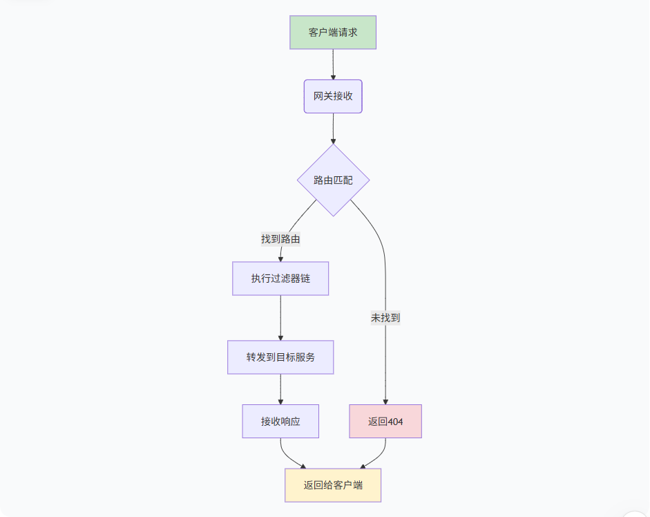

# Gateway学习笔记

## Gateway 请求流程图



**注意**过滤器的执行顺序是：全局过滤器 → 路由过滤器 → 转发 → 路由过滤器后置 → 全局过滤器后置

## Gateway 网关集成

### 引入依赖

```xml
<!-- gateway网关 -->
<dependency>
    <groupId>org.springframework.cloud</groupId>
    <artifactId>spring-cloud-starter-gateway</artifactId>
</dependency>

<!-- nacos-discovery  注册中心依赖-->
<dependency>
    <groupId>com.alibaba.cloud</groupId>
    <artifactId>spring-cloud-starter-alibaba-nacos-discovery</artifactId>
</dependency>

<!-- loadbalancer 负载均衡器依赖-->
<dependency>
    <groupId>org.springframework.cloud</groupId>
    <artifactId>spring-cloud-loadbalancer</artifactId>
</dependency>

<!-- nacos-config 配置中心依赖 -->
<dependency>
    <groupId>com.alibaba.cloud</groupId>
    <artifactId>spring-cloud-starter-alibaba-nacos-config</artifactId>
</dependency>

```

### 路由配置

**第一种方式**： 在 Yaml 文件中配置路由规则（推荐方式） 
```yaml
logging:
  level:
    org.springframework.cloud.gateway: DEBUG
    reactor.netty.http.client: DEBUG

spring:
  cloud:
    gateway:
      # 默认过滤器，相当于全局过滤器，对全局路由生效
      default-filters:
        - AddRequestHeader=X-Request-Tag, Springcloud-Gateway
      routes:
        # 定义路由 ID
        - id: order-server
          # lb 转发逻辑是在 ReactiveLoadBalancerClientFilter 全局过滤器中实现的，需要整合负载均衡器 loadbalancer
          # 定义路由的 URL 要转发到哪个服务器
          uri: lb://order-server 
          # 谓词断言，表示需要匹配哪些 URL 地址转发到 uri 服务
          predicates:
            - Path=/api/order/**
          filters:
            # 局部过滤器（只对 order-server 路由生效）
            - AddRequestParameter=name, tim
        - id: vainelx-http
          uri: http://127.0.0.1:8081 
          predicates:
            - Path=/api/vianlex/**
          filters:
            # 局部过滤器（只对 vainelx-http 路由生效）
            - StripPrefix=1 # 去掉请求前缀，转发后变成 http://127.0.0.1:8081/vianlex/**
            - AddResponseHeader=gateway-key, gateway-value
            - AddRequestHeader=X-Request-From, gateway
```

**第二种方式**：Java Config 的方式（不推荐，看具体情况）

```java
import org.springframework.cloud.gateway.filter.GatewayFilter;
import org.springframework.cloud.gateway.route.RouteLocator;
import org.springframework.cloud.gateway.route.builder.RouteLocatorBuilder;
import org.springframework.context.annotation.Bean;
import org.springframework.context.annotation.Configuration;

@Configuration
public class GatewayConfig {
    @Bean
    public RouteLocator customRouteLocator(RouteLocatorBuilder builder) {
        return builder.routes()
                .route("custom-route", r -> r.path("/api/products/**")
                     // 自定义过滤器
                    .filters(f -> f.filter(customAddHeaderFilter())
                    .rewritePath("/api/products/(?<segment>.*)", "/$\\{segment}")
                    .addRequestHeader("X-Product-Version", "2.0"))
                    .uri("lb://product-service")).build();
    }

    @Bean
    public GatewayFilter customAddHeaderFilter() {
        return (exchange, chain) -> {
            exchange.getRequest()
                    .mutate()
                    .header("X-Custom-Filter", "java-config")
                    .build();
            return chain.filter(exchange);
        };
    }

}

```

## 内置断言工厂分类

```yaml
spring:
  cloud:
    gateway:
      routes:
       - id: header_route
         uri: https://example.org
         predicates:
           # 按路径匹配（最常用）
           - Path=/api/users/**, /api/orders/**
           - Path=/product/{segment}, /category/{id}
           # 按时间匹配
           - After=2024-01-01T00:00:00+08:00 # 在指定时间之后
           - Before=2024-12-31T23:59:59+08:00 # 在指定时间之前
           - Between=2024-01-01T00:00:00+08:00, 2024-12-31T23:59:59+08:00 # 在指定时间之间
           # 按请求方法匹配（Method）
           - Method=GET,POST
           - Method=PUT,DELETE
           # 按请求头匹配（Header）
           - Header=X-Request-Id # 检查是否存在指定请求头
           - Header=X-Request-Id, \d+ # 检查请求头值是否匹配正则  
           - Header=Content-Type, application/json # 检查请求头值是否等于指定值
           # 按请求参数匹配（Query）
           - Query=userId # 检查是否存在参数
           - Query=userId, \d+  # 检查参数值是否匹配正则
           - Query=status, active # 检查参数值是否等于指定值
           # 按 Cookie 匹配
           - Cookie=sessionId # 检查是否存在Cookie
           - Cookie=sessionId, [a-zA-Z0-9]+  # 检查Cookie值是否匹配正则
           - Cookie=theme, dark # 检查Cookie值是否等于指定值
           # 按主机名匹配（Host）
           - Host=**.example.com  # 匹配主机名
           - Host=api.example.com, admin.example.com  # 多个主机名
           - Host=localhost:8080 # 带端口
           # 按远程地址匹配（RemoteAddr）
           - RemoteAddr=192.168.1.1/24 # IP地址或CIDR表示法
           - RemoteAddr=192.168.1.1, 10.0.0.1  # 多个IP
           - RemoteAddr=2001:db8::1 # IPv6
           # 按权重匹配（Weight） - （一般用于灰度发布）
           - Weight=group1, 8
           
```

组合使用示例，如下：

```yaml
spring:
  cloud:
    gateway:
      routes:
        - id: user_api_v1
          uri: lb://user-service-v1
          predicates:
            # 组合多个断言
            - Path=/api/v1/users/**
            - Method=GET,POST
            - Header=X-API-Version, v1
            - Query=debug, true
            - After=2024-01-01T00:00:00+08:00
            - Host=api.company.com
            
        - id: admin_api
          uri: lb://admin-service
          predicates:
            - Path=/admin/**
            - Header=X-User-Role, admin
            - RemoteAddr=192.168.1.0/24, 10.0.0.0/8
            
        - id: mobile_api
          uri: lb://mobile-service
          predicates:
            - Path=/mobile/**
            - Header=User-Agent, .*Mobile.*
            - Cookie=mobile_app, true
            
        - id: maintenance_route
          uri: http://localhost:8081/maintenance
          predicates:
            - Path=/**
            # 维护期间路由到维护页面
            - After=2024-12-24T00:00:00+08:00
            - Before=2024-12-26T00:00:00+08:00
         
        - id: weight_high
          uri: lb://service-v1
          predicates:
            - Path=/api/**
            # 版本A - 80%流量
            - Weight=group1, 8 
          
        - id: weight_low
          uri: lb://service-v2
          predicates:
            - Path=/api/**
             # 版本B - 20%流量
            - Weight=group1, 2
```


## 自定义断言工厂

**第一步**：自定义断言工厂实现 `AbstractRoutePredicateFactory` 类

```java
import org.springframework.cloud.gateway.handler.predicate.AbstractRoutePredicateFactory;
import org.springframework.stereotype.Component;
import org.springframework.web.server.ServerWebExchange;
import java.util.function.Predicate;
import java.util.List;

@Component
public class CustomHeaderPredicateFactory extends 
        AbstractRoutePredicateFactory<CustomHeaderPredicateFactory.Config> {
    
    public static class Config {
        private String headerName;
        private String expectedValue;
        
        // Getters and Setters
        public String getHeaderName() { return headerName; }
        public void setHeaderName(String headerName) { this.headerName = headerName; }
        
        public String getExpectedValue() { return expectedValue; }
        public void setExpectedValue(String expectedValue) { this.expectedValue = expectedValue; }
    }
    
    public CustomHeaderPredicateFactory() {
        super(Config.class);
    }
    
    @Override
    public List<String> shortcutFieldOrder() {
        return List.of("headerName", "expectedValue");
    }
    
    @Override
    public Predicate<ServerWebExchange> apply(Config config) {
        return exchange -> {
            String actualValue = exchange.getRequest()
                .getHeaders()
                .getFirst(config.getHeaderName());
            
            if (actualValue == null) {
                return false;
            }
            
            // 支持正则表达式匹配
            if (config.getExpectedValue().startsWith("regex:")) {
                String regex = config.getExpectedValue().substring(6);
                return actualValue.matches(regex);
            }
            
            // 精确匹配
            return actualValue.equals(config.getExpectedValue());
        };
    }
}
```

**第二步**：在本地配置文件（或者 Nacos 注册中心）中添加配置

```yaml
spring:
  cloud:
    gateway:
      routes:
        - id: custom_predicate_route
          uri: lb://service-a
          predicates:
            # 使用自定义断言
            - name: CustomHeader
              args:
                headerName: X-Custom-Header
                expectedValue: special-value
            # 简写形式（需实现shortcutFieldOrder）
            - CustomHeader=X-Custom-Header,special-value
```


## 自定义局部过滤器

**第一步**：需要按如下方式，实现抽象 `AbstractGatewayFilterFactory` 类

```java
import org.springframework.cloud.gateway.filter.GatewayFilter;
import org.springframework.cloud.gateway.filter.factory.AbstractGatewayFilterFactory;
import org.springframework.stereotype.Component;
import reactor.core.publisher.Mono;

import java.util.Arrays;
import java.util.List;

@Component
public class CustomHeaderGatewayFilterFactory extends
        AbstractGatewayFilterFactory<CustomHeaderGatewayFilterFactory.Config> {

    // 1. 定义配置类
    public static class Config {
        private String headerName;
        private String headerValue;

        // Getter 和 Setter
        public String getHeaderName() {
            return headerName;
        }

        public void setHeaderName(String headerName) {
            this.headerName = headerName;
        }

        public String getHeaderValue() {
            return headerValue;
        }

        public void setHeaderValue(String headerValue) {
            this.headerValue = headerValue;
        }
    }

    // 2. 构造函数
    public CustomHeaderGatewayFilterFactory() {
        super(Config.class);
    }

    /**
     * 3. 定义配置字段顺序（用于YAML简写）
     * 如：-CustomHeader: hello, helloWorld 配置时注意用逗号隔开
     * 解析后会按顺序赋值 config.headerName=hello; config.headerValue=helloWorld
     */
    @Override
    public List<String> shortcutFieldOrder() {
        return Arrays.asList("headerName", "headerValue");
    }

    // 4. 过滤器逻辑实现
    @Override
    public GatewayFilter apply(Config config) {
        return (exchange, chain) -> {
            // 记录日志
            System.out.println("Yaml 文件中配置的请求头：" + config.getHeaderName() + "=" + config.getHeaderValue());
            // 添加前置请求头：将配置文件中配置的请求头
            exchange.getRequest().mutate().header(config.getHeaderName(), config.getHeaderValue()).build();
            // 继续过滤器链
            return chain.filter(exchange)
                    .then(Mono.fromRunnable(() -> {
                        // 后置处理：添加响应头
                        exchange.getResponse().getHeaders().add("X-Custom-Filter", "helloWorld");
                    }));
        };
    }
}
```

**第二步**：通过 Yaml 文件（或者 Nacos 属性配置）指定该局部过滤器对哪个路由生效

```yaml
# Yaml 方式
spring:
  cloud:
    gateway:
      routes:
        - id: user-service
          uri: lb://user-service
          predicates:
            - Path=/api/users/**
          filters:
            # 方式A：完整配置
            - name: CustomHeaderFilter
              args:
                headerName: X-Custom-Header
                headerValue: custom-value
            # 方式B：使用简写（需实现 shortcutFieldOrder ）
            - CustomHeaderFilter=X-Custom-Header,custom-value
            # 与其他过滤器组合
            - StripPrefix=1
            - AddRequestHeader=X-Request-Id, ${uuid()}
```

## 自定义全局过滤器

全局过滤器（GlobalFilter）：对所有进入网关的请求都生效的过滤器，无论请求匹配哪个路由。

自定义全局过滤器，只需要实现 `GlobalFilter` 接口，然后交给 Spring 容器管理即可，不需要在配置文件中配置，。

```java
@Component
public class AuthGlobalFilter implements GlobalFilter, Ordered {

    @Override
    public Mono<Void> filter(ServerWebExchange exchange, GatewayFilterChain chain) {
        ServerHttpRequest request = exchange.getRequest();
        // 前置处理：统一鉴权
        String token = request.getHeaders().getFirst("Authorization");
        if (token == null) {
            exchange.getResponse().setStatusCode(HttpStatus.UNAUTHORIZED);
            // 中断请求，直接返回
            return exchange.getResponse().setComplete();
        }
        // 添加请求头
        ServerHttpRequest mutatedRequest = request.mutate().header("X-User-Id", extractUserId(token)).build();
        // 继续过滤器链
        return chain.filter(exchange.mutate().request(mutatedRequest).build());
    }

    // 2. 执行顺序（数值越小优先级越高）
    @Override
    public int getOrder() {
        return -100;
    }

    public String extractUserId(String token) {
        return token.substring(0);
    }
}
```