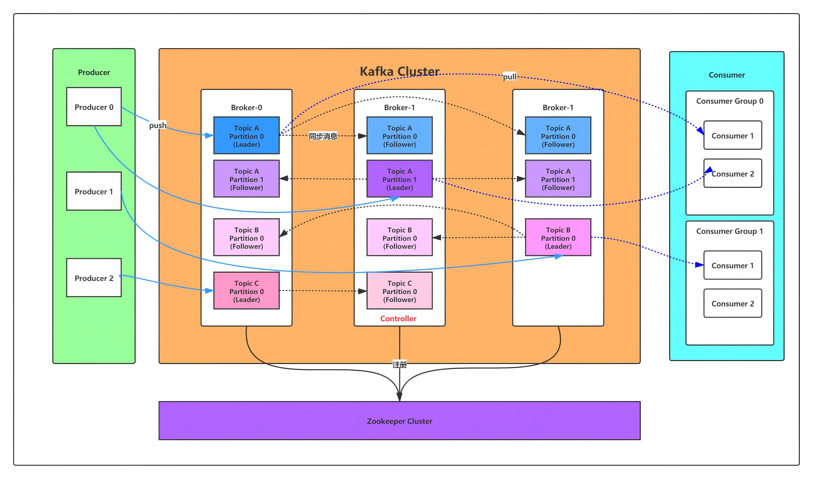

# Kafka 学习笔记

## Kafka 核心概念



### Broker 消息代理

- Broker 就是一个 Kafka 服务器节点, 主要负责存储和处理消息。
- Kafka 集群由多个独立的 Broker 节点组成。

### Topic 主题

- 主题是 Kafka 中消息的逻辑分类，在 Kafka 中发送消息时必须要有主题。
- kafka 创建主题时，会将主题划分为多个 leader 领导分区分布在不同的 Broker 服务器上，同时每一个 leader 领导分区又有多个 Fllower 副本分区，这些副本分区也分布在不同的 Broker 节点上，但是注意 leader 分区和 Fllower 副本分区不能在同一个 Broker 服务器中。
- 生产者（Producer）将消息发布到主题中，然后消费者（Consumer）通过订阅主题从中接收消息。

### Partition 分区

- Kafka 会将主题划分为多个 Leader 领导者分区，并会将这些分区分布在不同的节点服务器（Borker）上，以实现消息的并行处理和负载均衡。同时每个 Leader 分区存在多个 Fllower 副本分区，注意领导者分区和副本分区分布在不同的 Broker 服务器节点上。
- 消息是以文件日志格式按顺序存储在分区中，消息在分区中通过 offset 偏移量来记录消息的位置，消费者消息时只能通过偏移量去获取消息。注意消息的偏移量总是递增的，因为新产生的消息总是添加到分区日志的末端。
- 分区保证了消息在 Kafka 中的水平扩展和并行处理能力。

### Record 消息记录

- Kafka 的消息是以键值对的形式存储的，当我们发送消息时，如果不指定消息的 Key 值默认为空，则 Kafka 会以轮询的方式将消息写到不同的分区中，如果我们指定消息的 Key 值，那么同一个 Key 值的消息会写入同一个分区中。

### Producer 生成者

- 消息生产者，向 Broker 发送消息的客户端


### Consumer 消费者

- 消费者是从 Broker 读取消息的客户端，消费者可以订阅一个或多个消息主题，并从 Broker 节点中拉取消息。

### Consumer Group 消费者组

- 消费者组是由多个消费者客户端实例组成的逻辑集合，通过消费组可以实现消费者的负载均衡
- 一个消费者可以消费多个分区的消息，一个分区只能被同一个消费者组内的一个消费者消费，但是需要注意不同消费者组内的消费者是可以对同一分区消费。
- 消息者组允许消费者水平扩展，我们可以通过增加消费者，提高处理吞吐量，注意消费者数量不能大于分区数量，多余的消费者将处于**空闲状态**，不会分配到任何分区。


## Kafka 如何保证消息顺序

Kafka 消息在分区中是以文件日志形式按顺序存储的，只保证消息在分区内的顺序性，不保证 Topic 级别或全局顺序，我们可以通过以下方式实现消息的顺序性。

- **单分区主题**：每一个主题只设置一个分区，这样所有消息都会被发送到同一个分区，在同一分区内消息是有顺的。
- **使用消息 Key**: 发送消息时设置消息 Key，相同 Key 的消息会写入同一个分区，比如以订单 ID 为消息的 Key 那么同一个订单的所有消息都会写入同一个分区中。
- **自定意生产和消费者的分区路由**：在同一个分区内的消息是顺序储存的，通过路由自定义到指定分区。
- **消费者**使用单一线程处理分区消息，不要使用多线程，同时手动管理消息偏移量。


## 消息传递语义

- 最多一次（At Most Once）: 设置 `acks =0`，消息可能会丢失，但绝不会重复发送，生产者只发送一次消息，不管消费者有没有收到。该语义适用于对消息丢失不敏感的场景，但可能导致数据不一致。

- 至少一次（At Least Once）: 设置 `acks =1 | all`，消息永远不会丢失，但可能会重复发送。如果生产者没有收到 Broker 发送的 ack 确认消息，生产者会一直重试发送（如果 Broker 收到消息了，只是 Broker 发送确认消息出错了，生产者也会重试发送消息），直到收到 Broker 响应的确认消息， 该语义确保了消息的可靠传递，适用于需要确保消息到达的场景，但需要在消费者端处理重复消息的逻辑。 

- 精确一次（Exactly Once）: 设置 `acks =all`，每条消息只传递一次，既不会丢失也不会重复。该语义是最理想的语义，但实现起来较为复杂，通常需要结合事务处理和幂等性来保证。


## 消息模型

消息队列的消息传递模型主要有两种如下：

**点对点模型**：表示一条消息只由一个消息者消费。

**发布订阅模型**：表示一条消息可以被多个消息者消费。

Kafka 对于以上两种消息传递模式的实现原理如下：

在 kafka 中主题被划为多个分区，对于消费者而言，一个消费者可以消费多个分区的消息，同一分区的消息只能被消费组内的一个消费者消费，但是不同消费者组内的消费者可以消费同一个分区的消息。

通过同一分区的消息只能被消费组内的一个消费者消费的规则，来限定主题只由一个消费组去消费，就能实现点对点模型，点对对模型示意图如下：

```text
┌──────────────────────────────────────┐
│           Topic: order-topic         │
│         ┌─────┐ ┌─────┐ ┌─────┐      │
│         │ P0  │ │ P1  │ │ P2  │      │
│         └─────┘ └─────┘ └─────┘      │
└─────────────────┬────────────────────┘
                  │ 
            ┌─────▼─────┐ 
            │ Group A   │ 
            │ ┌───────┐ │ 
            │ │ Cons1 │ │ 
            │ └───────┘ │ 
            │ ┌───────┐ │ 
            │ │ Cons2 │ │ 
            │ └───────┘ │ 
            └───────────┘ 
```


通过同一个分区的消息能被不同消费者组内的消费者消费的规则，来指定一个主题多个消费者组来消费，就能实现发布订阅模型，发布订阅模型示意图如下：

```text
┌────────────────────────────────────────┐
│           Topic: order-topic           │
│         ┌─────┐ ┌─────┐ ┌─────┐        │
│         │ P0  │ │ P1  │ │ P2  │        │
│         └─────┘ └─────┘ └─────┘        │
└─────┬─────────────┬─────────────┬──────┘
      │             │             │
┌─────▼─────┐ ┌─────▼─────┐ ┌─────▼─────┐
│ Group A   │ │ Group B   │ │ Group C   │
│ ┌───────┐ │ │ ┌───────┐ │ │ ┌───────┐ │
│ │ Cons1 │ │ │ │ Cons1 │ │ │ │ Cons1 │ │
│ └───────┘ │ │ └───────┘ │ │ └───────┘ │
│ ┌───────┐ │ │ ┌───────┐ │ │ ┌───────┐ │
│ │ Cons2 │ │ │ │ Cons2 │ │ │ │ Cons2 │ │
│ └───────┘ │ │ └───────┘ │ │ └───────┘ │
└───────────┘ └───────────┘ └───────────┘

```


## 生产者消息路由机制

每个主题（Topic）可以划分为多个 leader 分区，分布在 Broker 集群的节点中，来实现主题消息的负载均衡。生产发送主题消息时，kafka 通过路由分区器决定将消息发送到哪个 leader 分区中，kafka 默认有多个路由分区器，同时也支持我们自定义路由分区器。

### 默认路由策略

#### Key-Based 分区路由

当消息指定有 key 时，通过 Key-Based 分区路由，将相同 Key 的消息会路由到同一分区，特点是能保证相同 Key 的消息有序性，该路由默认使用 Murmur2Hash 算法，如下

```java
// 使用默认的Murmur2哈希算法
partition = hash(key) % numPartitions
```

#### Round-Robin 轮询路由

当消息未指定 Key（null）时，每条消息轮询发送到主题的不同分区上，特点是实现消息的均匀分布。


#### Sticky Partitioning（粘性分区）

生产者批量发送时，会将同一批次的消息"粘"（全部发送）到一个分区，特点是减少批处理的创建开销提高吞吐量。


### 自定义分区路由

第一步：先实现自定义分区路由，需要实现 Partitioner 接口。

```java

public class CustomPartitioner implements Partitioner {
    
    @Override
    public int partition(String topic, Object key, byte[] keyBytes,
                        Object value, byte[] valueBytes, Cluster cluster) {
        
        List<PartitionInfo> partitions = cluster.partitionsForTopic(topic);
        int numPartitions = partitions.size();
        
        // 自定义逻辑示例1：基于业务字段
        if (key instanceof String) {
            String strKey = (String) key;
            return strKey.startsWith("A") ? 0 : 1;
        }
        
        // 自定义逻辑示例2：时间范围分区
        if (value instanceof Event) {
            Event event = (Event) value;
            return event.getTimestamp() % numPartitions;
        }
        
        // 默认使用哈希
        return Math.abs(key.hashCode()) % numPartitions;
    }
    
    @Override
    public void close() {}
    
    @Override
    public void configure(Map<String, ?> configs) {}
}

```

第二步：生产者配置中指定使用该自定义路由分区

```java
Properties props = new Properties();
props.put("partitioner.class", "com.example.CustomPartitioner");
```

## 消费者分配分区消费机制

### range 策略

range 分配策略的分配逻辑是将分区范围分配给消费者，可能导致分区分配不均匀。

```java
Topic: tp1, 分区数: 3 (p0, p1, p2)
消费者: c1, c2

计算每个消费者分配的分区数
分区数 / 消费者数 = 每个消费者基础分配数
剩余分区分配给前几个消费者

结果： c1: p0, p1  (2个分区), c2: p2 (1个分区)
```

### RoundRobin 策略

RoundRobin 分配策略的分配逻辑是将所有分区和所有消费者进行全局轮询，可能导致分区分配不均匀。

```java
Topic: tp1 (p0, p1, p2), tp2 (p0, p1)
消费者: c1, c2

将所有分区和消费者排序，然后轮询分配：
排序后消费者: [c1, c2]
排序后分区: [tp1-p0, tp1-p1, tp1-p2, tp2-p0, tp2-p1]

轮询分配结果：
c1: tp1-p0, tp1-p2, tp2-p1
c2: tp1-p1, tp2-p0
```

### sticky 策略

Sticky 粘性分配策略的分配逻辑有两个原则，如下：

1、在开始分区时，尽量保持分区的分配均匀。比如按照Range策略分（这一步实际上是随机的）。

2、分区的分配尽可能的与上一次分配的保持一致。比如在range分区的情况下，第三个Consumer的服务岩机了，那么按照sticky策略，就会保持consumer1和consumer2原有的分区分配情况。然后将consumer3分配的7~9分区尽量平均的分配到另外两个consumer上。这种粘性策略可以很好的保持Consumer的数据稳定性。


### 自定义分配策略

自定义分配策略需要继承 AbstractPartitionAssignor 抽象类

```java
class CustomAbstractPartitionAssignor extends AbstractPartitionAssignor {


}
```


## 生产者和消费属性配置介绍


### broker 服务器属性

**auto.create.topics.enable 属性**：任何生产者发送消息或消费者拉取消息时，如果主题不存在，则根据该属性判断是否自动创建主题。

**min.insync.replicas 属性**：表示当生产者设置 acks = all(-1) 时，需要最少多少个 Fllower 副本分区同步 leader 分区后，才会发确认消息给生产者。


### 生产者属性

**acks 属性**：表示 Producer 需要分区 leader 确认 Producer 请求。

1. `acks = 0` 表示 Producer 向主题发送消息时，不需要等待 Leader 分区的确认，直接返回。该方式有最高的吞吐率，但是不保证消息是否真的发送成功。

2. `acks = 1 ` 表示 Producer 向主题发送消息时，等待 Leader 分区写入本地日志成功后就返回确认消息发送成功，不需要等待 Leader 分区 Fllower 副本分区同步，注意如果此时 Leader 分区挂掉了，Fllower 副本分区还未同步，新选举的 Leader 可能没有这条消息，会造成消息会丢失。该方案吞吐量高和延迟比较低，但可靠性中等，也会存在消息重复发送（幂等性）问题。

3. `acks = -1 或者 acks = all` 表示生产者发送消息后， 等待 Leader 分区写入本地日志后，还需要等待 ISR（In-Sync Replicas ）中的所有 Fllower 副本分区都写入成功后，才返回确认消息发送成功。该方案可靠性最高，会存在消息幂等性，即消息重复发送问题，并且延迟性比较高和吞吐量比较低，acks 注意配合 `min.insync.replicas ` 属性使用。


### 消费者属性

**auto.offset.reset 属性** 表示消费者组第一次消费主题某个分区的消息时或者消费者在 `__consumer_offsets `主题中查询不到消费组对该主题分区的消费偏移量时，会触发 `auto.offset.reset ` 属性来重置 offset 表示要从哪里开始消费主题分区的消息，有以下几种方式。

1. `auto.offset.reset = earliest` 表示从分区的最早可用消息开始消费，缺点是会消费所有历史数据，可能重复消费（之前已经消费过，`__consumer_offsets` 主题数据丢失，导致查不到 offset 的情况），延迟高（需要消费大量的历史数据）。

2. `auto.offset.reset = latest` 从分区的最新消息之后开始消费（消费启动后，生产者才发送的新消息），优点是不会重复消费消息（消费的都是新消息）缺点是可能丢失历史消息（不消费已有数据），可能错过消息（在消费者启动期间到达的消息）。

3. `auto.offset.reset = none` 表示不自动重置 offset，如果没有找到有效的 offset 偏移量，抛出异常。优点是最安全的防止意外消费错误位置，缺点是可能导致消费停止如果没有正确处理。


### 主题属性


主题消息保留机制有两种分别是日志分片滚动和日志保留原理，除了 Broker 级别的保留机制配置，我们还可以为每个主题单独配置不同的保留机制，我们只需要创建主题时，指定以下参数即可。

第一种机制：日志分片滚动，每个主题（topic）被划分为多个分区（partition），每个分区的日志被进一步划分为多个分片（segment），日志分片的滚动配置说明如下：

- 基于时间的滚动：当活动分片的存在时间超过配置的 `segment.ms(默认7天)` 时，Kafka 会关闭当前分片并创建一个新的分片。
- 基于大小的滚动：当活动分片的大小达到配置的 `segment.bytes(默认1G)` 时，Kafka 会关闭当前分片并创建一个新的分片。


第二种机制：日志保留机制，该策略决定了消息在被删除之前可以保留多长时间或占用多大空间。

- 基于时间的保留：配置 `retention.ms(默认值3天)` 指定消息的保留时间，超过该时间的非活动分片将被删除。
- 基于大小的保留：配置 `retention.bytes(默认值无限制)` 指定每个分区的最大日志大小，超过该大小的旧分片将被删除。


## 客户端常用命令


查看所有消费者组

```bash
kafka-consumer-groups.sh --bootstrap-server 10.250.6.61:9092 --all-groups --describe
```

查看主题的消费偏移量

```bash
kafka-topics.sh --bootstrap-server 127.0.0.1：19092 --describe --topic __consumer_offsets
```


## 参考链接

1. https://docs.springjava.cn/spring-kafka/reference/kafka/sending-messages.html