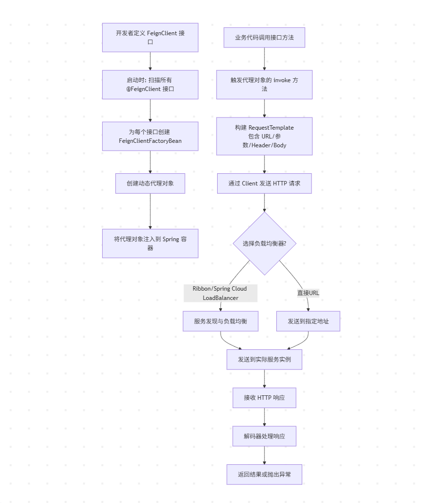

# OpenFeign 学习笔记

## @FeignClient 注解属性说明

```java
@Target(ElementType.TYPE)
@Retention(RetentionPolicy.RUNTIME)
@Documented
public @interface FeignClient {
    // 必填：服务注册中心的服务名称（用于服务发现）
    @AliasFor("name")
    String value() default "";

    // 服务名称（与 value 互为别名）
    @AliasFor("value")
    String name() default "";
    
    // 上下文 ID，默认服务名称，用于同一个服务需要配置多个不同的客户端
    String contextId() default "";
    
    // 直接指定服务 URL（用于不使用服务发现的场景）
    String url() default "";
    
    // 是否解码 404 错误，true 时 404 不抛异常而是返回 null
    boolean decode404() default false;
    
    // 配置类，为 FeignClient 客户端，自定义特定的配置
    Class<?>[] configuration() default {};
    
    // 降级处理类（服务不可用时的回退逻辑）
    Class<?> fallback() default void.class;
    
    // 工厂类，用于创建 fallback 实例
    Class<?> fallbackFactory() default void.class;
    
    // 定义请求路径前缀，所有的请求方法前都会加这个前缀（已废弃，推荐使用 Spring MVC 的 @RequestMapping）
    String path() default "";
    
    // 是否为主负载均衡客户端
    boolean primary() default true;
}
```

## 实现原理




## 日志配置

OpenFeign 支持 4 种日志级别，分别如下：

- NONE： 不记录任何日志（默认）
- BASIC：只记录请求方法、URL、响应状态码、执行时间
- HEADERS：记录基本信息 + 请求头和响应头
- FULL：记录所有请求和响应的详细信息，包括正文

### JavaBean 方式配置

1、全局日志配置

```java

import feign.Logger;
import org.springframework.context.annotation.Bean;
import org.springframework.context.annotation.Configuration;

@Configuration
public class FeignConfig {

    /**
    * OpenFeign 全局日志配置
    * 注意：如果日志不生效，请检查 application.yml 文件中是否开启日志记录配置（如：logging.level.com.ils.service=DEBUG）
    */ 
    @Bean
    public Logger.Level feignLoggerLevel() {
        return Logger.Level.FULL;
    }

}

```

2、局部日志配置，单独为某个 FeignClient 客户端配置日志

```java


import feign.Logger;
import org.springframework.context.annotation.Bean;

public class OrderFeignClientConfig {
    @Bean
    public Logger.Level feignLoggerLevel() {
        return Logger.Level.FULL;
    }
}


// 客户端
@FeignClient(name = "order-server"
    configuration = OrderFeignClientConfig.class  // 指定配置类
)
public interface OrderFeignClient {
    // ...
}

```

### Yaml 方式配置

```yaml
# YAML 配置
logging:
  level:
    root: DEBUG # 全局日志级别
    # 为特定 Feign 客户端设置日志级别
    com.example.feign.OrderOpenFeignClient: DEBUG
    
  # 或者全局设置所有 Feign 客户端
spring:
  cloud:
    openfeign:
      client:
        config:
          default:  # 全局默认配置
            logger-level: NONE
          order-server:  # 指定某个客户端的日志级别（注意这里的配置项是 @FeignClient中的 name 值，也就是具体的调用服务名）
            logger-level: BASIC
```

## 拦截器配置

OpenFeign 拦截器 (RequestInterceptor) 允许你在 HTTP 请求发送之前，对请求进行统一的预处理，常用于：

- 添加认证信息（Token、Basic Auth）
- 添加统一请求头（Trace-ID、版本号）
- 记录请求日志
- 参数加密/签名
- 请求重试前的特殊处理

### 执行时机

```text
时序：构建 RestTemplate 请求模板 → 执行拦截器链 → 发送HTTP请求
```

### 全局拦截器（作用于所有 Feign 客户端）

第一种配置方式，通过配置类实现如下：

```java
@Configuration
public class FeignConfig {
    
    @Bean
    @Order(1)
    public RequestInterceptor authInterceptor() {
        return requestTemplate -> {
            // 从 ThreadLocal 或 SecurityContext 获取 token
            String token = AuthContext.getCurrentToken();
            requestTemplate.header("Authorization", "Bearer " + token);
            // 添加其他通用 header
            requestTemplate.header("X-Request-Source", "feign-client");
            requestTemplate.header("X-Trace-Id", MDC.get("traceId"));
        };
    }
    
    @Bean
    @Order(2)
    public RequestInterceptor loggingInterceptor() {
        return requestTemplate -> {
            String method = requestTemplate.method();
            String url = requestTemplate.url();
            log.info("Feign 请求准备: {} {}", method, url);
            // 可以记录请求体（注意性能）
            if (requestTemplate.body() != null) {
                log.debug("请求体: {}", new String(requestTemplate.body()));
            }
        };
    }
}
```

第二种配置方式，通过实现 RequestInterceptor 接口，如下：

```java
@Component
public class GlobalFeignInterceptor implements RequestInterceptor {
    
    private static final Logger log = LoggerFactory.getLogger(GlobalFeignInterceptor.class);
    
    @Override
    public void apply(RequestTemplate template) {
        // 1. 添加认证
        addAuthHeader(template);
        // 2. 添加链路追踪
        addTraceInfo(template);
        // 3. 记录请求日志
        logRequest(template);
    }
    
    private void addAuthHeader(RequestTemplate template) {
        // Spring Security 集成示例
        Authentication authentication = SecurityContextHolder.getContext().getAuthentication();
        if (authentication != null && authentication.getCredentials() instanceof String) {
            String token = (String) authentication.getCredentials();
            template.header("Authorization", "Bearer " + token);
        }
    }
    
    private void addTraceInfo(RequestTemplate template) {
        // 添加 Sleuth 的 traceId
        String traceId = MDC.get("traceId");
        if (traceId != null) {
            template.header("X-B3-TraceId", traceId);
        }
    }
    
    private void logRequest(RequestTemplate template) {
        log.info("Feign Request -> Method: {}, URL: {}, Headers: {}", 
                 template.method(), 
                 template.url(),
                 template.headers());
    }
}
```

### 局部拦截（作用于特定客户端）

```java

// 1. 先定义特定配置类
public class OrderServiceFeignConfig {
    
    @Bean
    public RequestInterceptor orderServiceInterceptor() {
        return template -> {
            // 只针对用户服务的特殊处理
            template.header("X-Service-Type", "order-server");
            template.header("X-API-Version", "v2");
        };
    }
}

// 2. 在 @FeignClient 中指定
@FeignClient(
    name = "order-server",
    configuration = OrderServiceFeignConfig.class  // 指定配置
)
public interface OrderServiceClient {
    @GetMapping("/order/{id}")
    Order getOrder(@PathVariable("id") Long id);
}

```


### 基于配置文件的实现全局和局部拦截器配置

```yaml
# application.yml
spring:
  cloud:
    openfeign:
      client:
      config:
        # 全局默认配置
        default:
          request-interceptors:
            - com.example.interceptor.GlobalAuthInterceptor
            - com.example.interceptor.LoggingInterceptor
          connect-timeout: 5000
          read-timeout: 30000
        
        # 为特定的服务配置（优先级更高）
        order-server:
          request-interceptors:
            - com.example.interceptor.OrderServiceAuthInterceptor
          logger-level: full
          decode404: false
```


## 降级处理配置


### 局部降级配置（为指定客户端配置降级）

第一种配置方式，通过 fallback 实现服务降级处理，如下：

```java
// 1. 定义 Feign 客户端
@FeignClient(name = "user-service", fallback = UserServiceFallback.class)
public interface UserServiceClient {
    @GetMapping("/users/{id}")
    User getUser(@PathVariable Long id);
}
// 2. 实现 fallback 类
@Component
public class UserServiceFallback implements UserServiceClient {
    
    private static final Logger log = LoggerFactory.getLogger(UserServiceFallback.class);
    @Override
    public User getUser(Long id) {
        log.warn("用户服务不可用，返回默认用户，id: {}", id);
        // 返回默认数据
        return User.builder()
            .id(id)
            .name("默认用户")
            .email("default@example.com")
            .build();
    }
}
// 3. 需要开启 fallback（Spring Cloud 2020+ 默认关闭）
spring:
  cloud:
    feign:
      circuitbreaker:
        enabled: true
```

第二种配置方式，通过 fallbackFactory 实现降级处理（可以实现不同异常类型返回不同降级结果）

```java
// 1. 使用 fallbackFactory
@FeignClient(
    name = "user-service",
    fallbackFactory = UserServiceFallbackFactory.class
)
public interface UserServiceClient {
    @GetMapping("/users/{id}")
    User getUser(@PathVariable Long id);
}

// 2. 实现 FallbackFactory
@Component
@Slf4j
public class UserServiceFallbackFactory implements FallbackFactory<UserServiceClient> {
    
    @Override
    public UserServiceClient create(Throwable cause) {
        return new UserServiceClient() {
            @Override
            public User getUser(Long id) {
                log.error("调用用户服务失败，用户ID: {}，异常: {}", id, cause.getMessage(), cause);
                
                // 根据不同异常类型返回不同降级结果
                if (cause instanceof FeignException.NotFound) {
                    return User.builder()
                        .id(id)
                        .name("用户不存在")
                        .build();
                }
                return User.builder()
                    .id(id)
                    .name("服务暂时不可用")
                    .email("请稍后重试")
                    .build();
            }
        };
    }
}
```

### 全局降级配置（作用于所有客户端）

```yaml
spring:
  cloud:
    openfeign: 
      client:
        config:
          # default 代表所有 Feign 客户端
          default:
          # 降级类
          fallback: com.example.feign.fallback.GlobalFallback
          # 或使用工厂模式
          fallback-factory: com.example.feign.fallback.GlobalFallbackFactory
          # 特定客户端降级配置
          order-server:
          # 降级类
          fallback: com.example.feign.fallback.OrderServerFallback
          # 或使用工厂模式
          fallback-factory: com.example.feign.fallback.OrderServerFallbackFactory
```

## 同一服务多客户端配置

同一服务多客户端配置，需要通过 contextId 指定不同的上下文来实现，如下：

```java
// 场景：同一个服务需要多个不同配置的客户端（创建多个 order-service 客户端）
@Configuration
public class FeignClients {
    
    // 客户端1：普通调用
    @FeignClient(
        name = "order-service",
        contextId = "orderServiceNormal"  // 唯一标识
    )
    public interface OrderServiceNormalClient {}
    
    // 客户端2：长超时配置
    @FeignClient(
        name = "order-service",
        contextId = "orderServiceLongTimeout",
        configuration = LongTimeoutConfig.class
    )
    public interface OrderServiceLongTimeoutClient {}
    
    // 客户端3：带认证
    @FeignClient(
        name = "order-service",
        contextId = "orderServiceWithAuth",
        configuration = AuthConfig.class
    )
    public interface OrderServiceWithAuthClient {}
}
```


## 客户端 Http 组件替换配置

OpenFeign 支持以下 HTTP 客户端：

- 默认：java.net.HttpURLConnection（性能一般）
- Apache HttpClient 5：功能强大，成熟稳定
- OkHttp：高性能，支持 HTTP/2，Android 首选
- Apache HttpClient 4：旧版本，不建议新项目使用

### 具体的替换方式如下

第一步：

```xml
<!-- 使用 Spring Cloud 统一管理 -->
<dependency>
    <groupId>org.springframework.cloud</groupId>
    <artifactId>spring-cloud-starter-openfeign</artifactId>
</dependency>

<!-- 需要额外添加 HTTP 客户端依赖 -->
<dependency>
    <groupId>io.github.openfeign</groupId>
    <artifactId>feign-hc5</artifactId>
</dependency>

<!-- 或者额外添加 OkHttp 客户端依赖 -->
<dependency>
    <groupId>io.github.openfeign</groupId>
    <artifactId>feign-okhttp</artifactId>
</dependency>
```

第二步：在 yml 或者 Java 配置类的方式启动对应的组件即可

```yml
spring:
  cloud:
    openfeign:
      # 引入哪个组件，enabled 哪个组件即可
      httpclient:
        hc5:
          enabled: false
          # 连接池配置
          max-connections: 200
          max-connections-per-route: 50
          time-to-live: 900
          time-to-live-unit: seconds
      okhttp:
        enabled: true
        # 连接池配置
        max-idle-connections: 200
        keep-alive-duration: 300s
        # 超时配置
        connect-timeout: 3000ms
        read-timeout: 10000ms
        write-timeout: 10000ms
        call-timeout: 30000ms
```

